# Agent - 理论与思考

## 章节目标

本章回答一个核心问题：**Agent 到底是什么，它的设计模式从何而来，该如何选择？**

你将学到以下设计模式：

**第一块（第 1-4 章）：基础模式与执行起点**

- 1. 提示词链：为什么复杂任务需要分步执行
- 2. 路由：如何让系统智能地分发不同请求
- 3. 并行化：如何用并发提升执行效率
- 4. 反思：如何让 Agent 自我检查和修正输出

**第二块（第 5-8 章）：能力扩展与协同记忆**

- 5. 工具使用：如何连接外部世界扩展 Agent 能力
- 6. 规划：如何让 Agent 自主制定多步行动路径
- 7. 多智能体协作：如何通过分工解决单 Agent 瓶颈
- 8. 记忆管理：如何让 Agent 跨轮次保持上下文

**第三块（第 9-12 章）：学习进化与系统治理**

- 9. 学习与适应：如何让系统随时间持续改进
- 10. MCP：模型与工具如何标准化通信
- 11. 目标设定与监控：如何衡量和追踪 Agent 的进展
- 12. 异常处理与恢复：如何让系统遇错后自愈而非崩溃

**第四块（第 13-16 章）：人机协同与连接优化**

- 13. 人机协同（HITL）：何时必须引入人工干预
- 14. 知识检索（RAG）：如何补齐模型的事实盲区
- 15. A2A：智能体之间如何互联互通
- 16. 资源感知优化：如何平衡质量、时延与成本

**第五块（第 17-20 章）：推理安全与运营闭环**

- 17. 推理技术（CoT / ToT / ReAct）：如何提升推理深度
- 18. Guardrails / 安全模式：如何为 Agent 设置安全边界
- 19. 评估与监控：如何度量 Agent 的真实效果
- 20. 优先级排序：如何在多任务场景下调度资源

---

---

# 🟩 第一块（第 1-4 章）：基础模式与执行起点

> 从单步到多步、从串行到并行、从输出到自检，建立 Agent 的基础工作范式。

| 章节 | 核心问题 |
|------|----------|
| 1. 提示词链 | 为什么复杂任务需要分步执行？ |
| 2. 路由 | 如何智能分发不同类型的请求？ |
| 3. 并行化 | 如何用并发提升执行效率？ |
| 4. 反思 | 如何让 Agent 自我检查和修正输出？ |

---

# 1. 提示词链 (Prompt Chaining)

## 单一提示词的局限性

- **指令忽略**：部分提示内容被忽视
- **上下文偏离**：模型失去对初始上下文的追踪
- **错误传播**：早期错误被放大
- **上下文窗口不足**
- **幻觉**：认知负荷增加导致生成错误信息

## 定义

提示词链（Prompt Chaining），有时也称为管道模式（Pipeline pattern），是利用大型语言模型（LLM）处理复杂任务的强大范式。这种方法不再要求 LLM 在单一的整体化步骤中解决复杂问题，而是采用**分而治之**的策略。

## 核心概念

- 将复杂问题分解为一系列更小、更易管理的子问题
- 每个子问题通过专门设计的提示词单独处理
- 一个提示词的输出会作为输入策略性地传递给链中的下一个提示词
- 建立依赖链，使 LLM 能够在先前工作的基础上构建

<!-- fit -->
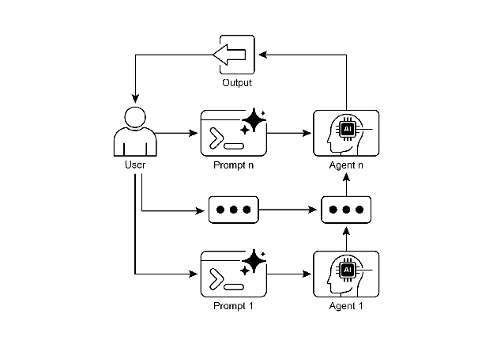

---

## 应用场景

1. **信息处理工作流**：文档总结 → 实体提取 → 知识库查询 → 生成报告
2. **复杂查询回答**：识别子问题 → 分别检索 → 综合答案
3. **数据提取和转换**：从非结构化文本转换为结构化格式
4. **内容生成工作流**：主题想法 → 大纲 → 起草 → 修订
5. **代码生成和完善**：理解 → 伪代码 → 编写 → 审查 → 完善

---

# 2. 路由 (Routing)

## 定义

路由将条件逻辑引入智能体系统的操作框架，使其从固定的执行路径转变为动态评估特定标准、从一组可能的后续操作中进行选择的模型。

<!-- fit -->
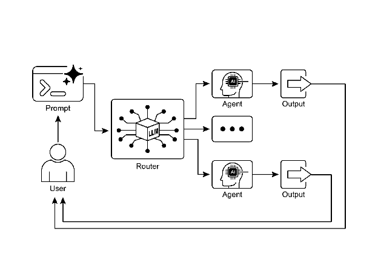

## 路由机制类型

|维度|**基于规则的路由**  <br>(Rule-Based)|**基于嵌入的路由**  <br>(Embedding-Based)|**基于机器学习模型的路由**  <br>(ML Model-Based)|**基于大模型的路由**  <br>(LLM-Based)|
|---|---|---|---|---|
|**核心原理**|关键词匹配、正则表达式、If-Else|向量相似度计算  <br>(语义匹配)|监督学习分类器  <br>(如 BERT, SVM, 逻辑回归)|提示词工程  <br>(Zero-shot/Few-shot)|
|**典型实例**|**场景：电商售后**  <br>规则：`if "退款" in text` → 路由到退款流程。  <br>**局限：** 用户说“我不想要了，把钱退我”，若无“退款”关键词则失效。|**场景：知识库检索**  <br>用户问：“怎么给手机充电？”  <br>系统计算该句向量与“电池故障”、“充电指南”向量的相似度，发现与“充电指南”最接近，自动路由过去。|**场景：高并发客服**  <br>利用历史积累的10万条客服对话训练一个分类器。用户输入“屏幕碎了”，模型基于权重判断属于“硬件维修”类别，而非“软件故障”。|**场景：复杂意图识别**  <br>用户输入：“我想买个送礼给长辈的电子产品，预算2000，不要太复杂的。”  <br>LLM分析后输出JSON：`{"category": "product_recommendation", "constraints": "elderly_friendly"}`。  <br>  <br>Example: refer to Chapter 16：Resource-Aware Optimization|
|**响应速度**|**极快**  <br>(微秒级)|**快**  <br>(毫秒级)|**快**  <br>(毫秒级)|**慢**  <br>(秒级，受限于生成速度)|
|**运行成本**|**极低**  <br>(几乎为0)|**低**  <br>(Embedding API费用)|**低**  <br>(推理算力成本低)|**高**  <br>(昂贵的 Token 费用)|
|**灵活性**|**差**  <br>(无法理解新表达)|**中**  <br>(懂语义，但需维护库)|**高**  <br>(泛化能力强)|**极高**  <br>(理解复杂/模糊意图)|
|**落地难度**|🟢 **低**  <br>(代码实现简单)|🟡 **中**  <br>(需向量数据库)|**高**  <br>(需标注数据与训练)|🟢 **低**  <br>(写 Prompt 即可)|
|**维护痛点**|规则多了会冲突，变成“打补丁”地狱。|需定期更新向量库，否则新知识无法匹配。|需持续收集新数据重新训练，防止模型“老化”。|提示词容易被攻击（越狱），且输出可能不|

## 实际应用

- **客户服务**：分析意图 → 路由到订单查询/产品信息/技术支持
- **数据处理管道**：根据内容/元数据分类 → 定向到不同工作流
- **多智能体系统**：高级调度器分配任务

---

---

# 3. 并行化 (Parallelization)

## 定义

并行化是指**并发执行多个组件**，包括 LLM 调用、工具使用乃至整个子智能体。不同于顺序等待每个步骤完成后再开始下一步，并行执行允许独立任务同时运行。

## 核心思想

识别工作流中**不依赖其他部分输出的环节**并将它们并行执行。这在处理具有延迟的外部服务（如 API 或数据库）时尤其有效。

## 顺序 vs 并行

**顺序执行：**
1. 搜索来源 A → 2. 总结 A → 3. 搜索来源 B → 4. 总结 B → 5. 综合
<!-- fit -->
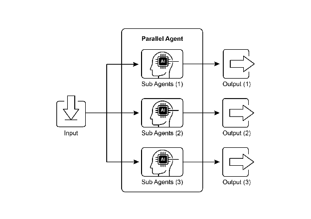

**并行执行：**
1. 同时搜索 A 和 B → 2. 同时总结 A 和 B → 3. 综合
<!-- fit -->
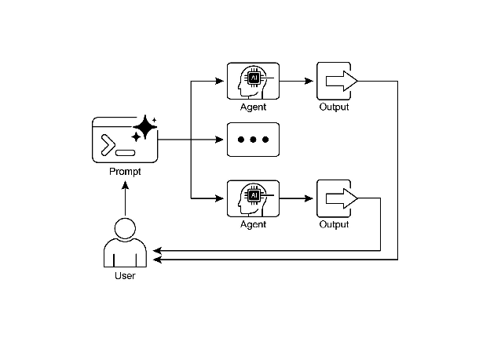

---

## 应用场景

1. **信息收集与研究**：同时搜索新闻、股票、社交媒体
2. **数据处理与分析**：同时进行情感分析、关键词提取、分类
3. **多 API 交互**：同时查询航班、酒店、活动、餐厅
4. **多组件内容生成**：同时生成主题、正文、图片、按钮
5. **验证与核实**：同时验证邮箱、手机、地址、不当内容

---

# 4. 反思 (Reflection)

## 定义

反思模式是指智能体**评估其自身工作、输出或内部状态**，并利用该评估来提升性能或优化响应。这是一种**自我纠正或自我改进机制**。

## 核心流程

1. **执行**：智能体执行任务或生成初始输出
2. **评估/评审**：智能体分析上一步结果（事实准确性、连贯性、风格、完整性）
3. **反思/优化**：基于评审意见确定改进方向
4. **迭代**：优化后的输出继续执行，反思过程可重复

## 生产者-评审者模型

- **生产者智能体**：专注于内容生成
- **评审者智能体**：评估输出，提出改进建议

这种关注点分离避免了"认知偏差"，产生更客观的结果。虽然单个智能体可执行自我反思，但使用两个专门智能体（或使用不同系统提示的两次独立LLM调用）通常会产生更稳健、更客观的结果
<!-- fit -->
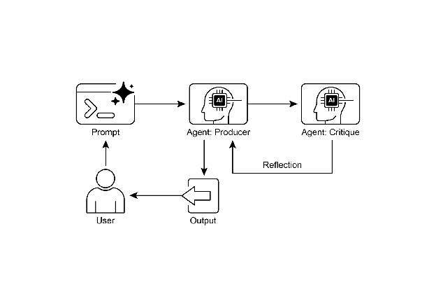

---

## 应用场景

1. **创意写作**：生成 → 评审流畅性/语气 → 重写
2. **代码生成与调试**：编写 → 运行测试 → 识别错误 → 修改
3. **复杂问题解决**：提出步骤 → 评估是否接近方案 → 回溯或调整
4. **摘要与信息综合**：生成摘要 → 对比原始文档 → 优化
5. **规划与策略**：生成计划 → 模拟执行 → 修订

---

---

# 🟧 第二块（第 5-8 章）：能力扩展与协同记忆

> 让 Agent 连接外部世界并形成协作体系，具备执行复杂任务的工程能力。

| 章节 | 核心问题 |
|------|----------|
| 5. 工具使用 | 如何连接外部世界扩展 Agent 能力？ |
| 6. 规划 | 如何让 Agent 自主制定多步行动路径？ |
| 7. 多智能体协作 | 如何通过分工解决单 Agent 瓶颈？ |
| 8. 记忆管理 | 如何让 Agent 跨轮次保持上下文？ |

---

# 5. 工具使用 (Tool Use)

## 定义

工具使用模式通过**函数调用（Function Calling）**机制实现，使智能体能够与外部 API、数据库、服务交互，甚至执行代码。工具调用是连接 LLM 推理能力与外部功能之间差距的技术机制。

<!-- fit -->
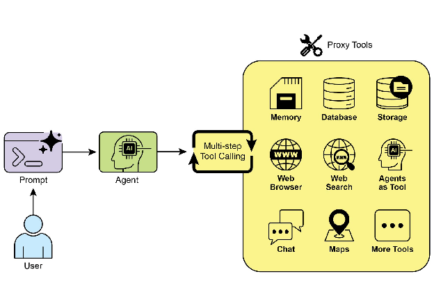

## 核心流程

1. **工具定义**：向 LLM 定义并描述外部函数及其参数
2. **LLM 决策**：LLM 决定是否需要调用工具来满足请求
3. **函数调用生成**：LLM 生成结构化输出（JSON），指定工具名称和参数
4. **工具执行**：智能体框架执行实际的外部函数
5. **结果返回**：工具输出返回给 LLM，用于最终响应

## 应用场景

- **信息检索**：天气 API、股票数据、实时查询
- **数据库交互**：查询、更新订单/库存/客户信息
- **计算执行**：数据分析、数学计算
- **通信发送**：发送邮件、消息
- **代码执行**：代码解释器、沙盒执行
- **系统控制**：智能家居、IoT 设备

---

# 6. 规划 (Planning)

## 定义

规划是指智能体**构思一系列行动，从初始状态向目标状态推进**的能力。规划智能体接受高层目标，自主生成实现目标的路径，而非执行预定义的固定脚本。

## 核心概念

- **目标定义**：明确最终要达成的状态
- **初始状态评估**：理解当前条件和约束
- **路径生成**：设计连接初始状态和目标状态的行动序列
- **适应性**：整合新信息、规避障碍、动态调整

## 关键原则

> 当问题的解决方案已被充分理解且可重复时，使用预定义工作流。当「方法」需要被发现时，使用动态规划。

## 应用场景

- **过程任务自动化**：新员工入职、复杂工作流编排
- **机器人导航**：状态空间遍历、路径优化
- **信息综合**：研究报告生成、多步问题解决
- **Deep Research**：迭代搜索-分析循环，系统性探索复杂主题

---

# 7. 多智能体协作

## 定义

多智能体协作模式通过将系统构建为由**不同专门化智能体组成的协作集合**来解决复杂任务。任务分解为离散的子问题，每个子问题分配给拥有最适合该任务的特定工具、数据访问或推理能力的智能体。

## 协作形式

- **顺序交接**：一个智能体处理任务并将其输出传递给下一个
- **并行处理**：多个智能体同时处理问题的不同部分
- **辩论与共识**：不同观点的智能体通过讨论达成共识
- **层次结构**：管理者智能体将任务委托给工作智能体
- **专家团队**：不同领域专家协作产生复杂输出
- **批评者-审查者**：一个智能体生成，多个批判性评估

## 通信模型

1. **单智能体**：自主运行，能力受限于单个智能体
2. **网络**：去中心化点对点通信，弹性好
3. **监督者**：中心协调，存在单点故障风险
4. **层次化**：多层组织结构，适合复杂问题分解

<!-- fit -->
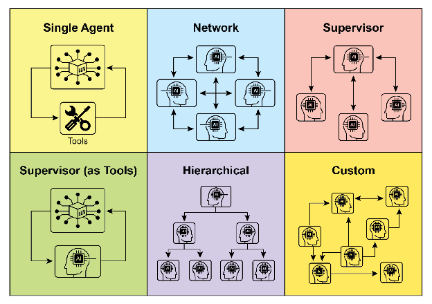

---

# 8. 记忆管理

## 定义

记忆管理使智能体能够利用**过去交互、观察和学习经验**来做出决策、维护对话上下文并持续改进。

<!-- fit -->
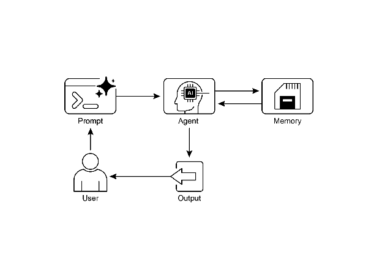

## 记忆类型

| 类型 | 说明 | 类比 |
|------|------|------|
| **短期记忆** | 上下文窗口中的当前/近期信息 | 工作记忆 |
| **长期记忆** | 持久化的知识和历史数据 | 长期知识库 |

## 短期记忆特点

- 存在于 LLM 上下文窗口中
- 容量有限，需要高效管理
- 会话结束即丢失
- 可通过总结旧对话片段优化

## 长期记忆特点

- 存储在智能体环境之外
- 数据库、知识图谱或向量数据库
- 支持语义搜索（相似性检索）
- 持久化，跨会话保留

---

---

# 🟦 第三块（第 9-12 章）：学习进化与系统治理

> 从能力提升到目标管理与异常恢复，让 Agent 在动态环境中稳定演进。

| 章节 | 核心问题 |
|------|----------|
| 9. 学习与适应 | 如何让系统随时间持续改进？ |
| 10. MCP | 模型与工具如何标准化通信？ |
| 11. 目标设定与监控 | 如何衡量和追踪 Agent 的进展？ |
| 12. 异常处理与恢复 | 如何让系统遇错后自愈而非崩溃？ |

---

# 9. 学习与适应

## 定义

学习和适应能力让智能体能够**通过经验和环境交互实现自主提升**，无需持续人工干预就能有效应对新情况并优化自身表现。
<!-- fit -->
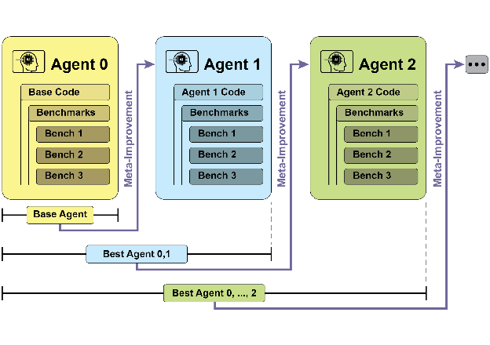

## 学习类型

- **强化学习 (RL)**：通过奖励/惩罚学习最优行为
- **监督学习**：从标注示例中学习输入-输出映射
- **无监督学习**：在未标注数据中发现隐藏模式
- **少样本/零样本学习**：利用 LLM 快速适应新任务
- **在线学习**：持续更新知识库适应动态环境
- **基于记忆的学习**：回忆过往经验调整行动

## 关键算法

- **PPO (近端策略优化)**：小幅、谨慎的策略更新，保持稳定性
- **DPO (直接偏好优化)**：直接在人类偏好数据上优化 LLM

## 案例研究

- **SICA**：自我改进编码智能体，能修改自身代码
- **AlphaEvolve**：Google 的算法发现智能体，利用 Gemini + 进化算法
- **OpenEvolve**：进化编码智能体，迭代优化代码


---

# 10. 模型上下文协议 (MCP)

## 定义

模型上下文协议（Model Context Protocol，MCP）是**标准化 LLM 与外部资源交互**的开放协议，作为开放标准，旨在标准化 Gemini、GPT、Mixtral、Claude 等 LLM 与外部应用程序、数据源和工具的通信方式。
<!-- fit -->
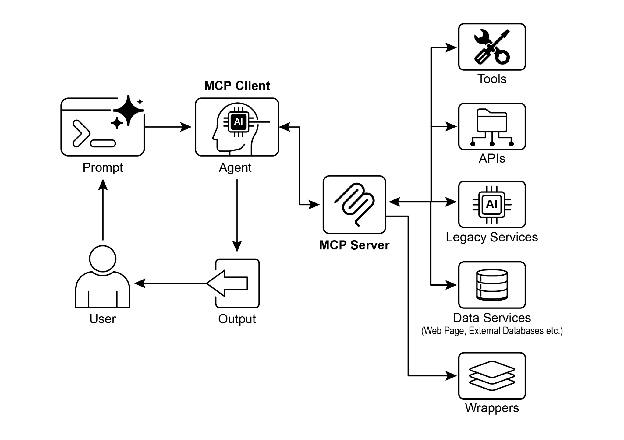


## MCP vs 工具函数调用

| 特性 | 工具函数调用 | MCP |
|------|------------|-----|
| **标准化** | 专有、供应商特定 | 开放标准化协议 |
| **范围** | 预定义函数的直接请求 | LLM 与外部工具的发现和通信框架 |
| **架构** | 一对一交互 | 客户端-服务器架构 |
| **发现** | 明确告知可用工具 | 动态发现可用工具 |
| **可重用性** | 与特定应用紧密耦合 | 可重用独立 MCP 服务器 |

## 架构组件

1. **LLM**：核心智能，处理请求，决定何时需要外部访问
2. **MCP 客户端**：应用程序/包装器，将 LLM 意图转换为 MCP 请求
3. **MCP 服务器**：外部网关，公开工具、资源和提示
4. **第三方服务**：实际执行操作的服务端点

## 应用场景

- 数据库集成
- 生成媒体编排
- 外部 API 交互
- 复杂工作流编排
- 物联网设备控制

---

# 11. 目标设定与监控

## 定义

目标设定与监控模式为智能体设定**具体的工作目标**，并为其配备**跟踪进度和确定目标是否已实现**的手段。
<!-- fit -->
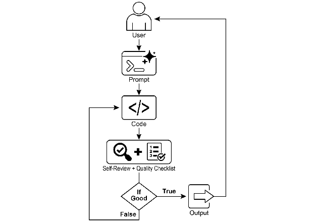

## 核心概念

- **目标定义**：明确最终要达成的状态
- **初始状态**：理解当前条件和约束
- **进度跟踪**：持续监控向目标推进的情况
- **成功判定**：确定目标是否已实现


## 应用场景

- **客户支持自动化**：解决客户查询为目标，监控对话和数据库
- **个性化学习系统**：提高学生理解为目标，监控练习进度
- **项目管理助手**：确保里程碑完成为目标，监控任务状态
- **自动交易机器人**：在风险范围内最大化收益为目标
- **机器人/自动驾驶**：安全抵达目的地为目标

## 与其他模式的关系

- **反思**：作为纠正引擎，利用监控反馈分析偏差
- **记忆**：提供历史上下文，支持目标评估
- **规划**：生成实现目标的行动序列

---

# 12. 异常处理与恢复

## 定义

异常处理和恢复模式专注于开发**极其耐用且有弹性的智能体**，即使面临各种困难和异常情况，也能保持不间断的功能和操作完整性。

<!-- fit -->
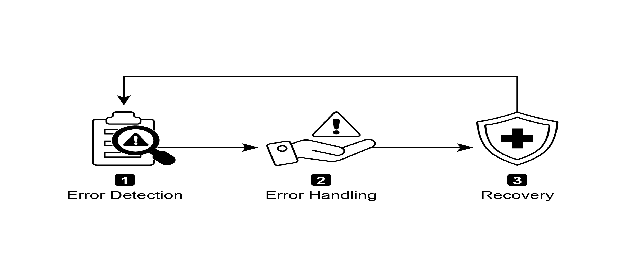

## 核心组件

| 阶段 | 说明 | 具体策略 |
|------|------|----------|
| **错误检测** | 识别出现的操作问题 | 验证工具输出、检查 API 错误码、使用超时 |
| **错误处理** | 制定深思熟虑的响应计划 | 日志记录、重试、回退、优雅降级、通知 |
| **恢复** | 将智能体恢复到稳定状态 | 状态回滚、诊断分析、自我纠正、问题升级 |

## 关键策略详解

- **重试**：对瞬态错误重复操作
- **回退**：使用替代策略或方法
- **优雅降级**：维持部分功能而非完全失败
- **状态回滚**：撤销最近的更改
- **自我纠正**：调整计划、逻辑或参数

## 应用场景

- **客户服务聊天机器人**：数据库故障时优雅提示用户
- **自动金融交易**：处理资金不足、市场关闭等错误
- **智能家居自动化**：网络/设备故障时通知并建议手动干预
- **数据处理智能体**：跳过损坏文件并报告

---

---

# 🟥 第四块（第 13-16 章）：人机协同与连接优化

> 建立人机协同和智能体协同机制，并在资源约束下实现高效运行。

| 章节 | 核心问题 |
|------|----------|
| 13. 人机协同（HITL） | 何时必须引入人工干预？ |
| 14. 知识检索（RAG） | 如何补齐模型的事实盲区？ |
| 15. A2A | 智能体之间如何互联互通？ |
| 16. 资源感知优化 | 如何平衡质量、时延与成本？ |

---

# 13. 人机协同 (HITL)

## 定义

人机协同（Human-in-the-Loop，HITL）模式**将人类认知的独特优势与 AI 的计算能力相结合**。核心原则是确保 AI 在道德边界内运行，遵守安全协议，并以最佳效率实现目标。

<!-- fit -->
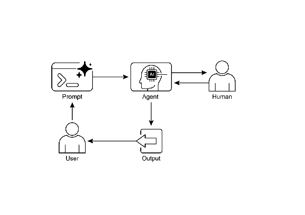

## 关键方面

- **人类监督**：监控 AI 性能和输出
- **干预和纠正**：AI 遇错时请求人工干预
- **学习反馈**：收集人类反馈用于完善 AI 模型
- **决策增强**：AI 提供分析和建议，人类做出最终决定
- **升级策略**：规定智能体何时及如何将任务升级给人类

## 注意事项

- **可扩展性不足**：人类操作员无法管理数百万任务
- **专业知识依赖**：人类操作员需专业培训
- **隐私问题**：敏感信息必须严格匿名化

## 应用场景

- 内容审核、自动驾驶、金融欺诈检测
- 法律文件审查、复杂客户支持、数据标注

---

# 14. 知识检索 (RAG)

## 定义

知识检索（RAG，即检索增强生成）使 LLM 能够**访问和整合外部信息、实时数据和特定上下文内容**，显著提高输出的准确性、相关性和事实基础。

## 核心概念

| 概念 | 说明 |
|------|------|
| **嵌入 (Embeddings)** | 文本的数值向量表示，捕捉语义含义 |
| **语义相似度** | 基于含义而非关键字匹配查找相关内容 |
| **文档分块** | 将大型文档分解为更小的可管理片段 |
| **向量数据库** | 专门存储和查询嵌入的数据库 |

## RAG 流程

1. 用户查询 → 2. 语义搜索知识库 → 3. 检索相关片段 → 4. 增强提示 → 5. LLM 生成

## Agentic RAG
代表了标准检索模式的复杂演进，将其从被动的数据管道转变为主动的、解决问题的框架。通过嵌入一个可以评估来源、协调冲突、分解复杂问题和使用外部工具的推理层，智能体显著提高了生成答案的可靠性和深度。这一进步使 AI 更加可信和有能力，尽管它带来了必须仔细管理的系统复杂性、延迟和成本方面的重要权衡。

|维度|TF-IDF|BM25|向量检索|混合检索|
|---|---|---|---|---|
|**核心逻辑**|**统计加权**  <br>词频越高、越稀有，分越高。|**概率优化**  <br>在 TF-IDF 基础上，增加了**长度惩罚**和**词频饱和**。|**语义映射**  <br>计算向量在空间中的几何距离（余弦相似度）。|**博采众长**  <br>BM25 的精准 + 向量的语义，加权融合。|
|**场景一：精准匹配**  <br>_(搜 "iPhone 15 Pro Max 价格")_|**表现一般**  <br>会匹配到包含这些词的文档，但如果有一篇长文堆砌了关键词，排名会虚高。|**表现优秀**  <br>能精准命中。即使文档很长，只要关键词密度合适，就能准确识别。|**表现较差**  <br>容易“自作聪明”。可能会召回“三星 S24 价格”或“华为 Mate 60 评测”，因为语义上它们都是“手机价格”，导致**精确匹配丢失**。|**表现完美**  <br>BM25 负责锁定“iPhone 15 Pro Max”这个专有名词，向量负责理解“价格”的意图。|
|**场景二：语义泛化**  <br>_(搜 "怎么修电脑")_|**失败**  <br>如果文档里写的是“计算机故障维修指南”，因为没有“修”和“电脑”这两个确切词，TF-IDF 可能完全搜不到。|**失败**  <br>同 TF-IDF，它依然依赖字面匹配，无法理解“电脑”和“计算机”是同一个东西。|**表现优秀**  <br>能轻松找到“计算机维修指南”或“笔记本故障排除”。因为它理解**语义相似性**。|**表现优秀**  <br>向量检索负责召回语义相关的文档，BM25 负责过滤掉不相关的噪音。|
|**场景三：短文本/停用词**  <br>_(搜 "是")_|**表现差**  <br>因为“是”在所有文档都出现，IDF 值极低，几乎搜不出任何有意义的结果。|**表现中等**  <br>通过 IDF 抑制了常见词权重，但依然很难处理纯虚词的搜索。|**表现不可控**  <br>单个字的向量很难表达明确语义，可能会搜出各种奇怪的哲学句子。|**表现稳健**  <br>通常会在预处理阶段过滤掉这类无意义词，或依赖向量检索的模糊匹配能力。|
|**缺陷/痛点**|1. **长度偏见**：长文档占便宜。  <br>2. **易作弊**：堆砌关键词就能排第一。|1. **语义盲区**：不懂同义词，不懂“言外之意”。|1. **精确度差**：分不清“小米手机”和“小米粥”。  <br>2. **算力贵**：需要 GPU 跑模型。|1. **架构复杂**：要维护两套索引（倒排+向量）。  <br>2. **重排序难**：需要调优权重参数。|

---

# 15. 智能体间通信 (A2A)

## 定义

Agent2Agent（A2A）协议是实现不同 AI 智能体框架间**通信与协作的开放标准**。确保互操作性，使不同框架（如 Google ADK、LangGraph、CrewAI）开发的智能体能协同工作。

A2A 获得了众多技术公司支持，包括 Atlassian、Box、LangChain、MongoDB、Salesforce、SAP 和 ServiceNow。Microsoft 计划将 A2A 集成到 Azure AI Foundry 和 Copilot Studio。

---

## 核心参与者

1. **用户**：发起对智能体的请求
2. **A2A 客户端**：代表用户请求操作或信息的应用程序
3. **A2A 服务器**：提供 HTTP 端点处理请求的 AI 智能体系统，以"不透明"方式运行

---

## Agent 卡片

智能体的数字身份文件（JSON 格式），包含：

| 字段 | 说明 |
|------|------|
| name/description | 智能体身份和描述 |
| url | 端点 URL |
| version | 版本号 |
| capabilities | 支持的功能（streaming、pushNotifications 等）|
| skills | 技能列表（id、name、description、examples、tags）|
| authentication | 认证要求 |

每个技能包含：输入/输出模式、示例用法、标签等。

---

## Agent 发现机制

| 策略 | 说明 | 适用场景 |
|------|------|----------|
| **标准 URI** | 在 /.well-known/agent.json 托管卡片 | 公共/自动化发现 |
| **精选注册表** | 集中目录管理 | 企业环境 |
| **直接配置** | 嵌入或私下共享 | 私有系统 |

---

## 通信和任务模型

- **任务**：异步工作单元，有唯一标识符，经历状态变化（已提交→工作中→已完成）
- **消息**：包含元数据（优先级、时间戳）+ 内容部分（文本、文件、JSON）
- **工件**：任务期间生成的有形输出
- **协议**：HTTP(S) + JSON-RPC 2.0
- **contextId**：多次交互中保持连续性

---

## 交互机制

| 机制 | 说明 | 适用场景 |
|------|------|----------|
| **同步请求/响应** | 客户端等待完整响应 | 快速即时操作 |
| **异步轮询** | 客户端轮询任务状态 | 长时处理任务 |
| **流式更新 (SSE)** | 服务器推送增量结果 | 实时更新 |
| **推送通知 (Webhook)** | 任务完成时通知 | 长时间运行任务 |

A2A 是模态无关的，支持文本、音频、视频等多模态交互。

---

## A2A 与 MCP 的关系

| 方面     | MCP           | A2A       |
| ------ | ------------- | --------- |
| **焦点** | 智能体与外部资源/工具交互 | 智能体间通信与协作 |
| **目的** | 提供上下文、数据、工具   | 发现能力、委派任务 |
| **关系** | 互补而非竞争        |           |

MCP 专注于智能体"知道什么"（上下文和工具），A2A 专注于智能体"能做什么"（相互协作）。

---

## 安全性

- **双向 TLS**：加密和认证连接
- **审计日志**：详细记录通信过程
- **Agent 卡片声明**：明确身份验证要求
- **凭据处理**：通过 HTTP 头传递 OAuth 2.0 令牌或 API 密钥

---

## 实际应用

- **多框架协作**：ADK、LangGraph、CrewAI 智能体相互通信
- **工作流编排**：数据收集→分析→报告生成的智能体协作
- **动态信息检索**：主智能体从专业数据获取智能体请求实时信息

---

# 16. 资源感知优化

## 定义

资源感知优化使智能体能够**动态监控和管理计算、时间和财务资源**。在动作执行方面做出决策，以便在指定资源预算内达成目标或优化效率。

## 核心策略

- **成本优化的 LLM 使用**：根据预算选择合适模型
- **延迟敏感操作**：选择更快但可能不全面的推理路径
- **服务可靠性回退**：主要模型不可用时自动切换
- **数据使用管理**：摘要数据检索而非完整下载

## 模型选择策略

| 场景 | 模型选择 | 原因 |
|------|----------|------|
| 简单查询 | Gemini Flash | 快速，成本效益高 |
| 复杂推理 | Gemini Pro | 更强大、深入分析 |
| 实时信息 | + 搜索工具 | 获取最新数据 |

## 分层智能体架构

- **规划层**：复杂 LLM (Pro) 处理高层决策
- **执行层**：经济 LLM (Flash) 处理重复任务

---

---

# 🟪 第五块（第 17-20 章）：推理安全与运营闭环

> 用更强推理解决复杂问题，用安全与评估守住边界，再通过优先级形成持续运营闭环。

| 章节 | 核心问题 |
|------|----------|
| 17. 推理技术（CoT / ToT / ReAct） | 如何提升复杂任务推理深度？ |
| 18. Guardrails / 安全模式 | 如何为 Agent 设置安全边界？ |
| 19. 评估与监控 | 如何度量 Agent 的真实效果？ |
| 20. 优先级排序 | 如何在多任务场景下调度资源？ |

---

# 17. 推理技术

## 定义

推理技术使智能体的**内部推理过程透明可见**，通过分配更多计算资源来处理复杂问题，显著提升准确性、连贯性和鲁棒性。

## 核心推理技术

| 技术 | 说明 | 特点 |
|------|------|------|
| **CoT (思维链)** | 生成中间推理步骤序列 | 将单步问题分解为多步 |
| **ToT (思维树)** | 探索多个推理路径形成树状结构 | 支持回溯、自我纠正 |
| **自我纠正** | 内部评估生成内容 | 识别模糊性，信息缺口 |
| **PALMs** | 结合 LLM 与符号推理 | 生成和执行代码 |
| **ReAct** | 推理与行动结合 | 边想边做，调用工具 |

---

## 思维链 (Chain-of-Thought, CoT)

CoT 提示词通过模拟逐步思考过程，显著增强了 LLM 的复杂推理能力。

<!-- fit -->
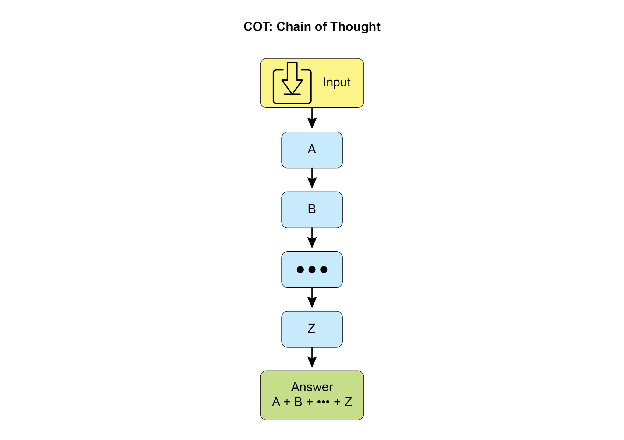

## CoT 核心优势

- **问题分解**：将困难的单步问题转化为一系列更简单的步骤
- **推理透明**：为理解模型决策过程提供宝贵见解
- **准确性提升**：在算术计算常识推理、符号操作等任务上表现显著提升

### 实现策略

1. **少样本示例**：提供展示逐步推理的示例
2. **显式指令**：简单指示模型"逐步思考"

---

## 思维树 (Tree-of-Thought, ToT)

ToT 允许 LLM 通过分支到不同的中间步骤来探索多个推理路径，形成树状结构。

<!-- fit -->
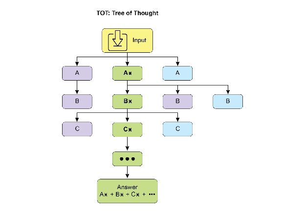

## ToT 核心特点

- **多路径探索**：支持发散思维，同时考虑多个解决方案
- **自我评估**：每个分支进行自我评分
- **回溯能力**：遇到死胡同可以返回重新选择
- **策略决策**：评估各种推理轨迹后确定最终答案

---

## 自我纠正 (Self-Correction)

自我纠正是智能体推理过程的关键方面，涉及对生成内容和中间思考过程的内部评估。

### 核心流程

1. **理解原始需求**：回顾导致内容创建的原始提示/要求
2. **分析当前内容**：仔细阅读现有内容
3. **识别问题**：查找准确性、完整性、清晰度、风格等问题
4. **提出改进**：为每个识别的弱点提出具体改进建议
5. **生成修订版**：整合所有必要的更改

### 实际应用

- 代码调试和生成
- 内容审查和优化
- 法律分析
- 战略规划

---

## PALMs (程序辅助语言模型)

PALMs 将 LLM 与符号推理能力相结合，允许在问题解决过程中生成和执行代码。

### 核心原理

- **混合架构**：结合 LLM 的理解能力与精确计算
- **代码生成**：将复杂计算、逻辑操作卸载到确定性编程环境
- **结果转换**：将执行结果转换为自然语言

### 实际案例

```python
coding_agent = Agent(
    model='gemini-2.0-flash',
    name='CodeAgent',
    code_executor=[BuiltInCodeExecutor],
)
```

---

## ReAct (推理与行动)

ReAct 将思维链提示词与智能体通过工具与外部环境交互的能力相结合。

<!-- fit -->
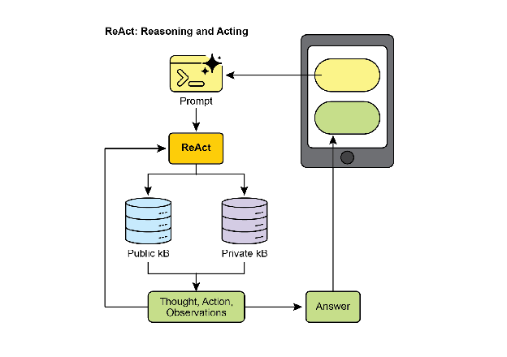

### 核心机制

- **思考**：Agent 制定计划，确定下一步行动
- **行动**：执行工具调用（如搜索、数据库查询）
- **观察**：获取行动结果并纳入后续推理

### 迭代循环

"思考 → 行动 → 观察 → 思考..."的循环允许智能体：
- 调整计划
- 纠正错误
- 实现需要多次交互的目标

---

## CoD (辩论链) 与 GoD (辩论图)

### 辩论链 (Chain of Debates, CoD)

微软提出的框架，多个不同模型协作和争论：
- 类似于 AI 委员会会议
- 不同模型提出初步想法，批评彼此推理
- 交换反驳论点

### 辩论图 (Graph of Debates, GoD)

将讨论重新构想为动态的、非线性网络：
- 论点是节点，关系是边（支持/反驳）
- 新的探究线索可以动态分支
- 结论通过识别最稳健的论点集群达成

---

## MASS 框架

多智能体系统搜索（Multi-Agent System Search）自动化和优化多智能体系统设计。

<!-- fit -->
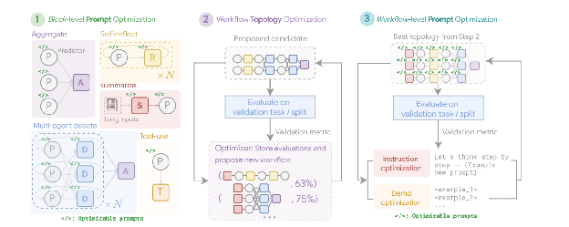

### 三阶段优化

| 阶段 | 做什么 | 目的 |
|------|--------|------|
| **块级提示词优化** | 优化单个智能体的提示词 | 确保每个"零件"本身高质量 |
| **工作流拓扑优化** | 搜索最佳协作结构 | 剪枝低效连接，保留高效路径 |
| **工作流级提示词优化** | 全局提示词微调 | 优化智能体相互依赖性 |

---

## 推理扩展定律

推理扩展定律揭示：模型的性能可预测地随着分配给它的计算资源的增加而提高。

### 核心原则

- **小模型可以实现优越结果**：通过增加推理时间的计算投资
- **关键策略**：指示模型生成多个潜在答案，然后使用选择��制识别最优输出
- **思考预算**：在推理期间应用的额外计算步骤或复杂算法

### 实际应用

| 因素 | 优化建议 |
|------|----------|
| **模型大小** | 较小的模型在内存和存储方面要求较低 |
| **响应延迟** | 战略性地应用计算以避免过度延迟 |
| **运营成本** | 在不提高成本的情况下优化性能 |

---

## 智能体的思考过程

Agent 的思考过程是一种结合推理和行动来解决问题的结构化方法。

### Think-Act-Observe 循环

1. **思考**：首先生成分解问题、制定计划的文本思考
2. **行动**：从预定义的选项集中选择一个行动（如搜索、检索）
3. **观察**：从环境接收反馈（搜索结果、网页内容）

### 核心能力

- **规划**：制定透明的、多步骤的计划
- **监控**：跟踪进展并评估每个步骤的效果
- **工具交互**：与外部工具和环境动态交互

---

## 框架对比

|框架|核心隐喻|推理模式|实战案例 (以"规划旅行")|缺点|
|---|---|---|---|---|
|**CoT**|**慢思考**|**线性步骤**  <br>一步步推导|一步步推导机票预算|无法使用工具，知识有滞后性|
|**ToT**|**下棋/谋略**|**多路径探索**  <br>发散思维，自我评估|探索多个旅行主题并自我评分|成本极高，速度慢|
|**ReAct**|**特工/工匠**|**思考+行动**  <br>边想边做，调用工具|调用搜索工具查询实时价格|依赖工具准确性|

---

## 关键要点

- **推理明确化**：使智能体能够制定透明的、多步骤的计划
- **ReAct 框架**：提供核心操作循环，使智能体能够与外部工具交互
- **推理扩展定律**：性能关乎分配的"思考时间"
- **CoT**：作为智能体内部独白，提供制定计划的结构化方法
- **ToT 和自我纠正**：赋予智能体审议能力，评估多个策略并改进计划
- **协作框架 (CoD)**：从单独智能体到多智能体系统的转变
- **Deep Research**：展示这些技术如何实现完全自主的复杂任务

---

# 18. Guardrails/安全模式

## 定义

Guardrails（防护栏）是**确保智能体安全、符合道德规范并按预期运行的关键机制**。作为保护层，引导智能体的行为和输出，防止有害、有偏见或其他不良响应。

<!-- fit -->
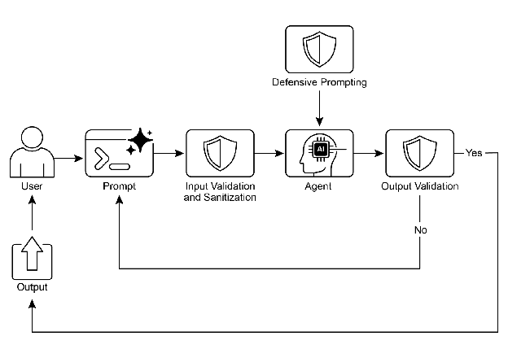

## 实施层级

1. **输入验证/清理**：过滤恶意内容
2. **输出过滤/后处理**：分析毒性或偏见
3. **提示词级别指令**：设置行为约束
4. **工具使用限制**：约束智能体能力
5. **外部审核 API**：智能体核心审核
6. **人机协同**：人工监督/干预

## 主要目的

- 确保稳健、可靠且有益的运行
- 防止操纵，维护道德和法律标准
- 构建负责任的 AI 系统

## 应用场景

- 客户服务聊天机器人、内容生成系统
- 教育导师、法律研究助手
- 招聘工具、社交媒体内容审核


---

# 19. 评估与监控

## 定义

评估和监控使智能体能够**系统地评估性能、监控目标进展、检测操作异常**。对智能体效率、效能和合规性进行持续测量。

![[images/chapter-19/image4.png]]

## 关键实践

- **实时性能跟踪**：监控准确性、延迟、资源消耗
- **A/B 测试**：系统比较不同智能体版本
- **合规性审计**：跟踪道德准则和监管要求
- **漂移检测**：检测性能何时退化
- **异常检测**：识别异常或意外操作

## 评估指标

- 事实正确性、流畅性、语法精确性
- Token 使用量、响应延迟
- LLM-as-a-Judge 主观评估

---

# 20. 优先级排序

## 定义

优先级排序模式使智能体能够**根据重要性、紧迫性、依赖关系和既定标准来评估和排序任务**，确保精力集中在最关键的任务上。

## 核心要素

- **标准定义**：建立评估规则（紧急性、重要性、依赖关系）
- **任务评估**：根据标准评估潜在任务
- **调度逻辑**：基于评估选择最佳行动
- **动态重排**：根据情况变化调整优先级

## 优先级层级

| 级别 | 说明 | 场景 |
|------|------|------|
| **P0** | 最高优先级 | 系统停机、安全问题 |
| **P1** | 高优先级 | 重要客户、高价值任务 |
| **P2** | 标准优先级 | 日常事务、常规请求 |

## 应用场景

- 自动化客户支持（紧急 > 高价值 > 日常）
- 云计算资源分配、实时交易
- 自动驾驶安全决策、网络安全警报

---

**下一章**：[2. Agent - 工程实践](2.%20Agent%20-%20工程实践.md)


