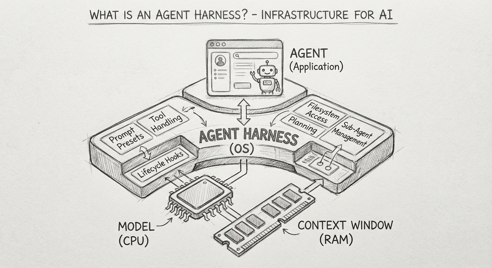

# Agent - 工程实践

## 章节目标

本章回答一个核心问题：**如何从零构建一个可运行、可信赖的 Agent？**

你将学到：

1. Agent 的工程化思维模型：Harness Engineering
2. 上下文工程：如何给模型喂正确的信息
3. 工具系统：如何设计可靠的 Tools & Skills
4. 记忆系统：如何让 Agent 不爆上下文还能持续工作
5. 规划与反思：如何让 Agent 完成多步骤复杂任务
6. 评估与可观测性：如何追踪、度量、调试 Agent
7. 安全与护栏：如何防止 Agent 犯破坏性错误
8. Human-in-the-Loop 设计：何时暂停、如何设计审批流
9. 成本与模型路由：生产级 Agent 的降本策略
10. 主流框架速览：LangChain / LangGraph / AutoGen

---

## 1. 工程思维：Agent = Model + Harness

**思考：**
- 只换个更强模型，为什么 Agent 还是经常翻车？
- 工程师到底要补哪一块，才能让 Agent 稳定干活？

### 1.1 什么是 Harness？

**Agent = Model + Harness**



> Harness = 模型之外的一切代码、配置和执行逻辑。

工程师的职责不再只是"写代码"，而是：

- **设计环境**：让模型能读懂、能操作的数字世界
- **明确意图**：给模型清晰的目标、约束和验收标准
- **构建反馈回路**：让模型能从结果中学习和自我修正

Harness 涵盖的工程层次：

| 层次          | 内容                         |
| ----------- | -------------------------- |
| 系统提示        | AGENTS.md、CLAUDE.md、角色定义   |
| 工具与协议       | Tools、MCP、技能包（Skills）      |
| 沙箱基础设施      | 文件系统、浏览器、隔离执行环境            |
| 编排逻辑        | 子智能体生成、handoff、模型路由        |
| 中间件 / Hooks | Compaction、续接、Lint 检查、权限拦截 |

### 1.2 六大工程原则

---

**原则一：仓库即记录系统（Repo as System of Record）**

> 将代码仓库视为 Agent 唯一的真理来源和长期记忆体。

**为什么这样做？**
Agent 没有持久记忆，每次会话都是"新生"。如果关键信息散落在 Slack、Wiki、口头约定里，Agent 就会在错误的假设下工作，产生无法复现的行为。仓库是唯一能让 Agent 跨会话"记住"事情的地方。

**怎么做：**
- 不在仓库里的东西，对 Agent 来说不存在
- Slack 讨论有结论？→ 提 PR 写进 ADR（Architecture Decision Record）
- 脑中的约定？→ 写进 AGENTS.md 并提交

**好处：**
- Agent 行为可复现：同一个仓库状态 → 同一套知识 → 可预期的执行结果
- 人类也受益：隐性知识显性化，新人 onboarding 更快
- 问题可追溯：出了 bug 可以 git blame 到是哪次更新改坏了 Agent 的行为

---

**原则二：地图而非手册（Map, Not Manual）**

> 不要把所有知识塞给模型，要给它一个清晰的导航结构。

**为什么这样做？**
直觉上会想"把规范写得越详细越好"——但巨型指令文件有三个死因：**挤占上下文**（把有效 token 用来堆文档）、**无法维护**（一处变更需要同步多处）、**无法验证**（模型承诺了但不会真正强制执行）。

**怎么做：**
- AGENTS.md ≈ 目录页（~100 行），只写"去哪找什么"
- 渐进式披露：入口 → 按需指向更深层文档
- 把"必须遵守"的规则转化为 lint 规则（原则三），而不是写在文档里

**好处：**
- 节省上下文：token 留给真正有用的任务信息
- 易维护：规则只在一个地方定义，不会出现版本漂移
- 模型更聚焦：精短的指令比啰嗦的手册更容易被模型正确理解

---

**原则三：机械化执行（Mechanical Enforcement）**

> 不要依赖模型的"自觉性"来遵守约束，要把约束变成代码层的自动检查。

**为什么这样做？**
"请注意不要修改生产配置"写在 prompt 里，模型大概率会遵守——直到某一次不遵守，造成严重事故。语言承诺的可靠性远低于代码约束的可靠性。

**怎么做：**
- 自定义 Linter：检查文件结构、命名规范、禁止的 import
- 结构测试：验证关键不变量（如 API 响应格式、数据库 schema 一致性）
- **关键技巧**：lint 错误信息里内嵌修复指令，让模型看到错误后能自我纠正

```bash
# 好的 lint 错误示例（模型可自我纠正）
Error: service/user.ts missing @injectable decorator
Fix: Add @injectable() above the class definition
See: docs/patterns/di.md#injectable
```

**好处：**
- 约束不会因 prompt 更新而失效（文档会腐烂，lint 规则不会）
- 模型可以自主修复，减少"人工检查循环"
- 错误在 CI 阶段暴露，不会进入生产

---

**原则四：Agent 可读性（Agent Readability）**

> 让模型能无障碍理解你的系统，让人类能无障碍理解模型的决策。

**为什么这样做？**
Agent 的"视力"取决于训练数据的覆盖度和代码的可读性。如果你用了一个冷门库、魔法配置或隐式约定，模型可能根本不知道如何正确操作，即使给了文档也效果有限。

**怎么做：**
- 优先选择"无聊"技术：API 稳定、社区大、训练集覆盖好（React > 冷门框架）
- 有时重新实现一个简单子集，比包装一个不透明的上游库更划算
- 让应用支持按 git worktree 启动：Agent 可以在隔离实例里安全实验
- 给 Agent 的决策留下可读痕迹（注释、日志、structured output）

**好处：**
- 降低幻觉率：模型用熟悉的技术出错的概率更低
- 调试更容易：人类能读懂 Agent 的推理过程，知道哪里出了问题
- 降低 onboarding 成本：新 Agent（新会话）能更快上手项目

---

**原则五：熵管理（Entropy as Garbage Collection）**

> 系统必须定期自动扫描，识别并清理不再有效的"数字垃圾"。

**为什么这样做？**
Agent 会复现它在仓库里看到的模式——包括坏模式。如果你有一段写于 3 年前的糟糕代码，Agent 会把这个糟糕模式复制到新代码里，因为它看到"这是项目里的惯例"。技术债不只拖慢人类，也会污染 Agent 的行为。

**怎么做：**
- 把"黄金规则"编码进仓库（最佳实践示例、禁用模式清单）
- 定期后台任务自动扫描偏差并提 issue／PR
- 对技术债采取"小额持续偿还"策略，而不是攒成大重构

**好处：**
- Agent 质量随仓库质量提升：好的代码库 → 好的 Agent 输出
- 防止"坏模式扩散"：一处糟糕代码不会通过 Agent 的复现蔓延到全库
- 团队保持对系统的理解：熵增是不可见的，定期扫描让"腐烂"变得可见

---

**原则六：人类掌舵，Agent 执行（Humans Steer, Agents Execute）**

> 人类时间是最稀缺的资源，要用在最值钱的地方。

**为什么这样做？**
一个常见误区是：Agent 出错了 → 写更长的 prompt → 还是出错 → 继续加 prompt。这条路走不通。真正的问题往往是：Agent 缺少某个上下文、某个工具、或某个约束——这是人类需要提供的设计决策，不是更多文字能解决的。

**职责边界：**

|     | 人类（掌舵）           | Agent（执行）           |
| --- | ---------------- | ------------------- |
| 做什么 | 意图、判断、伦理、审美、最终验收 | 路径规划、繁琐操作、信息检索、具体实施 |
| 时机  | 任务开始前、关键节点、完成后验收 | 执行过程中               |
| 出错时 | 重新设计环境/工具/约束     | 反思并重试               |

**好处：**
- 人类精力聚焦在真正需要判断力的地方
- Agent 在明确边界内自主执行，减少"问了一半就等待"的摩擦
- 出问题有清晰的归因路径：是上下文缺失？工具缺失？约束缺失？

---

## 2. 上下文工程（Context Engineering）

**思考：**
- 为什么模型有时不是不聪明，而是“没吃到对的信息”？
- 同样一个问题，喂不同上下文，结果为什么差这么大？

### 2.1 什么是上下文工程？

> 上下文工程 = 构建动态系统，为 LLM 规划和输送正确信息的技术学科。

**关键洞察**：模型的能力上限，往往取决于你给它提供的上下文质量，而不是模型本身。

### 2.2 四个核心部分

**1. 动态记忆系统**

AI 本身是无状态的（聊完就忘），上下文工程负责给它植入记忆：

- **短期记忆**：管理当前对话窗口，通过滑动窗口或摘要压缩，让 AI 不超出 token 限制
- **长期记忆**：利用向量数据库存储历史决策、用户偏好，当前会话可随时检索注入

**2. 外部知识接入（RAG）**

解决知识截止和幻觉问题：

- 用户提问时，先检索私有知识库 / 实时数据，把结果作为参考资料注入上下文
- 2026 趋势：GraphRAG（知识图谱），让 AI 理解复杂关联关系

**3. 工具与能力注入**

AI 需要"手"和"脚"来干活：

- 将 API、代码解释器、搜索等功能封装成模型可理解的格式（JSON Schema）
- **MCP（模型上下文协议）**：2026 年工具接入的主流标准，像 USB 接口一样统一工具接入方式

**4. 运行时优化**

上下文窗口有限且昂贵，必须精打细算：

- **上下文压缩**：提炼冗长文档为摘要，只保留关键信息
- **重排序（Re-ranking）**：检索到的信息按相关度重排，把最重要的放在最前面

### 2.3 上下文工程 vs 驾驭工程

|      | 上下文工程           | 驾驭工程                  |
| ---- | --------------- | --------------------- |
| 关注点  | 输入质量            | 输出可靠性                 |
| 核心问题 | 给 AI 看什么，它才能答对？ | 怎么管着 AI，它才不会闯祸？       |
| 主要技术 | RAG、记忆管理、提示词模板  | 工具调用逻辑、错误重试、安全护栏、流程编排 |

---

## 3. 工具系统（Tools & Skills）

**思考：**
- 为什么 Agent 明明会思考，但一调用工具就容易出错？
- 工具描述到底怎么写，模型才不乱用、少误用？

### 3.1 工具的本质

工具是 Agent 在环境中采取行动的接口。一个好的工具设计应该：

1. **名称和功能说明**：模型从名称就能判断何时使用
2. **参数简洁**：减少模型的决策负担
3. **错误可读**：失败时返回模型可以自我纠正的信息

### 3.2 工具描述的分层设计

工具描述（Tool Description）和提示词（Prompt）各司其职：

- **工具描述**：定义 AI 能做什么（能力边界）
- **提示词**：告诉 AI 何时做、为什么做（业务逻辑）

```
❌ 错误做法（在 Prompt 里重复技术细节）
"当用户需要搜索时，调用 search 工具，需要 query 参数，
 query 参数是字符串类型，不能为空，最大长度 100 字符..."

✅ 正确做法（Prompt 专注业务逻辑）
"当用户询问实时信息、最新数据或需要验证事实时，
 主动使用搜索工具获取准确信息。优先权威来源，
 确保信息时效性，结合上下文综合判断。"
```

### 3.3 Skills：可复用的领域知识包

工具是 Agent 的"手"，Skills 是 Agent 的"知识库"。

**Skills 的工程价值**：
- 把领域专有工作流封装成可复用的 `SKILL.md`
- 模型通过 `skill` 工具按需加载——不占用平时上下文
- 支持从本地目录、项目目录、远程 URL 多来源发现

**典型 Skill 结构**（以一个 Code Review 技能为例）：
[Specification - Agent Skills](https://agentskills.io/specification)

```
.agents/
  skills/
    code-review/
      SKILL.md          # 技能描述、工作流、注意事项
      checklist.md      # 可引用的检查清单
      examples/         # 示例
```

`SKILL.md` frontmatter：
```yaml
---
name: code-review
description: 执行完整的代码审查，覆盖安全、性能和可维护性
---
```

**Skills vs 工具**：

|      | 工具（Tool） | 技能（Skill）  |     |
| ---- | -------- | ---------- | --- |
| 本质   | 函数调用     | 知识 + 工作流注入 |     |
| 加载时机 | 始终可用     | 按需加载       |     |
| 内容   | 输入/输出参数  | 说明、流程、资源   |     |
| 修改方式 | 改代码      | 改 Markdown |     |

---

## 4. 记忆系统（Memory）

**思考：**
- 对话一长就忘事，Agent 的“记忆力”到底怎么补？
- 什么时候该保留原文，什么时候该压缩成摘要？

### 4.1 四种压缩策略

Agent 长程运行时，上下文会不断增长，最终溢出。四种应对策略：

**1. 摘要压缩（Summarization）**

在丢弃旧历史前，先调用模型总结成精炼摘要，用摘要替换原始对话。

- 优点：保留关键信息和决策脉络
- 类比：笔记本快写满时，先整理一页精华总结

**2. 滑动窗口（Sliding Window）**

只保留最近 N 轮对话，超出部分丢弃或先摘要再丢弃。

- 优点：实现简单，零额外开销
- 缺点：会按时间顺序丢弃，可能丢失早期重要信息

**3. 重要性过滤（Importance Filtering）**

按内容"价值"而非时间决定去留，通过规则或模型为每条消息打分。

- 优点：能保留跨越长时间的关键决策
- 类比：整理房间时按"是否有用"而不是按购买时间

**4. 结构化抽取（Structured Extraction）**

从对话中抽取关键信息（需求、决策、偏好）存入结构化长期记忆（JSON / 数据库）。

- 优点：持久化核心知识，超越单次会话长度
- 后续会话可检索并注入，实现真正的"长期记忆"

### 4.2 压缩触发机制

| 机制     | 说明                | 适用场景      |
| ------ | ----------------- | --------- |
| 阈值触发   | token 数超过预设值时自动压缩 | 简单、稳定的工作流 |
| 模型自主决策 | 由 Agent 判断最佳压缩时机  | 复杂的多步任务   |

**模型自主触发的典型场景**：
- 任务切换时（旧上下文不再需要）
- 子任务完成并确认后
- 进入复杂操作前（提前清理上下文）

### 4.3 完整上下文架构

```
[系统提示] + [长期记忆摘要] + [中期对话摘要] + [短期完整对话]
```

这种分层结构保证了：
- **短期工作区**（滑动窗口）：流畅的交互体验
- **中期缓冲**（摘要 + 重要性过滤）：保留历史脉络
- **长期知识库**（结构化抽取）：跨会话的持久记忆

---

## 5. 规划与反思（Planning & Reflection）

**思考：**
- 为什么让 Agent 直接开干，常常越做越偏？
- 怎么让它像人一样“先想计划，再复盘纠错”？

### 5.1 规划（Planning）

规划让 Agent 把大任务分解成可执行的步骤序列。

**关键设计问题**：
1. 一次性生成计划，还是边执行边调整？
2. 什么时候需要人工确认再执行？
3. 如何表示任务进度（todo list）？

**plan → build 双模式**（工程实践）：

```
Plan 模式：只读，生成计划，禁止修改文件
    ↓（用户确认）
Build 模式：执行，允许修改文件
```

这是解决"AI 乱改代码"问题的核心工程手段：**先规划后执行，中间插入人工确认**。

### 5.2 反思（Reflection）

反思让 Agent 在执行后自我评估，检测错误并再次尝试。

**典型反思循环**：

```
执行工具 → 观察结果 → 自我评估（是否符合预期？）
    ↑                          ↓
    ←←← 调整策略重试 ←←← 发现问题
```

**反思的工程前提**：
- 工具必须返回结构化的、模型可读的错误信息
- 系统要防止 doom loop（无限重试同一个失败动作）
- 设置最大重试次数作为熔断器

### 5.3 多 Agent 分工

复杂任务可以拆分给专门的子 Agent 并行处理：

```
主 Agent（Orchestrator）
    ├── 子 Agent A：代码搜索
    ├── 子 Agent B：文档生成
    └── 子 Agent C：测试运行
```

**分工原则**：
- 每个子 Agent 的职责单一且明确
- 通过 `task.ts` 委托任务，支持 task_id 续跑
- 结果汇总回主 Agent 再做最终决策

---

## 6. 主流框架速览

**思考：**
- LangChain、LangGraph、AutoGen 到底该怎么选，不踩坑？
- 什么时候该上框架，什么时候直接自建 Harness 更合适？

### 6.1 LangChain

- **定位**：工具 + 链 + Agent 的组合框架
- **适合**：快速搭原型，工具调用场景
- **核心概念**：Chain（链式调用）、Agent（工具使用）、Memory（记忆管理）

```python
from langchain.agents import initialize_agent, Tool
from langchain.llms import OpenAI

tools = [Tool(name="Search", func=search_fn, description="搜索互联网")]
agent = initialize_agent(tools, llm=OpenAI(), agent="zero-shot-react-description")
agent.run("今天上海天气怎么样？")
```

### 6.2 LangGraph

- **定位**：有状态的 Agent 工作流（图结构）
- **适合**：多步骤、有分支、需要人工确认节点的复杂工作流
- **核心概念**：Node（节点）、Edge（边）、State（全局状态）、Human-in-the-loop

```python
from langgraph.graph import StateGraph

graph = StateGraph(AgentState)
graph.add_node("plan", plan_fn)
graph.add_node("execute", execute_fn)
graph.add_node("reflect", reflect_fn)
graph.add_edge("plan", "execute")
graph.add_conditional_edges("execute", should_reflect, {"yes": "reflect", "no": END})
```

### 6.3 AutoGen

- **定位**：多 Agent 对话与协作
- **适合**：多个专家 Agent 互相讨论、辩论、分工的场景
- **核心概念**：AssistantAgent（执行者）、UserProxyAgent（人类代理）、GroupChat（多方对话）

```python
from autogen import AssistantAgent, UserProxyAgent

coder = AssistantAgent("coder", llm_config={"model": "gpt-4"})
reviewer = AssistantAgent("reviewer", system_message="你是严格的 code reviewer")
user = UserProxyAgent("user", human_input_mode="TERMINATE", code_execution_config={...})

user.initiate_chat(coder, message="用 Python 写一个二分查找")
```

### 6.4 框架选型建议

| 场景 | 推荐框架 |
|------|---------|
| 快速验证想法 / 原型 | LangChain |
| 复杂工作流 + 人工审批节点 | LangGraph |
| 多专家角色分工协作 | AutoGen |
| 生产级工具 Agent | 直接基于 Provider SDK + 自建 Harness |

---

## 7. 最小可用 Agent 实战

**思考：**
- 如果今天就开工，最小可用 Agent 应该先做哪几步？
- 怎么避免“一上来就做太大”，最后跑不起来？

### 7.1 从零搭建 Agent 的五步路径

按照从简到难的顺序逐步复刻：

**Step 1：工具层**
```python
# 定义工具接口
def read_file(path: str) -> str: ...
def write_file(path: str, content: str) -> str: ...
def run_shell(cmd: str) -> str: ...

tools = [read_file, write_file, run_shell]
```

**Step 2：权限层**
```python
# 每个工具执行前确认
def ask_permission(tool: str, args: dict) -> bool:
    return input(f"允许执行 {tool}({args})? [y/n] ") == "y"
```

**Step 3：执行状态机**
```python
class ToolState(Enum):
    PENDING = "pending"
    RUNNING = "running"
    COMPLETED = "completed"
    ERROR = "error"
```

**Step 4：ReAct 循环**
```python
while True:
    response = llm.chat(messages, tools=tools)
    if response.tool_calls:
        for call in response.tool_calls:
            if ask_permission(call.name, call.args):
                result = execute_tool(call)
            else:
                result = "用户拒绝执行"
            messages.append(tool_result(call.id, result))
    else:
        print(response.content)
        break
```

**Step 5：上下文压缩**
```python
def maybe_compact(messages: list, limit: int = 80000) -> list:
    if count_tokens(messages) < limit:
        return messages
    summary = llm.chat(messages, system="总结以上对话的关键信息")
    return [{"role": "assistant", "content": f"[摘要] {summary.content}"}]
```

### 7.2 系统提示最佳实践（AGENTS.md 模板）

```markdown
# 项目 Agent 配置

## 你是谁
你是一个帮助完成 [项目类型] 任务的工程 Agent。

## 仓库结构
[列出关键目录和它们的职责]

## 工作规范
- 修改文件前先读取当前内容
- 每次修改后运行相关测试
- 不确定时先规划，等用户确认再执行

## 禁止事项
- 不修改 /config/prod 下的配置
- 不执行破坏性的 shell 命令（rm -rf 等）
```

---

## 8. 评估与可观测性（Evaluation & Observability）

**思考：**
- Agent 出错时，为什么我们常常不知道错在哪一步？
- 不做追踪和评估，线上问题为什么越修越乱？

Agent 不像普通函数——输入相同、输出可能不同，且错误往往在第 7 步才暴露。没有可观测性，你就是在盲开飞机。

### 8.1 三层追踪体系

```
Trace（一次完整任务）
  └── Span（每个步骤）
        └── Event（每个工具调用 / LLM 请求）
```

每条 Trace 应记录：
- 起止时间、总 token 消耗、总成本
- 每步的输入 / 输出 / 耗时
- 工具调用结果（成功/失败/被拒绝）
- 用户确认节点的决策历史

### 8.2 关键度量指标

| 指标     | 含义                  | 健康基线        |
| ------ | ------------------- | ----------- |
| 任务完成率  | 不需要人工干预完成的比例        | > 70%（复杂任务） |
| 工具成功率  | 工具调用一次成功的比例         | > 90%       |
| 平均步骤数  | 完成任务所需工具调用轮次        | 视任务而定       |
| 上下文溢出率 | 触发 compaction 的任务比例 | < 20%       |
| 用户中断率  | 用户主动终止任务的比例         | < 10%       |

### 8.3 评估方法

**离线评估**：收集真实轨迹，构建"黄金集"（golden set）
- 用已知答案的任务集定期跑 regression
- 衡量输出质量：LLM-as-judge + 规则检查双重打分

**在线评估**：生产中的持续监控
- 追踪用户满意度信号（thumbs up/down、任务完成 / 放弃）
- 异常告警：步骤数超阈值、doom loop 检测、cost spike

**提示：可以用 LangSmith（LangChain 生态）、Arize、Langfuse 等工具快速接入追踪。**

---

## 9. 安全与护栏（Safety & Guardrails）

**思考：**
- Agent 权限一放开，最先可能出什么大事故？
- 护栏到底要加在哪几层，才不是“看起来安全”？

Agent 能写代码、能执行命令、能访问文件——意味着它也能犯破坏性的错误。

### 9.1 威胁模型

| 威胁        | 描述                    | 工程应对                         |
| --------- | --------------------- | ---------------------------- |
| 提示词注入     | 恶意内容通过工具输出劫持 Agent 行为 | 对工具输出做内容过滤，不直接信任外部数据         |
| 越权操作      | Agent 访问或修改超出预期范围的资源  | 路径白名单 + 权限三态（allow/deny/ask） |
| Doom Loop | Agent 无限重复同一失败动作      | 最大步骤熔断 + 重复动作检测              |
| 信息泄漏      | Agent 把系统提示或私有数据暴露给用户 | 输出过滤层，禁止特定模式                 |
| 幻觉执行      | Agent 对不存在的文件/函数调用工具  | 工具层参数校验 + 执行前预检              |

### 9.2 护栏设计分层

```
输入护栏（Input Guard）
  → 清洗 / 截断 / 过滤用户输入中的注入尝试

工具护栏（Tool Guard）
  → 执行前权限检查（allow / deny / ask）
  → 路径越权检测
  → 参数合法性校验

输出护栏（Output Guard）
  → 过滤敏感信息（密钥、PII）
  → 格式合规检查（如必须输出 JSON）
  → 有害内容检测
```

### 9.3 最小权限原则

**每个 Agent 只应拥有完成当前任务所需的最小权限。**

实践建议：
- Plan 模式：只读权限，禁止写操作
- Build 模式：按目录范围开放写权限
- 一次性授权 vs 持久授权分开管理
- 高风险操作（删除、部署、外部调用）始终要求显式确认

---

## 10. Human-in-the-Loop 设计

**思考：**
- 哪些步骤必须让人拍板，不能全自动？
- 审批点加太多很烦，怎么设计才不打断节奏？

Human-in-the-Loop（HITL）不是"没有自动化信心"的妥协，而是**主动设计的质量关卡**。

### 10.1 何时插入人工节点

| 场景     | 原因                           | 建议的暂停方式            |
| ------ | ---------------------------- | ------------------ |
| 不可逆操作前 | 删除文件、部署、发送消息                 | 强制确认，展示预览          |
| 超出权限范围 | Agent 需要访问未授权资源              | 请求临时授权             |
| 置信度低   | Agent 输出的 `<uncertainty>` 标记 | 暂停并附上不确定原因         |
| 计划完成后  | Plan 模式 → Build 模式切换         | 展示计划摘要，等待 go/no-go |
| 步骤数超阈值 | 任务比预期复杂                      | 汇报进展，询问是否继续        |

### 10.2 审批流设计模式

**同步审批**（适合关键路径）：
```
Agent 暂停 → 展示即将执行的动作 → 用户确认/修改/拒绝 → 继续
```

**异步审批**（适合批量操作）：
```
Agent 生成待办队列 → 用户批量审阅 → 批准后并发执行
```

**超时降级**（适合时间敏感）：
```
等待用户响应超过 N 分钟 → 降级为只读模式继续，或暂停并通知
```

### 10.3 减少不必要打断

打断太多会让用户疲劳，最终"全部同意"反而失去了 HITL 的价值。

- 学习用户的授权模式，相同场景自动复用历史决策
- 区分"需要你决策"和"通知你"——后者用日志不用打断
- 提供"本次任务内全部允许"的快捷选项（对应 `always` 规则）

---

## 11. 成本与模型路由（Cost & Model Routing）

**思考：**
- 为什么 Agent 一上线，最先爆的常常是成本？
- 怎么在效果不明显下降的前提下，把费用压下来？

生产级 Agent 不是一个模型包打天下，而是**按任务复杂度动态路由**。

### 11.1 成本驱动的分层策略

```
简单查询 / 格式转换    → 小模型（GPT-4o-mini, Haiku）：$0.1/M tokens
标准工具调用           → 中等模型（GPT-4o, Sonnet）：$3/M tokens
复杂规划 / 架构决策    → 旗舰模型（o3, Opus）：$15+/M tokens
```

**路由决策因子**：
- 任务类型（分类/生成/推理/代码）
- 所需工具数量
- 上下文长度
- 失败代价（高风险任务用更强模型）

### 11.2 三个降本手段

**1. 提示词缓存（Prompt Caching）**

系统提示和 Skills 内容固定不变，开启 provider 的 prompt caching 可节省 50-90% 的 token 费用。

**2. 工具输出截断**

工具输出不加控制会迅速消耗 token。原则：
- 只返回模型需要的信息，不返回原始大文件
- 文件读取加行数上限（如默认 2000 行）
- 搜索结果做摘要后再注入上下文

**3. 任务分解降档**

把大任务拆分给子 Agent：
- 旗舰模型负责规划和最终决策
- 小模型负责文件读取、格式化、重复性步骤

### 11.3 成本监控基线

每次任务完成后记录：
- `input_tokens + output_tokens`
- `cache_hit_tokens`（节省了多少）
- `cost_usd`

设置 per-task 和 per-day 的 cost budget，超限自动降级或告警。

---

## 12. 本章小结

**思考：**
- 这一章讲完后，落地时最该先改哪三件事？
- 如何判断团队已经从“提示工程”进入“Agent 工程”？

工程化 Agent 的核心不是"找到最好的模型"，而是**构建一个让模型能可靠工作的 Harness**。

三个关键工程价值：

1. **可追踪**：事件驱动的执行状态，每步行动有记录
2. **可治理**：权限系统拦截高风险动作，人工确认关键节点
3. **可持续**：上下文压缩 + 结构化记忆，长程任务不崩溃

**从"提示工程师"到"Agent 工程师"的核心跨越**：
> 不再只是写更好的 Prompt，而是设计让 AI 能可靠执行的环境、工具和反馈回路。

---

**下一章**：[3. Agent - 实例讲解（OpenCode 实战）](3.%20Agent%20-%20实例讲解.md)
