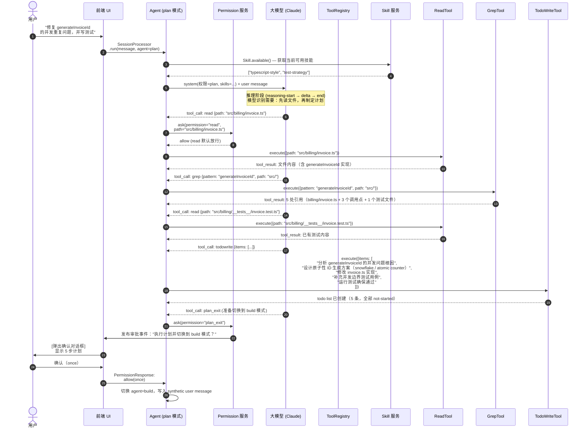
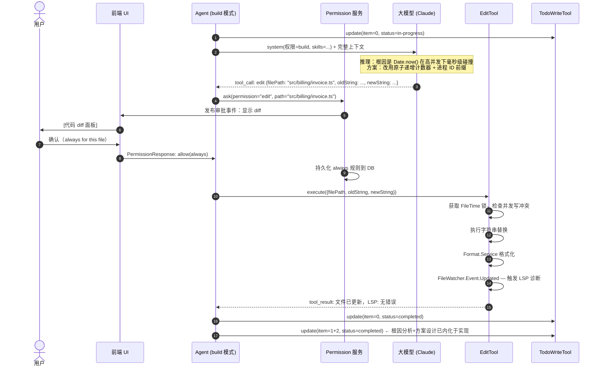
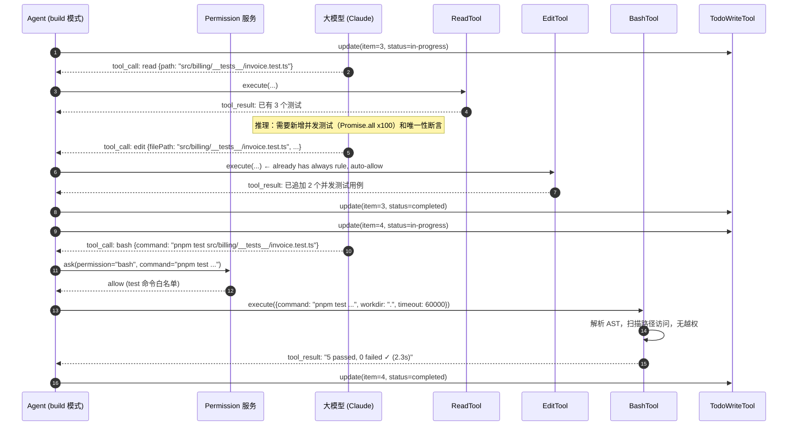
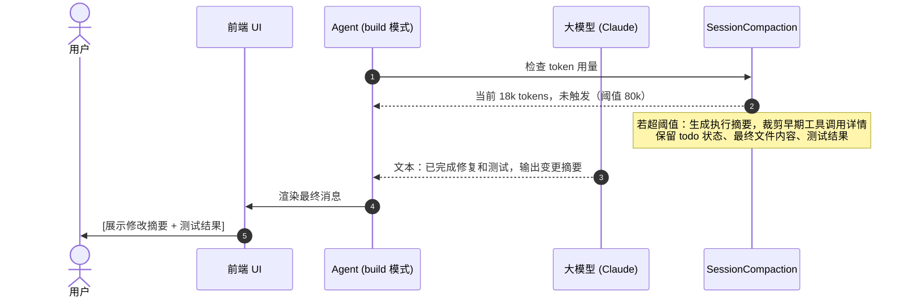
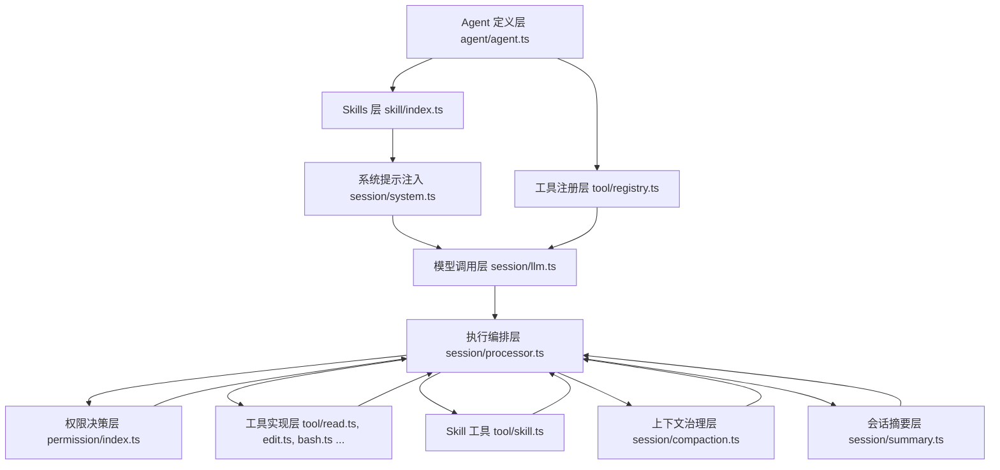

# Agent - 实例讲解（OpenCode 实战，基于真实源码）

## 章节目标

本章不讲“伪代码版 Agent”，而是基于 **OpenCode（sst/opencode, branch: 2.0）** 的真实实现，拆解一个工业级 Coding Agent 的关键模块。

你将学到：

1. OpenCode 的真实模块边界与运行链路（Tool、Skill、Session、Permission、Agent）
2. 工具系统如何注册、过滤、执行、回写结果
3. Skills 如何做领域能力注入与工作流复用
4. 计划模式（plan）与执行模式（build）如何通过权限切换
5. ReAct 循环在真实代码里的事件驱动实现
6. 主流大模型 API 接口核心差异与生产级踩坑指南
7. 如何从源码出发手搓一个最小可用 Agent

---

## 0. 代码基线与阅读方式

### 仓库基线

- 仓库：`https://github.com/sst/opencode`
- 课程基线：`2.0` 分支

### 本章阅读主路径

- `packages/opencode/src/tool/*`
- `packages/opencode/src/session/*`
- `packages/opencode/src/agent/agent.ts`
- `packages/opencode/src/permission/index.ts`

---

## 1. OpenCode 架构总览（真实模块）

OpenCode 的核心不是“一个大 Agent 类”，而是多个服务协作：

1. **Agent**：定义代理类型（build/plan/general/explore）及权限基线
2. **ToolRegistry**：组装工具池（内置工具 + 插件工具 + 特性开关）
3. **Skill Service**：发现并加载技能目录，向模型注入可用技能上下文
4. **SessionProcessor**：处理 LLM 流式事件、工具调用生命周期、中断与继续
5. **Permission**：统一权限判定（allow/deny/ask）与用户交互审批
6. **SessionCompaction / SessionSummary**：上下文压缩与历史摘要，防止上下文溢出

这对应源码中的真实目录：

- `packages/opencode/src/agent`
- `packages/opencode/src/tool`
- `packages/opencode/src/skill`
- `packages/opencode/src/session`
- `packages/opencode/src/permission`

---

## 2. 模块一：Tools（真实工具系统）

## 2.1 工具注册中心：`tool/registry.ts`

真实入口是 `ToolRegistry.layer`，它会：

1. 初始化内置工具（`bash/read/glob/grep/edit/write/task/todowrite/webfetch/...`）
2. 扫描项目目录下 `tool`/`tools` 脚本，动态加载自定义工具
3. 合并插件工具（`Plugin.Service`）
4. 根据 Feature Flag 控制工具是否暴露（如 `lsp`、`plan_exit`）

关键点：OpenCode 不是把工具“写死在 prompt”，而是通过注册中心动态组装可用工具集。

## 2.2 ReadTool（`tool/read.ts`）

真实实现能力（并非简单 `open().read()`）：

1. 支持文件与目录两种读取模式
2. 默认行数上限：`2000`（`DEFAULT_READ_LIMIT`）
3. 行长度截断与输出体积控制（`MAX_LINE_LENGTH`、`MAX_BYTES`）
4. 二进制文件保护与图片/PDF 特殊处理（返回附件）
5. 读取前触发权限询问：`ctx.ask(permission: "read")`

## 2.3 EditTool（`tool/edit.ts`）

真实实现链路：

1. 参数校验：`filePath/oldString/newString`
2. 通过 `assertExternalDirectoryEffect` 检查外部目录越权
3. 通过 `ctx.ask(permission: "edit")` 进行权限确认
4. 使用 `FileTime` 锁 + 断言，避免并发写冲突
5. 写入后自动格式化（`Format.Service`）
6. 发布文件变更事件（`FileWatcher.Event.Updated`）
7. 触发 LSP 诊断并把错误回给模型

这比课程里常见的“replace 一下字符串”工程强度高得多。

## 2.4 BashTool（`tool/bash.ts`）

真实 Bash 工具不是直接 `shell=True`：

1. 解析命令 AST（`web-tree-sitter`）
2. 抽取潜在文件/目录访问路径，先做权限扫描
3. 区分 PowerShell 与 POSIX 行为
4. 执行前调用 `ctx.ask(permission: "bash")`
5. 支持 timeout / workdir / 命令描述等参数

这解释了为何 OpenCode 的 shell 执行可控且可审计。

## 2.5 任务与待办工具

- `tool/task.ts`：把任务委托给子 agent，支持 `task_id` 续跑
- `tool/todo.ts`（`todowrite`）：维护结构化 todo 列表，支持会话内状态更新

这两个工具让 Agent 具备“跨轮计划推进”能力，而不是一次性输出。

---

## 3. 模块二：Skills（领域能力注入）

Skills 不是“提示词片段收藏夹”，而是 OpenCode 里可发现、可治理、可加载的能力模块。

## 3.1 Skill 服务：`skill/index.ts`

`Skill.Service` 的真实职责：

1. 从多个来源扫描并加载 `SKILL.md`（全局目录、项目目录、配置路径、远程 URL）
2. 校验 frontmatter（`name`、`description`）并去重同名技能
3. 维护 `skills` 与 `dirs` 状态，支持 `get/all/available` 查询
4. 按 agent 权限过滤可见技能（deny 的 skill 不会暴露给模型）

## 3.2 Skill 工具：`tool/skill.ts`

`SkillTool` 的真实执行链路：

1. 动态生成工具描述，列出当前可用 skills
2. 执行前走权限询问：`permission: "skill"`
3. 按技能名加载内容，返回 `<skill_content name="...">` 块
4. 同时返回技能目录和采样文件列表，便于模型按相对路径调用资源

## 3.3 系统提示注入：`session/system.ts`

OpenCode 会在 system prompt 中注入技能清单：

1. `SystemPrompt.skills(agent)` 获取当前 agent 可用技能
2. 当 `skill` 权限被禁用时，不注入技能段落
3. 通过 `Skill.fmt(..., { verbose: true })` 输出结构化技能信息

这保证了技能是“按权限暴露、按需加载、可审计调用”的。

---

## 4. 模块三：Planning（计划模式与代理切换）

OpenCode 的“规划”不是单独一个 Planner 类，而是通过 **agent mode + permission** 落地。

## 4.1 代理定义：`agent/agent.ts`

内置代理包含：

1. `build`：默认执行代理，允许工具执行与修改
2. `plan`：规划模式，默认拒绝 edit 类操作
3. `general` / `explore`：子代理，用于检索与并行复杂任务

其中 `plan` 的权限策略明确“禁改文件，只做规划”。

## 4.2 计划完成切换：`tool/plan.ts`

`plan_exit` 工具会：

1. 询问用户是否从 plan 切到 build
2. 若同意，写入一条 synthetic user message
3. 引导进入“执行计划”阶段

这是真实的“先规划后执行”工程闭环，而不是概念示意图。

---

## 5. 模块四：Memory（会话记忆与压缩）

OpenCode 的记忆重点在 **会话上下文管理**，核心在 `session/*`。

## 5.1 SessionSummary：`session/summary.ts`

- 通过 snapshot diff 统计本会话文件改动（additions/deletions/files）
- 生成会话摘要并写入存储
- 为后续上下文压缩和回溯提供结构化基础

## 5.2 SessionCompaction：`session/compaction.ts`

当上下文接近溢出时：

1. 触发 compact 流程
2. 生成“继续工作所需摘要”而非原样保留全部历史
3. 可对旧工具输出做 prune（保留必要信息，释放 token）

这部分是工业级 Agent 的关键能力：**不爆上下文还能持续工作**。

## 5.3 Todo 作为执行记忆

`todowrite` + Session 让模型保留任务进度状态，支持：

- 已完成/进行中/未开始
- 跨多轮执行一致推进

---

## 6. 模块五：Execution（执行器）

执行主循环在 `session/processor.ts`，采用流式事件驱动。

核心事件包括：

1. `reasoning-start/delta/end`
2. `tool-input-start`
3. `tool-call`
4. `tool-result`
5. `tool-error`

执行器负责：

1. 创建与更新 ToolPart 状态（pending/running/completed/error）
2. 调用 `completeToolCall` / `failToolCall` 回写工具结果
3. 处理中断、重试、上下文压缩触发
4. 防止 doom loop（重复相同工具调用）

这就是 OpenCode 的真实“工具执行状态机”。

---

## 7. 模块六：Permission（权限系统）

权限系统并不是散落在每个工具里，而是统一在 `permission/index.ts`。

## 7.1 三态决策

每条规则输出：

- `allow`
- `deny`
- `ask`

工具在执行前统一调用 `Permission.ask(...)`，再由系统发布事件并等待用户回复。

## 7.2 可持续规则

用户可回复：

- `once`：仅本次允许
- `always`：后续匹配自动放行
- `reject`：拒绝执行

并可把规则持久化到项目级（数据库中的 permission 表）。

这使 OpenCode 在安全和效率之间实现可配置平衡。

---

## 8. 模块七：ReAct 循环（真实实现）

OpenCode 的 ReAct 不是写在论文里的“Thought/Action/Observation”字符串，而是事件化实现：

1. **Reasoning**：`reasoning-*` 事件流
2. **Action**：`tool-call`
3. **Observation**：`tool-result/tool-error`
4. **Next Step**：继续、停止或触发 compaction

对应核心文件：

- `session/llm.ts`：模型流式输出与工具调用入口
- `session/processor.ts`：事件消费与状态推进

这套实现让 ReAct 可追踪、可审计、可恢复。

---

## 9. 从源码到实战：最小复刻路径

如果你要“从零手搓一个 OpenCode 风格 Agent”，建议按这个顺序复刻：

1. 先做 Tool 接口 + Registry（至少 read/edit/bash）
2. 再做 Permission 三态（allow/deny/ask）
3. 做 SessionProcessor 的工具状态机（pending/running/completed/error）
4. 加 Todo 工具形成任务推进闭环
5. 加 Skill Service + SkillTool，支持领域知识按需加载（写一个本地 SKILL.md 验证）
6. 最后补 Context Compaction（防 token 溢出）

---

## 10. 主流大模型 API 接口差异全解析

> 一个工业级 Agent 需要对接多个 LLM Provider。这节解析真实工程里最容易踩坑的接口差异，以及 OpenCode 是如何处理这些差异的。

### 10.1 核心接口对比

| 维度 | Anthropic (Claude) | OpenAI (GPT/o系列) | Google (Gemini) | AWS (Bedrock) |
|------|------|------|------|------|
| **工具调用格式** | `tool_use` / `tool_result` | `function_calling` / `tool_messages` | `functionCall` / `functionResponse` | 依底层模型，通常兼容 Anthropic 格式 |
| **流式协议** | Server-Sent Events（`event: content_block_delta`） | SSE（`data: {"choices":[...]}`） | SSE（`data: {"candidates":[...]}`） | 同 Anthropic |
| **系统提示** | 独立 `system` 参数（顶层字段） | `messages[0].role = "system"` | `systemInstruction` 字段 | 同 Anthropic |
| **推理/思考** | `thinking` 块（`budget_tokens`） | `reasoning_effort: "low/medium/high"` | `thinkingConfig.thinkingBudget` | 不支持 |
| **最大输出 token** | `max_tokens`（必填） | `max_completion_tokens` | `maxOutputTokens` | 同 Anthropic |
| **提示词缓存** | `cache_control: {"type":"ephemeral"}` | 自动（无需显式标记） | 无原生支持 | 部分支持 |
| **多模态输入** | `type: "image"` 含 base64/URL | `type:"image_url"` | `inlineData` / `fileData` | 同 Anthropic |

### 10.2 工具调用格式差异（最常见踩坑点）

**Anthropic 格式**：
```json
// 模型输出
{
  "type": "tool_use",
  "id": "tool_abc123",
  "name": "read_file",
  "input": { "path": "src/index.ts" }
}

// 工具结果回传
{
  "role": "user",
  "content": [{
    "type": "tool_result",
    "tool_use_id": "tool_abc123",
    "content": "file contents here..."
  }]
}
```

**OpenAI 格式**：
```json
// 模型输出
{
  "tool_calls": [{
    "id": "call_abc123",
    "type": "function",
    "function": {
      "name": "read_file",
      "arguments": "{\"path\": \"src/index.ts\"}"  // 注意：字符串而非对象
    }
  }]
}

// 工具结果回传（专用 role）
{
  "role": "tool",
  "tool_call_id": "call_abc123",
  "content": "file contents here..."
}
```

**关键差异**：
1. OpenAI 的 `arguments` 是 **JSON 字符串**，需要 `JSON.parse()`；Anthropic 的 `input` 直接是对象
2. OpenAI 用专用 `role: "tool"` 回传结果；Anthropic 把工具结果塞回 `role: "user"` 的消息里
3. 工具调用 ID 字段名不同：`id` vs `tool_calls[].id`

### 10.3 流式事件格式差异

**Anthropic SSE 事件序列**（以工具调用为例）：
```
event: content_block_start
data: {"type":"content_block_start","index":0,"content_block":{"type":"tool_use","id":"...","name":"read_file","input":{}}}

event: content_block_delta
data: {"type":"content_block_delta","index":0,"delta":{"type":"input_json_delta","partial_json":"{\"path\":"}}

event: content_block_stop
data: {"type":"content_block_stop","index":0}

event: message_stop
data: {"type":"message_stop"}
```

**OpenAI SSE 事件序列**：
```
data: {"choices":[{"delta":{"tool_calls":[{"index":0,"id":"call_abc","function":{"name":"read_file","arguments":""}}]}}]}

data: {"choices":[{"delta":{"tool_calls":[{"index":0,"function":{"arguments":"{\"path\":"}}]}}]}

data: [DONE]
```

**OpenCode 的处理方式**（`session/llm.ts`）：用 provider 适配层把不同 SSE 格式标准化为内部事件（`tool-input-start` / `tool-call` / `tool-result`），上层 `session/processor.ts` 只消费内部事件，不感知底层 provider 差异。

### 10.4 系统提示位置差异

这是最容易出 bug 的差异之一：

```typescript
// Anthropic: system 是顶层独立字段
const response = await anthropic.messages.create({
  model: "claude-opus-4-5",
  system: "你是一个工程 Agent...",   // ← 独立 system 参数
  messages: [{ role: "user", content: "..." }],
  max_tokens: 4096
})

// OpenAI: system 是 messages 数组的第一条
const response = await openai.chat.completions.create({
  model: "gpt-4o",
  messages: [
    { role: "system", content: "你是一个工程 Agent..." },  // ← 混在消息里
    { role: "user", content: "..." }
  ],
  max_completion_tokens: 4096
})

// Gemini: 独立字段但名称不同
const response = await gemini.generateContent({
  systemInstruction: "你是一个工程 Agent...",  // ← 又是另一个字段名
  contents: [{ role: "user", parts: [{ text: "..." }] }]
})
```

### 10.5 推理模式（Thinking）差异

三大 provider 对"让模型先思考再回答"的支持方式完全不同：

| Provider | 开启方式 | 思考过程可见性 | 成本影响 |
|---|---|---|---|
| **Anthropic** | `thinking: { type:"enabled", budget_tokens: 8000 }` | 返回 `thinking` 类型的 content block | 思考 token 按正常价计费，但有独立缓存 |
| **OpenAI** | `reasoning_effort: "low"/"medium"/"high"` | 不暴露思考过程（内部处理） | high 模式成本显著更高 |
| **Gemini** | `thinkingConfig: { thinkingBudget: 8192 }` | 返回 `thought: true` 的 parts | 部分模型支持 |

**工程建议**：如果你的 Agent 工作流依赖"看到模型的推理步骤来做条件分支"，目前只有 Anthropic 是可靠的。OpenAI 和 Gemini 的推理过程是黑盒。

### 10.6 重试与降级策略（参考 Claude Code 实践）

来自 Claude Code (`withRetry.ts`) 的生产级重试数据：

| 错误码 | 含义 | 最佳实践 |
|---|---|---|
| **429** | 速率限制 | 指数退避（500ms × 2^n），加 ±25% jitter 防雷群效应 |
| **529** | 过载（Anthropic 特有） | 连续 3 次 → 自动降级到 Sonnet，前台请求才重试（后台任务直接放弃） |
| **413 / 400 prompt_too_long** | token 超限 | 捕获后自动 compact 上下文再重试 |
| **503 / 502** | 服务不可用 | 最多重试 10 次，总等待约 2.5 分钟 |

**双重看门狗（流式连接专用）**：
- **Idle 看门狗**：90 秒无事件 → 强制中断并降级到非流式模式（45 秒时先发警告）
- **Stall 检测**：两个 chunk 间隔 > 30 秒 → 记录日志（不中断，因为模型可能只是在思考）

### 10.7 提示词缓存：省钱的关键

| Provider | 缓存方式 | 节省比例 |
|---|---|---|
| **Anthropic** | 显式标记 `cache_control: {type:"ephemeral"}`，命中后 input token 价格降 90% | 50-90%（取决于命中率） |
| **OpenAI** | 自动（>1024 tokens 的 prefix 自动缓存），价格降 50% | 0-50%（不可控） |
| **Gemini** | 需要创建 `CachedContent` 对象，适合超长静态内容 | 75%+（但有最低计费时长） |

**实践**：把系统提示、Skills 内容、大型文件内容放在消息的最前面（Anthropic）或保持前缀稳定（OpenAI），最大化缓存命中率。

### 10.8 OpenCode 的 Provider 适配设计

OpenCode 通过 `session/llm.ts` 的 provider 适配层，将所有 provider 的差异封装在同一个接口后面：

```
Provider 适配层（session/llm.ts）
  ├── Anthropic SDK   → 标准化内部事件（reasoning-start / tool-call / tool-result）
  ├── OpenAI SDK      → 同上
  ├── Gemini SDK      → 同上（部分功能受限）
  └── Bedrock         → 通常复用 Anthropic 格式
                           ↓
               session/processor.ts
               （只消费内部事件，不感知 provider）
```

**系统提示的多 provider 适配**（`session/system.ts`）：
针对不同 provider 选择不同的系统提示词模板（`PROMPT_ANTHROPIC`、`PROMPT_GPT`、`PROMPT_GEMINI`），因为同样的行为指令对不同模型效果不同——这直接对应 ch07 里的"模型特定调优"思想。

---

## 11. 综合实战案例：用户请求"修复一个 Bug 并写测试"的完整执行流程

> 这是一个贴近真实场景的端到端走查。不讲概念，只看每一步发生了什么、谁在做决定、信息如何流动。

### 11.1 场景描述

**用户输入**：
```
我在 src/billing/invoice.ts 里有一个生成发票编号的函数 generateInvoiceId，
但是在并发请求下会出现重复编号。请帮我修复这个 bug，
并为修复后的版本写单元测试。
```

**涉及的能力**：Plan 模式（先规划）→ Build 模式（执行）→ Tools（read/grep/edit/bash）→ Skills（项目技术栈规范）→ Permission（审批写操作）→ Todo（任务推进）→ Compaction（长对话保活）

---

### 11.2 完整时序图

#### 11.2.1 Step 1-3：Plan 模式分析与计划确认



#### 11.2.2 Step 4：Build 模式执行修复



#### 11.2.3 Step 5-6：补测试并执行验证



#### 11.2.4 Step 7-8：上下文压缩检查与最终回复



---

### 11.3 逐步解析

#### Step 1 — 进入 Plan 模式：先想清楚再动手

用户消息进入后，系统首先以 **`plan` agent** 启动。这不是偶然设计：

- `plan` 模式的权限策略默认 **拒绝 edit/bash** 等写操作
- LLM 在这个约束下只能"看"，被迫先做充分调研
- Skills 在此阶段就注入了项目的 `typescript-style`（命名规范、模块结构）和 `test-strategy`（单测哲学、边界覆盖要求）

这对应 `agent/agent.ts` 里 `plan` 的 permission 基线：
```typescript
// 伪代码示意
plan: {
  permissions: {
    edit: "deny",
    bash: "deny",
    read: "allow",
    grep: "allow",
  }
}
```

**关键洞察**：Plan 模式不是"魔法提示词"，而是通过**权限收紧**强制模型做先分析后执行的行为。

---

#### Step 2 — 三次工具调用串联，模型建立完整上下文

模型读了三个文件：
1. `invoice.ts`：看到 `generateInvoiceId` 实现，发现问题（`Date.now()` + 随机数，高并发下会碰撞）
2. `grep` 全仓扫引用：确认影响范围（5 处），没有隐藏调用点
3. 已有测试文件：了解测试覆盖现状，避免写重复测试

这三步是 **探索-定位-评估**的经典 ReAct 序列，全部通过工具与外部世界交互，而不是凭空推断。

---

#### Step 3 — TodoWrite + Plan Exit：计划外显化，人工确认

模型写入 Todo 列表，把意图从模型内部引出来，**变成用户可见的结构化承诺**。

然后调用 `plan_exit` 工具，这个工具本质上做了：
1. 暂停模型执行
2. 向用户展示完整的 5 步计划
3. 等待人工确认（`plan/index.ts` 的 `ask` 流程）
4. 用户确认后写入 synthetic user message："好的，开始执行"

这就是 **Human-in-the-Loop** 的真实工程落地点：不是随机弹框，而是在"规划完成、准备执行"的关键节点上。

---

#### Step 4 — Build 模式执行：Edit + Permission 审批

切换到 `build` agent 后，模型发出 `edit` 工具调用。此时 Permission 流程启动：

1. 第一次 edit 需要用户审批（弹出 diff 面板）
2. 用户选择 `always`（后续对同文件自动放行）
3. Permission 服务把 `always` 规则写入 SQLite 持久化

EditTool 执行时的工程细节：
```
① 申请 FileTime 锁（防止同时两个工具调用改同一文件）
② 执行 oldString → newString 替换
③ 触发 Format.Service（prettier/ESLint 自动格式化）
④ 触发 FileWatcher → LSP 诊断
⑤ 把 LSP 错误（如果有）回传给模型
```

如果步骤 ④ 发现 TS 类型错误，模型会立刻收到错误信息并在下一轮修复，而无需用户介入——这就是 **编辑-诊断-修复** 的自愈闭环。

---

#### Step 5 — 写测试：在已有框架上增量添加

模型先读一遍已有测试（避免重复），然后 `edit` 追加两个新用例：

```typescript
// 模型追加的并发测试（示意）
it("should generate unique IDs under concurrent requests", async () => {
  const ids = await Promise.all(
    Array.from({ length: 100 }, () => generateInvoiceId())
  );
  const unique = new Set(ids);
  expect(unique.size).toBe(100); // 100 次调用，100 个不同 ID
});

it("should maintain monotonic ordering within same millisecond", async () => {
  const ids = await Promise.all(
    Array.from({ length: 10 }, () => generateInvoiceId())
  );
  // 序号部分严格递增
  const seqs = ids.map(id => parseInt(id.split("-")[2]));
  expect(seqs).toEqual([...seqs].sort((a, b) => a - b));
});
```

第二次 edit 已有 `always` 规则，**无需再次审批**——用户只在关键节点确认，重复操作自动放行，效率和安全兼顾。

---

#### Step 6 — BashTool 运行测试：结果回路闭合

`bash` 工具执行 `pnpm test` 时的两个安全机制：

1. **AST 解析**：`web-tree-sitter` 拆解命令结构，确认没有隐藏的文件删除或网络请求
2. **权限询问**：test 命令在白名单内（用户之前设置了 `always`），自动放行

测试结果 "5 passed" 作为 `tool_result` 回到模型，模型据此确认任务完成，更新 Todo 状态，给用户最终总结。

**如果测试失败**，模型会再次读取失败的 stacktrace，定位错误，发出新的 `edit` 工具调用修正，进入下一轮循环——这才是 ReAct 的价值所在。

---

#### Step 7 — Compaction（可选）：长任务的保险绳

本案例对话约 18k tokens，未达到压缩阈值。但如果这是一个需要修改 20 个文件的复杂 Bug，Compaction 会在达到阈值时：

1. 暂停工具调用循环
2. 生成"继续工作所需的最小上下文摘要"（包含：已完成 Todo、关键文件内容、未完成任务）
3. 把早期的大型工具输出（如整个文件内容）裁剪为指针（"已读过，核心是 X"）
4. 恢复执行

**没有 Compaction，Agent 就不能做超过 100k tokens 的长任务**。这是工业级 Agent 和玩具 Agent 的分水岭之一。

---

### 11.4 关键决策点总结

| 时间点 | 决策内容 | 谁在决策 |
|--------|----------|----------|
| 进入 plan 模式 | 禁止写操作，强制先分析 | Agent 权限策略 |
| 读文件 × 3 | 顺序决定上下文构建质量 | LLM 推理 |
| plan_exit | 是否从规划切到执行 | 人类审批（Human-in-the-Loop） |
| 第一次 edit 审批 | 是否相信模型的 diff | 人类审批 + 规则持久化 |
| 后续 edit 自动放行 | always 规则生效 | Permission 服务 |
| 运行测试 | 验证修复正确性 | BashTool + LLM 判断结果 |
| Compaction 触发 | token 超阈值时压缩 | SessionCompaction 自动触发 |

---

### 11.5 这个案例体现的工程核心

1. **Plan → Build 切换**：不是 prompt 技巧，是权限策略的切换
2. **Todo 作为任务内存**：计划跨轮持续，不依赖对话历史维持上下文
3. **Permission 分级**：只打扰用户一次（always 规则），之后自动放行
4. **编辑-诊断-修复闭环**：LSP 错误自动回传，无需人工中继
5. **测试作为验收标准**：Agent 不靠"感觉"判断完成，靠测试通过
6. **Compaction 保险**：即使任务变复杂，也不会因 token 超限崩溃

这就是一个生产级 Coding Agent 和"调用一次 API"的本质区别。

---

## 12. 本章小结

通过 OpenCode 真实代码你会看到：

1. 工业级 Agent 的关键不在“会不会调用模型”，而在执行编排、权限治理和上下文管理
2. 计划模式与执行模式是权限策略问题，不只是 prompt 文案问题
3. ReAct 在生产系统里应当是“事件状态机”，而不是字符串模板

这就是本课程第三章的核心价值：
**从概念 Agent，走到可运行、可扩展、可审计的工程 Agent。**

---

## 附录：OpenCode 源码阅读导航图（课堂投屏版）

> 建议讲解时长：15-20 分钟
> 使用方式：先讲“全局图”，再按“阅读顺序”逐层下钻。

### 1) 全局模块导航（从入口到执行闭环）



### 2) 按能力分区的源码地图

| 能力域 | 核心文件 | 你要看什么 |
|---|---|---|
| Agent 角色与模式 | `packages/opencode/src/agent/agent.ts` | build/plan/general/explore 的权限和职责边界 |
| 工具注册与过滤 | `packages/opencode/src/tool/registry.ts` | builtin/custom/plugin 工具合并与 feature flag 过滤 |
| 工具实现（读写改查） | `packages/opencode/src/tool/read.ts` `edit.ts` `bash.ts` `grep.ts` `glob.ts` `write.ts` | 参数约束、权限询问、输出结构、异常处理 |
| Skills 服务 | `packages/opencode/src/skill/index.ts` | 多来源扫描、权限过滤、get/all/available 查询 |
| Skill 工具 | `packages/opencode/src/tool/skill.ts` | 按需加载技能内容、权限询问、资源文件列举 |
| Skills 系统提示注入 | `packages/opencode/src/session/system.ts` | 可用 skills 格式化写入 system prompt、按 agent 过滤 |
| 子任务与任务推进 | `packages/opencode/src/tool/task.ts` `todo.ts` | 子 agent 委托、task_id 续跑、todo 状态推进 |
| 计划模式切换 | `packages/opencode/src/tool/plan.ts` | plan -> build 的人工确认与 synthetic message |
| 模型流式调用 | `packages/opencode/src/session/llm.ts` | stream 输入结构、tools 注入、provider 适配 |
| 执行状态机 | `packages/opencode/src/session/processor.ts` | tool pending/running/completed/error 生命周期 |
| 权限与审批 | `packages/opencode/src/permission/index.ts` | allow/deny/ask、once/always/reject、规则持久化 |
| 长对话治理 | `packages/opencode/src/session/compaction.ts` | 溢出检测、压缩策略、历史裁剪 |
| 会话总结与diff | `packages/opencode/src/session/summary.ts` | snapshot diff、会话统计、摘要写回 |

### 3) 推荐阅读顺序（讲课顺序）

1. `agent/agent.ts`：先明确“有哪些 agent、谁能做什么”。
2. `tool/registry.ts`：再看“系统到底给模型暴露了哪些工具”。
3. `skill/index.ts` + `session/system.ts`：理解 Skills 如何被发现并注入 system prompt。
4. `tool/skill.ts`：看 Skill 工具如何按需加载领域内容。
5. `session/llm.ts`：理解"模型调用时 tools/system/messages 如何装配"。
6. `session/processor.ts`：看真实 ReAct 事件循环如何推进。
7. `permission/index.ts`：看"高风险动作如何被拦截和确认"。
8. `tool/read.ts` `edit.ts` `bash.ts`：落到三个核心工具的真实工程细节。
9. `session/compaction.ts` `session/summary.ts`：最后讲"为什么能长程运行不崩上下文"。

### 4) 总结

- "先别看细节函数，先建立模块地图：Agent 定义权限边界，Registry 决定工具暴露，Skills 注入领域知识，LLM 发起调用，Processor 驱动事件循环，Permission 卡住风险动作，Compaction 保证长程稳定。"
- "Skills 和工具的最大区别：工具是模型的手，Skills 是模型的专业知识库——Skill 加载后，模型就像翻开了一本领域手册，知道该怎么做、该用哪些资源。"
- "这套设计最大的工程价值是：可追踪（事件）、可治理（权限）、可持续（压缩）、可复用（Skills）。这四点决定了它能不能上生产。"

### 5) 源码走查任务（给学员）

1. 在 `tool/read.ts` 找到默认读取行数上限和大小上限，解释为什么这样设计。
2. 在 `tool/edit.ts` 找到 edit 的权限询问和 LSP 诊断回注逻辑。
3. 在 `session/processor.ts` 画出 tool-call 的状态流转图（pending -> running -> completed/error）。
4. 在 `permission/index.ts` 说明 `always` 如何影响后续同会话请求。
5. 在 `session/compaction.ts` 解释为什么要有 prune 和 compaction 两段策略。
6. 在 `skill/index.ts` 找到多来源扫描的优先级顺序，说明为什么全局 `.claude/.agents` 目录最先扫描。
7. 在 `tool/skill.ts` 找到 Skill 加载后返回给模型的完整结构，解释 `<skill_content>` 和 `<skill_files>` 各自的作用。

