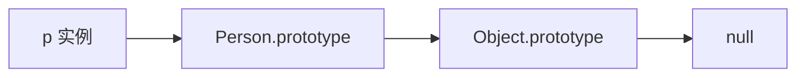
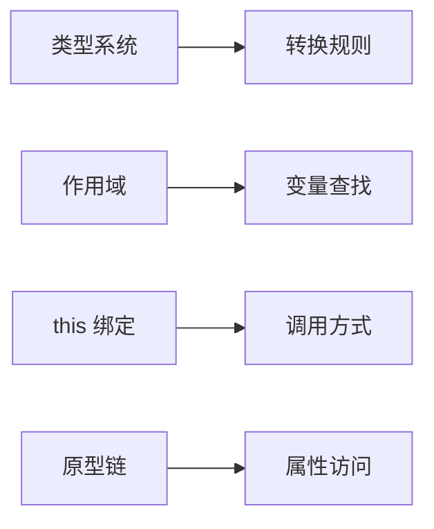
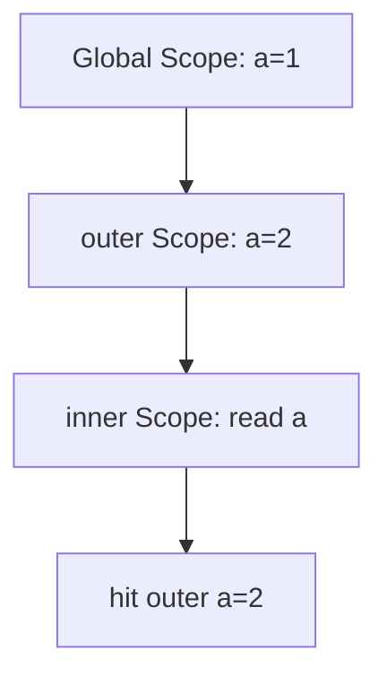
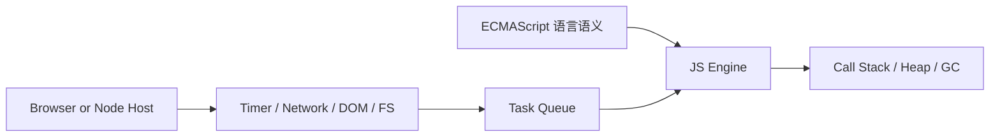
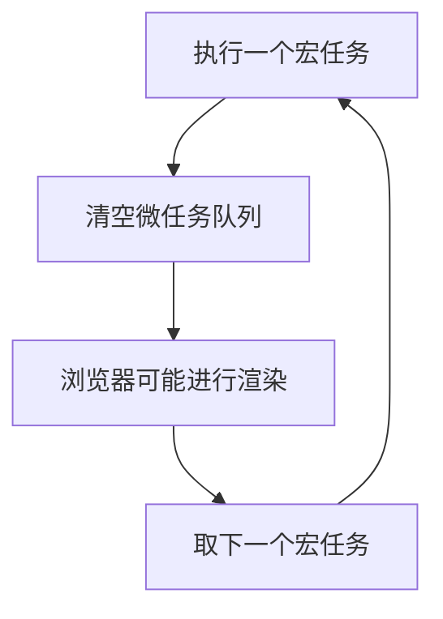
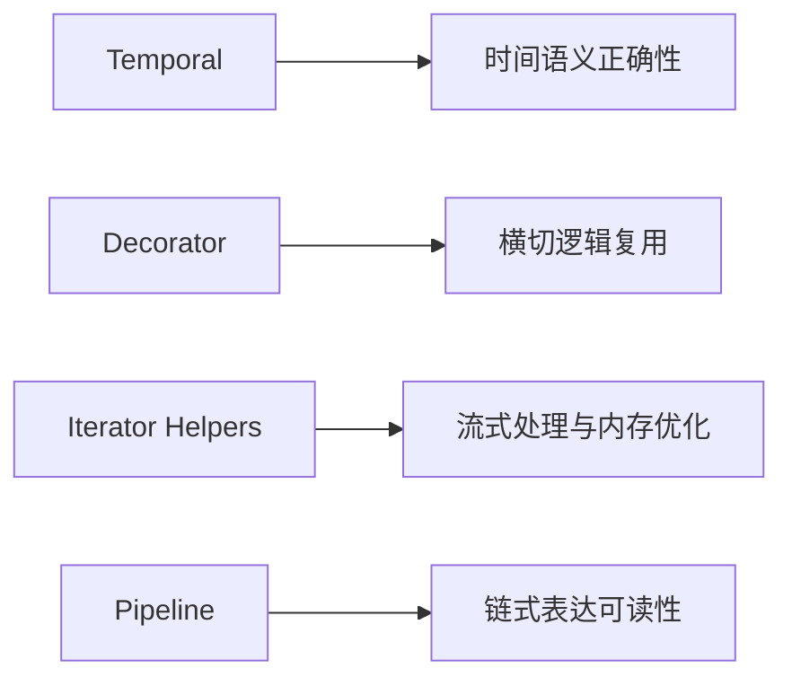

### 🧭 JavaScript 学习总览

这份文档已经合并为单层学习结构，不再拆成“提纲区 + 展开区”。

### 📊 学习路径建议

1. 先学习模块一和模块二，建立语义与执行模型。
2. 再学习模块三和模块四，打通运行时与异步调度。
3. 再学习模块五和模块六，把语言能力映射到工程与浏览器环境。
4. 最后学习模块七，通过手写与优化题巩固全链路理解。

### 🎯 学习目标

- 能说清 JavaScript 的类型系统、作用域、`this` 与原型链这些基础语义。
- 能解释执行上下文、调用栈、事件循环、宿主运行时与内存管理之间的关系。
- 能把语言能力连接到模块化、Web API、异步控制与工程实践场景。
- 能在面试中同时回答“怎么用”和“为什么会这样运行”。

---

### 📐 模块一：语言基础（类型、作用域、对象模型）

- **知识点**：数据类型、类型转换、作用域、`this`、原型链。
- **模块讲解**：
    - 类型系统决定了大多数运算结果，理解隐式转换可以避免大量 bug。
    - 作用域和 `this` 是两套机制：作用域看定义位置，`this` 看调用方式。
    - 对象模型由原型链驱动，属性读取和继承都依赖它。

#### 1.1 类型判断与转换

- **讲解**：
    - `===` 不做转换，`==` 会触发抽象相等比较。
    - `Number.isNaN` 不做类型转换，`isNaN` 会先尝试转数字。
    - 对象参与运算会走 `ToPrimitive`，常见顺序是 `valueOf -> toString`。
- **示例**：

```js
console.log(typeof null); // object（历史遗留）
console.log(Number.isNaN('NaN')); // false
console.log(isNaN('NaN')); // true

const obj = {
    valueOf() {
        return 10;
    }
};
console.log(obj + 1); // 11
```

#### 1.2 this 与原型链

- **知识点**：`this` 绑定规则、显示/隐式绑定冲突、原型链查找、原型继承关系。

##### 1.2.1 this（调用方式决定绑定）

- **讲解**：
    - `this` 的核心不是“函数定义在哪”，而是“函数如何被调用”。
    - 绑定优先级：`new` 绑定 > 显式绑定（`call/apply/bind`）> 隐式绑定（对象调用）> 默认绑定（严格模式下是 `undefined`，非严格模式下通常是全局对象）。
    - 箭头函数没有自己的 `this`，会捕获外层词法作用域的 `this`，因此不适合当作需要动态绑定 `this` 的对象方法。
    - 面试常见误区：把作用域链和 `this` 混为一谈。作用域回答“变量从哪找”，`this` 回答“方法在谁身上执行”。
- **示例**：

```js
function show() {
    return this && this.name;
}

const user = { name: 'Tom', show };
const admin = { name: 'Alice' };

console.log(user.show()); // Tom（隐式绑定）
console.log(show.call(admin)); // Alice（显式绑定）

const bound = show.bind({ name: 'Bound' });
console.log(bound()); // Bound

const obj = {
    name: 'Obj',
    normal() {
        return this.name;
    },
    arrow: () => this
};

console.log(obj.normal()); // Obj
console.log(obj.arrow === globalThis); // 在浏览器普通脚本下通常为 true（箭头函数不绑定 obj）
```

- **原理追问**：
    - 为什么 `bind` 之后再 `call` 不能改掉 `this`？
    - 为什么类方法在事件回调里常出现 `this` 丢失？

##### 1.2.2 原型链（对象模型与继承）

- **讲解**：
    - JavaScript 对象读取属性时，先查对象自身；找不到则沿着 `[[Prototype]]` 向上查找，直到 `null`。
    - `new Fn()` 的关键动作包括：创建新对象、将其原型指向 `Fn.prototype`、以新对象作为 `this` 调用构造函数、返回对象。
    - 原型链让实例共享方法，避免每个实例重复创建同样函数，降低内存开销。
    - 需要区分：`__proto__`（历史访问器，不推荐业务代码依赖）与 `Object.getPrototypeOf`（标准方式）。
- **示例**：

```js
function Person(name) {
    this.name = name;
}

Person.prototype.say = function () {
    return `hi, ${this.name}`;
};

const p = new Person('Tom');
console.log(p.say()); // hi, Tom
console.log(p instanceof Person); // true
console.log(Object.getPrototypeOf(p) === Person.prototype); // true
console.log(Object.getPrototypeOf(Person.prototype) === Object.prototype); // true
```

- **图例（原型链查找）**：



- **原理追问**：
        - `instanceof` 的判断本质是什么？
        - 为什么重写 `prototype` 可能导致 `constructor` 丢失？

- **图例（语言基础关系）**：



### 🧠 模块二：执行机制（执行上下文与调用过程）

- **知识点**：执行上下文、作用域链、变量提升、TDZ、调用栈。
- **模块讲解**：
    - 这一模块不是背定义，而是建立“代码运行时到底发生了什么”的过程视角。
    - 同一段代码的行为，往往由“上下文创建 -> 变量可见性 -> 调用栈推进”共同决定。

#### 2.1 执行上下文（Execution Context）

- **讲解**：
    - 执行上下文可以理解为“当前代码片段运行所需的环境记录”。
    - 全局代码会创建全局执行上下文；每次函数调用都会创建函数执行上下文。
    - 函数上下文中至少包含：变量环境、词法环境、`this` 绑定和外层引用。
    - 面试常问“函数为什么能访问外层变量”，本质就是上下文里保存了外层环境引用。

#### 2.2 作用域链（Scope Chain）

- **讲解**：
    - 作用域链是变量查找路径，遵循“就近原则”：先找当前作用域，再逐层向外。
    - 它在函数定义时确定（词法作用域），不是在函数调用位置动态决定。
    - 这也是闭包成立的基础：内部函数携带对外层词法环境的引用。
- **示例**：

```js
const a = 1;

function outer() {
    const a = 2;
    function inner() {
        console.log(a);
    }
    return inner;
}

const fn = outer();
fn(); // 2
```

- **图例（作用域链）**：



#### 2.3 变量提升（Hoisting）

- **讲解**：
    - 提升是“声明在编译阶段先被处理”的现象，不是代码物理移动。
    - `var` 声明会提升并初始化为 `undefined`，所以声明前读取不会报错但值是 `undefined`。
    - 函数声明也会提升，并且可在声明前调用；函数表达式则按变量规则处理。
- **示例**：

```js
console.log(v); // undefined
var v = 1;

say(); // ok
function say() {
    console.log('hello');
}
```

#### 2.4 TDZ（暂时性死区）

- **讲解**：
    - `let/const/class` 也会“被登记到作用域”，但在真正执行到声明语句前不可访问。
    - 这段“已存在但不可用”的区间就是 TDZ。
    - TDZ 的价值是尽早暴露错误，避免像 `var` 那样出现静默的 `undefined` 问题。
- **示例**：

```js
// console.log(x); // ReferenceError: Cannot access 'x' before initialization
let x = 2;
```

#### 2.5 调用栈（Call Stack）

- **讲解**：
    - 调用栈是函数执行顺序的栈结构：后调用先返回。
    - 每次函数调用会压栈，返回时弹栈；报错时堆栈信息就是这条调用路径。
    - 递归没有终止条件会持续压栈，最终触发栈溢出（`Maximum call stack size exceeded`）。
- **示例**：

```js
function a() {
    b();
}

function b() {
    c();
}

function c() {
    console.log('in c');
}

a();
```

- **原理追问**：
    - 为什么闭包变量不会随着函数返回立刻消失？
    - 函数声明和函数表达式在提升行为上有哪些关键差异？
    - TDZ 对工程代码质量的实际收益是什么？
    - 如何从错误堆栈快速定位真实入口函数？

### ⚙️ 模块三：运行时机制（JS 引擎、宿主环境、Event Loop 与内存）

- **知识点**：JS 引擎、调用栈、Heap、宿主环境、宏任务、微任务、渲染时机、垃圾回收。
- **模块讲解**：
    - JavaScript 语言规范只定义语义和 Job/Microtask 这类抽象，不直接提供 `setTimeout`、DOM、文件系统、网络这些能力。
    - 真正执行 JS 的是“引擎 + 宿主环境”：例如浏览器里常见的是 V8/SpiderMonkey/JavaScriptCore + Web APIs，Node.js 里是 V8 + libuv + Node API。
    - 引擎负责解析、编译、执行、管理调用栈和堆；宿主环境负责提供任务来源，并在合适时机把回调送回 JS 线程。
    - 长任务会阻塞渲染和交互，内存泄漏会拖慢长期运行页面，所以理解运行时分层是性能问题排查的前提。

#### 3.1 JS 引擎与宿主运行时分工

- **讲解**：
    - JS 引擎负责词法分析、语法分析、AST、字节码/JIT、执行上下文、调用栈、垃圾回收。
    - 宿主环境负责把“外部世界”接进来，例如浏览器的 DOM、定时器、事件系统，Node.js 的 fs、net、process、worker threads。
    - 所以 `Promise.then` 属于语言层能力，但 `setTimeout`、`fetch` 属于宿主层能力。
    - 面试里如果只会背“宏任务微任务”，但说不清任务是谁产生的、谁调度回 JS 线程，通常会被认为理解不够到底层。
- **图例（分层关系）**：



#### 3.2 Event Loop 与任务队列来源

- **讲解**：
    - JS 线程会先执行当前调用栈中的同步代码。
    - 当栈清空后，运行时会取出一个宏任务执行；该宏任务结束后，再把当前所有微任务清空。
    - 浏览器通常在微任务清空后才给渲染一个机会，所以“过多微任务”也会卡住界面。
    - 常见微任务来源：`Promise.then`、`queueMicrotask`、MutationObserver；常见宏任务来源：`setTimeout`、`setInterval`、I/O、UI 事件。
- **示例**：

```js
console.log('A');
setTimeout(() => console.log('B'), 0);
queueMicrotask(() => console.log('C'));
Promise.resolve().then(() => console.log('D'));
console.log('E');
// A E C D B
```

- **图例（浏览器事件循环）**：



#### 3.3 浏览器与 Node.js 运行时差异

- **讲解**：
    - 浏览器的重点是 UI 事件、网络、渲染帧；Node.js 的重点是 I/O、多阶段事件循环和服务端吞吐。
    - Node.js 由 libuv 管理 event loop，存在 timers、poll、check 等阶段，因此 `setImmediate`、`setTimeout`、I/O 回调之间的先后关系和浏览器不同。
    - 浏览器里没有 `process.nextTick`；Node.js 里 `process.nextTick` 的优先级又高于普通微任务，这也是常见考点。
- **示例（Node.js 心智模型）**：

```js
setTimeout(() => console.log('timeout'), 0);
setImmediate(() => console.log('immediate'));
Promise.resolve().then(() => console.log('promise'));
process.nextTick(() => console.log('nextTick'));

// 常见顺序（Node 环境下）:
// nextTick -> promise -> timeout/immediate（后两者与阶段有关）
```

#### 3.4 内存模型与垃圾回收

- **讲解**：
    - 栈内存通常存放执行上下文和局部引用，堆内存存放对象、数组、函数闭包等复杂数据。
    - 现代引擎通常使用分代回收：新生代对象回收快，老生代对象回收更重。
    - 常见泄漏来源不是“GC 不工作”，而是仍然有引用链存在，例如全局缓存、闭包、未解绑监听器、DOM 引用残留。
- **示例（泄漏场景）**：

```js
const cache = [];

function register() {
    const bigData = new Array(100000).fill('x');
    cache.push(() => bigData.length);
}

register();
// bigData 被闭包持有，无法被释放
```

### ⏳ 模块四：异步编程（Promise 到工程化控制）

- **知识点**：回调、Promise、`async/await`、并发控制、取消请求。
- **模块讲解**：
    - Promise 让异步状态可追踪，支持链式组织和错误传播。
    - `await` 是 Promise 语法糖，本质是把后续逻辑放进微任务恢复。
    - 工程里要考虑超时、重试、并发上限和取消能力。

#### 4.1 并发请求

```js
async function fetchBoth(a, b) {
    const [ra, rb] = await Promise.all([a(), b()]);
    return { ra, rb };
}
```

#### 4.2 限制并发数

```js
async function limitConcurrency(tasks, limit = 2) {
    const results = [];
    let index = 0;

    async function worker() {
        while (index < tasks.length) {
            const current = index++;
            results[current] = await tasks[current]();
        }
    }

    await Promise.all(Array.from({ length: limit }, worker));
    return results;
}
```

### 🧩 模块五：模块化与现代语法

- **知识点**：CommonJS、ESM、Tree Shaking、现代 ES 语法。
- **模块讲解**：
    - 这一模块的重点不是背语法，而是理解“模块系统如何影响构建、运行时和包体积”。
    - 前端工程里模块规范和语言新特性是绑定出现的，面试里通常会一起追问。

#### 5.1 CommonJS

- **讲解**：
    - CommonJS 是 Node.js 早期主流模块规范，核心语法是 `require` 和 `module.exports`。
    - 它是运行时加载，模块在执行时才解析依赖，因此更接近“同步读取并执行模块”。
    - CommonJS 输出的是“导出对象的当前结果”，不是像 ESM 那样的静态 live binding。
    - 因为依赖关系在运行时才更完整地确定，构建工具做静态分析和按需裁剪时天然比 ESM 更难。
- **示例**：

```js
// math.cjs
function add(a, b) {
    return a + b;
}

module.exports = { add };

// app.cjs
const { add } = require('./math.cjs');
console.log(add(1, 2)); // 3
```

#### 5.2 ESM

- **讲解**：
    - ESM 是 ECMAScript 官方标准模块系统，使用 `import` 和 `export`。
    - 它的依赖关系在语法层就是静态可分析的，所以浏览器和构建工具都更容易提前确定依赖图。
    - ESM 的导出是 live binding，也就是导出的值变化后，导入方读到的是最新值，而不是初始拷贝。
    - 现代前端工程和越来越多的 Node.js 新项目都更偏向 ESM first。
- **示例（ESM 实时绑定）**：

```js
// esm-a.js
export let count = 0;
export function inc() {
    count += 1;
}

// esm-b.js
import { count, inc } from './esm-a.js';
inc();
console.log(count); // 1
```

#### 5.3 Tree Shaking

- **讲解**：
    - Tree Shaking 指构建阶段删除“没有被实际使用的导出代码”，从而减小最终 bundle。
    - 它依赖静态可分析的模块结构，所以通常和 ESM 配合得最好。
    - 但 Tree Shaking 不是“只要用了 ESM 就一定生效”，如果模块有副作用，构建器通常不能随便删。
    - 常见影响因素包括：是否使用 `sideEffects` 标记、是否写了顶层副作用代码、是否通过动态方式访问导出。
- **示例**：

```js
// utils.js
export function used() {
    return 'used';
}

export function unused() {
    return 'unused';
}

// app.js
import { used } from './utils.js';

console.log(used());
// 构建后若 unused 未被引用，且模块无副作用，通常可被移除
```

#### 5.4 现代 ES 语法

- **讲解**：
    - 现代 ES 语法不只是“写起来更短”，更重要的是让代码表达更精确、边界更清楚。
    - 例如可选链 `?.` 适合处理深层对象访问，空值合并 `??` 能避免把 `0`、`''` 误判成默认值。
    - 动态导入 `import()` 可以把模块加载延后到真正需要时，常用于路由懒加载和大模块拆分。
    - 解构、展开运算符、模板字符串、类字段等语法则主要提升可读性和组合能力。
- **示例**：

```js
const city = user?.profile?.city ?? 'unknown';

async function loadModule() {
    const mod = await import('./utils.js');
    return mod.run();
}
```

- **原理追问**：
    - 为什么 CommonJS 更难做 Tree Shaking？
    - 为什么 ESM 的静态结构对构建优化很关键？
    - `??` 和 `||` 在默认值场景里的语义差异是什么？
    - 动态导入带来的收益和代价分别是什么？

### 🌐 模块六：浏览器环境与 Web API

- **知识点**：DOM/BOM、事件传播、事件委托、动画调度。
- **模块讲解**：这一模块的重点不是"背 API"，而是理解浏览器运行时与 JS 语言层的边界，以及事件系统和渲染调度的工作原理。

#### 6.1 DOM / BOM

- **讲解**：
    - DOM（Document Object Model）是浏览器对页面结构的树状抽象，JS 通过它读写元素、属性和样式。
    - BOM（Browser Object Model）是浏览器环境自身的接口集合，包括 `window`、`location`、`history`、`navigator`、`screen` 等，不属于 ECMAScript 规范。
    - DOM 操作的代价不在于"调用次数"，而在于是否触发了重排（reflow）或重绘（repaint）。读取布局属性（`offsetWidth`、`getBoundingClientRect` 等）会强制刷新样式，批量修改时应先缓存再操作。
    - `document.querySelector` 返回静态快照，`getElementsByTagName` 返回实时 HTMLCollection，二者行为不同。
- **示例**：

```js
// 批量修改避免多次重排
const list = document.querySelector('.list');
const fragment = document.createDocumentFragment();

for (let i = 0; i < 100; i++) {
    const li = document.createElement('li');
    li.textContent = `item ${i}`;
    fragment.appendChild(li);
}

list.appendChild(fragment); // 只触发一次重排
```

#### 6.2 事件传播

- **讲解**：
    - 浏览器事件传播分为三个阶段：**捕获阶段**（从根节点向下到目标）、**目标阶段**（到达触发元素）、**冒泡阶段**（从目标向上返回根节点）。
    - `addEventListener` 第三个参数为 `true` 时在捕获阶段监听，默认为 `false` 即冒泡阶段监听。
    - `event.stopPropagation()` 阻止事件继续传播，`event.preventDefault()` 阻止默认行为，两者互不影响。
    - 面试常问："为什么阻止冒泡会影响父元素的监听器？"——因为父元素通常在冒泡阶段监听，传播被截断后父元素的回调不会执行。
- **示例**：

```js
document.querySelector('.parent').addEventListener('click', () => {
    console.log('parent clicked');
});

document.querySelector('.child').addEventListener('click', (e) => {
    e.stopPropagation(); // 阻止事件冒泡到 .parent
    console.log('child clicked');
});
```

#### 6.3 事件委托

- **讲解**：
    - 事件委托利用冒泡机制，在父节点上统一监听子元素事件，不需要给每个子元素单独注册。
    - 优点：减少监听器数量，自动兼容后来动态插入的子元素。
    - 核心技巧是通过 `event.target` 或 `event.target.closest()` 判断实际触发元素是否符合预期。
    - 注意：`stopPropagation` 在子元素中使用会让委托失效，使用时需谨慎。
- **示例**：

```js
document.getElementById('list').addEventListener('click', (e) => {
    const item = e.target.closest('li');
    if (!item) return;
    console.log('clicked:', item.dataset.id);
});
```

#### 6.4 动画调度

- **讲解**：
    - `setTimeout` 和 `setInterval` 的时间精度受到事件循环影响，动画用它们容易出现掉帧或抖动。
    - `requestAnimationFrame`（rAF）会在浏览器下一次重绘前执行，和屏幕刷新率对齐（通常是 60fps），动画更流畅。
    - rAF 回调会接收一个高精度时间戳，可以用来计算每帧经过的时间，实现基于时间而非帧数的动画。
    - 页面不可见时（切换标签页）rAF 会自动暂停，避免无效 CPU 消耗。
- **示例**：

```js
let x = 0;
const box = document.getElementById('box');

function tick() {
    x += 2;
    box.style.transform = `translateX(${x}px)`;
    if (x < 300) requestAnimationFrame(tick);
}

requestAnimationFrame(tick);
```

- **原理追问**：
    - `getBoundingClientRect` 为什么会触发强制重排？
    - 事件委托和直接绑定在哪些场景下各有优势？
    - 为什么动画里不推荐用 `setInterval` 而推荐用 `rAF`？

### 🛠️ 模块七：常见实现与工程能力

- **知识点**：手写基础 API、防抖节流、性能与安全意识。
- **模块讲解**：
    - 手写函数用于验证对 `this`、原型、闭包、异步流程的理解。
    - 性能优化聚焦主线程负载和渲染时机，安全聚焦输入输出边界。

#### 7.1 防抖与节流

```js
function debounce(fn, wait = 300) {
    let timer = null;
    return function (...args) {
        clearTimeout(timer);
        timer = setTimeout(() => fn.apply(this, args), wait);
    };
}

function throttle(fn, wait = 300) {
    let last = 0;
    return function (...args) {
        const now = Date.now();
        if (now - last >= wait) {
            last = now;
            fn.apply(this, args);
        }
    };
}
```

#### 7.2 `instanceof` 的实现思路

```js
function myInstanceof(obj, Ctor) {
    if (obj == null || (typeof obj !== 'object' && typeof obj !== 'function')) {
        return false;
    }

    let proto = Object.getPrototypeOf(obj);
    const target = Ctor.prototype;
    while (proto) {
        if (proto === target) return true;
        proto = Object.getPrototypeOf(proto);
    }
    return false;
}
```

### 🚀 JavaScript 业界热点（2026 前后）

这部分用于跟进“正在被大量使用”与“即将影响工程实践”的 JS 新能力。不同运行时上线节奏不同，使用前建议同时查看浏览器兼容性与 Node.js 版本支持。

### 1) 近年已落地且值得优先掌握的标准能力

- **不可变数组新方法**（`toSorted` / `toReversed` / `toSpliced` / `with`）
    - 价值：避免原地修改，提升状态管理可预测性（React/Vue 场景很常见）。

```js
const arr = [3, 1, 2];
const sorted = arr.toSorted();
console.log(arr); // [3, 1, 2]
console.log(sorted); // [1, 2, 3]
```

- **分组能力**（`Object.groupBy` / `Map.groupBy`）
    - 价值：减少手写 `reduce` 模板代码，数据分桶更直观。

```js
const list = [
    { name: 'A', type: 'fruit' },
    { name: 'B', type: 'vegetable' },
    { name: 'C', type: 'fruit' }
];

const grouped = Object.groupBy(list, item => item.type);
console.log(grouped.fruit.length); // 2
```

- **Promise 工程化增强**（如 `Promise.withResolvers`）
    - 价值：在封装异步流程、任务队列、桥接事件模型时更方便。

```js
const { promise, resolve, reject } = Promise.withResolvers();
setTimeout(() => resolve('ok'), 100);
promise.then(console.log);
```

### 2) ESM 生态持续成为主流

- **ESM First**：前端构建工具和 Node.js 新项目越来越偏向 ESM。
- **动态导入与按需加载**：`import()` 仍是性能优化核心能力。
- **Import Attributes**：JSON 等资源导入方式逐步规范化（不同环境支持节奏不同）。

```js
const mod = await import('./feature.js');
mod.run();
```

### 3) 2026 前后高关注提案方向（关注趋势）

#### 3.1 Temporal（新日期时间 API）

- **要解决的问题**：`Date` 在时区、夏令时、可变对象语义上容易出错，跨时区业务（预约、账单、日志）很难维护。
- **核心能力**：
    - 将“绝对时间点”“本地日期时间”“仅日期”分离建模，减少语义混淆。
    - 内置时区与日历处理，避免手写偏移计算。
- **示例**：

```js
// 语义示例（具体可用性取决于运行时支持）
const meeting = Temporal.ZonedDateTime.from('2026-05-01T09:00:00+08:00[Asia/Shanghai]');
const utc = meeting.toInstant();
console.log(String(utc));
```

- **采用建议**：
    - 新项目的时间模型可先用“Instant + TimeZone”思路设计接口。
    - 老项目先统一时间存储规范（如统一 UTC），再逐步迁移 API。

#### 3.2 Decorator（装饰器生态完善）

- **要解决的问题**：类增强逻辑（日志、权限、缓存、校验）分散在业务代码中，重复且难维护。
- **核心能力**：
    - 以声明式方式增强类、方法、字段行为。
    - 框架可围绕装饰器构建一致的元数据与依赖注入模型。
- **示例**：

```js
function logged(value, context) {
    return function (...args) {
        console.log(`call: ${String(context.name)}`);
        return value.apply(this, args);
    };
}

class Service {
    @logged
    run(task) {
        return `done:${task}`;
    }
}
```

- **采用建议**：
    - 团队内先统一装饰器使用边界，优先用于横切关注点，不要滥用。
    - 明确 Babel/TypeScript 配置，避免不同编译器语义差异导致行为不一致。

#### 3.3 Iterator Helpers

- **要解决的问题**：对大数据流进行 map/filter/take 时，数组链式调用会产生中间数组并增加内存压力。
- **核心能力**：
    - 在迭代器层完成数据变换，按需消费，降低峰值内存。
    - 更适合日志流、分页流、生成器结果处理。
- **示例**：

```js
function* gen() {
    yield* [1, 2, 3, 4, 5, 6];
}

const out = gen()
    .map(x => x * 2)
    .filter(x => x > 5)
    .take(2)
    .toArray();

console.log(out); // [6, 8]
```

- **采用建议**：
    - 数据规模较小场景仍可优先数组方法，代码更直观。
    - 大数据流或流式处理场景优先迭代器辅助方法。

#### 3.4 Pipeline Operator（管道运算符）

- **要解决的问题**：多步数据处理在嵌套调用下可读性较差，调试和重构成本高。
- **核心能力**：
    - 把“值流经一系列步骤”的意图写成线性结构，提高可读性。
    - 与函数式编程、数据清洗流程天然契合。
- **示例**：

```js
// 语义示例，具体写法以提案最终语法为准
const result = value
    |> step1
    |> step2
    |> step3;
```

- **采用建议**：
    - 在提案未完全稳定前，项目中可先用小函数 + compose/pipe 维持一致风格。
    - 等工具链稳定后再评估是否迁移为新语法。

- **图例（提案价值对照）**：



说明：提案状态和语法细节可能变化较快，建议以 TC39 proposals 与主流引擎发布说明为准。

### 4) 工程实践层面的热点（与语言同等重要）

#### 4.1 运行时多样化（Node.js / Deno / Bun）

- **核心变化**：同一套业务代码常常需要在不同运行时执行，生态从“只支持 Node”转向“尽量遵循 Web 标准 + 运行时适配层”。
- **落地建议**：
    - 优先使用跨运行时 API：`fetch`、`URL`、`TextEncoder`、`Web Crypto`。
    - 隔离运行时差异：把文件系统、进程管理、路径处理封装到 adapter 层。
    - 在 CI 中做最小跨运行时验证（至少两种运行时 smoke test）。
- **示例（运行时适配）**：

```js
export async function readText(path) {
    // Node.js
    if (typeof process !== 'undefined' && process.versions?.node) {
        const fs = await import('node:fs/promises');
        return fs.readFile(path, 'utf8');
    }

    // Deno
    if (typeof Deno !== 'undefined') {
        return Deno.readTextFile(path);
    }

    throw new Error('Unsupported runtime');
}
```

#### 4.2 类型驱动开发（TypeScript + JSDoc）

- **核心变化**：类型系统不只是“防错”，而是逐步成为 API 设计和协作契约的一部分。
- **落地建议**：
    - JS 项目可先从 `// @ts-check` + JSDoc 开始，不必一次性迁移全量 TS。
    - 为核心领域模型（订单、用户、支付等）先建立稳定类型，再向外扩展。
    - 将类型检查纳入 CI（如 `tsc --noEmit`），避免“本地能跑、线上出错”。
- **示例（JSDoc 类型约束）**：

```js
// @ts-check

/**
 * @typedef {{ id: string, amount: number }} Order
 */

/**
 * @param {Order} order
 */
function pay(order) {
    return `${order.id}:${order.amount}`;
}
```

#### 4.3 边缘计算与 Serverless（Web 标准 API 优先）

- **核心变化**：函数更靠近用户执行，冷启动、响应时间、地理分布成为架构关键指标。
- **落地建议**：
    - 代码避免依赖 Node 独占 API，优先 `Request/Response/fetch` 这一套通用接口。
    - 把数据库连接、配置读取、缓存访问做成懒加载，缩短冷启动路径。
    - 对 I/O 请求设置超时和降级策略，避免边缘节点雪崩。
- **示例（边缘节点的超时与降级）**：

```js
export default {
    async fetch(request) {
        const controller = new AbortController();
        const timeout = setTimeout(() => controller.abort(), 800);

        try {
            const upstream = await fetch('https://api.example.com/profile', {
                signal: controller.signal
            });

            if (!upstream.ok) {
                return new Response(JSON.stringify({ profile: null, fallback: true }), {
                    status: 200,
                    headers: { 'content-type': 'application/json' }
                });
            }

            return new Response(await upstream.text(), {
                status: 200,
                headers: { 'content-type': 'application/json' }
            });
        } catch {
            return new Response(JSON.stringify({ profile: null, fallback: true }), {
                status: 200,
                headers: { 'content-type': 'application/json' }
            });
        } finally {
            clearTimeout(timeout);
        }
    }
};
```

#### 4.4 性能与可观测性（Web Vitals + 错误与性能链路）

- **核心变化**：优化目标从“感觉快”转向“指标可量化 + 回归可监控”。
- **落地建议**：
    - 先建立基线指标（Largest Contentful Paint, LCP；Interaction to Next Paint, INP；Cumulative Layout Shift, CLS；首屏 JS 体积；长任务数量）。
    - 其中 LCP 关注加载速度，INP 关注交互响应，CLS 关注视觉稳定性。
    - 监控前后端同一请求链路（traceId），把慢页面和慢接口关联起来。
    - 对高频交互加防抖/节流，对长任务做切分（`requestIdleCallback`、分批执行）。
- **示例（简单性能埋点）**：

```js
const t0 = performance.now();
await loadCriticalData();
const t1 = performance.now();

console.log('critical-data-cost(ms):', Math.round(t1 - t0));
```

- **图例（观测闭环）**：


### 5) 学习与跟进建议

1. 先掌握“已落地且已广泛可用”的标准能力，再跟进提案。
2. 每次引入新语法前先查目标环境兼容性，避免线上回退成本。
3. 新特性学习顺序建议：语义价值 -> 可读性收益 -> 团队规范 -> 工具链支持。