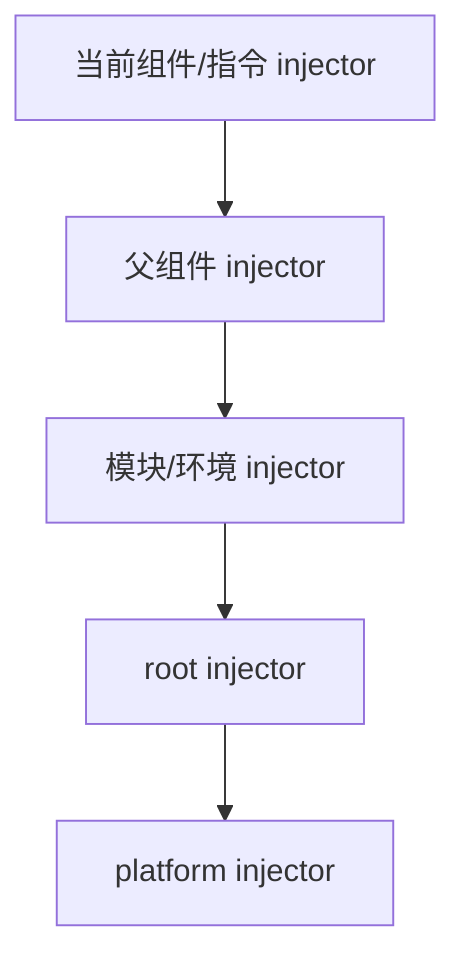
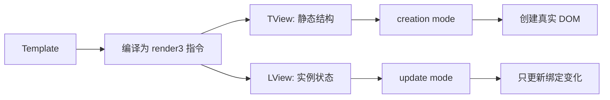
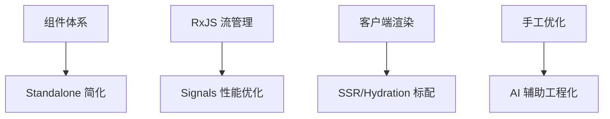

### 🧭 Angular 学习总览

这份文档采用单层学习结构，按“组件 -> DI -> 响应式 -> 渲染机制 -> 现代特性 -> 测试”展开。

### 📊 学习路径建议

1. 先学模块一和模块二，掌握 Angular 组件化和 DI 基础。
2. 再学模块三和模块四，理解 RxJS/Signals 与变更检测。
3. 再学模块五，补齐 Standalone、SSR 与现代能力。
4. 最后学模块六，形成可落地测试与排障能力。

### 🎯 学习目标

- 能建立 Angular 组件、模板、DI、响应式状态和渲染机制的完整心智模型。
- 能解释 Ivy、注入器查找链、Zone.js 与 Signals 分别解决什么问题。
- 能把 Angular 能力落到企业级表单、路由、SSR、性能优化与测试排障场景。
- 能在面试中回答 Angular 不只是“怎么写”，还包括“为什么这样设计”。

---

### 🧱 模块一：组件体系与模板

- **知识点**：组件定义、装饰器、生命周期 Hook、模板绑定、属性/事件/双向绑定、组件通信、内容投影。
- **模块讲解**：
    - Angular 以组件为核心组织 UI，模板、样式、逻辑高度内聚。
    - 组件声明周期 Hook 帮助在正确时机执行初始化、副作用与清理。
    - 模板绑定分插值、属性、事件、双向四种，语法各不相同。
    - 组件通信优先级：Input/Output -> 服务 + 依赖注入 -> 状态管理。

#### 1.1 组件定义与装饰器

- **讲解**：
    - `@Component` 装饰器定义组件元数据（selector、template、styles 等）。
    - Standalone 组件无需 NgModule，直接声明依赖，适合新项目。
    - 组件选择器支持元素、属性、类名三种匹配方式。
- **示例**：

```ts
@Component({
  selector: 'app-counter',
  template: `
    <button (click)="inc()">+</button>
    <p>{{ count }}</p>
  `,
  styles: [`button { padding: 0.5rem; }`],
  standalone: true
})
export class CounterComponent {
  count = 0;
  inc() {
    this.count += 1;
  }
}
```

#### 1.2 生命周期 Hook

- **讲解**：
    - `ngOnInit`：初始化，接收 Input 值后调用。
    - `ngAfterViewInit`：视图初始化完毕后调用，此时可访问 ViewChild。
    - `ngOnDestroy`：销毁前调用，用于清理订阅、定时器。
    - 其他 Hook 按调用顺序：`OnChanges -> OnInit -> DoCheck -> AfterContentInit -> AfterViewInit -> OnDestroy`。
- **示例**：

```ts
@Component({
  selector: 'app-counter',
  template: `<p>{{ count }}</p>`,
  standalone: true
})
export class CounterComponent implements OnInit, OnDestroy {
  @Input() initialValue = 0;
  count = 0;
  private destroy = new Subject<void>();

  ngOnInit() {
    this.count = this.initialValue;
  }

  ngOnDestroy() {
    this.destroy.next();
    this.destroy.complete();
  }
}
```

#### 1.3 模板绑定

- **讲解**：
    - 插值 `{{ }}` 用于表达式求值和显示。
    - 属性绑定 `[prop]` 设置属性，事件绑定 `(click)` 监听事件。
    - 双向绑定 `[(ngModel)]` 等价于 `[value] + (valueChange)`。
    - 指令分属性型（`*ngIf`）和结构型（`*ngFor`）两类。
- **示例**：

```ts
@Component({
  selector: 'app-form',
  template: `
    <input [(ngModel)]="name" placeholder="Your name" />
    <p *ngIf="name">Hello, {{ name }}!</p>
    <ul>
      <li *ngFor="let item of items; let i = index">
        {{ i }}: {{ item }}
      </li>
    </ul>
  `,
  standalone: true,
  imports: [CommonModule, FormsModule]
})
export class FormComponent {
  name = '';
  items = ['apple', 'banana'];
}
```

#### 1.4 组件通信与内容投影

- **讲解**：
    - `@Input` 父组件传值给子组件，支持绑定和默认值。
    - `@Output` 子组件发事件给父组件，必须是 `EventEmitter`。
    - `<ng-content>` 用于内容投影，支持具名投影 `select` 选择器。
    - `@ViewChild/@ViewChildren` 访问模板中的组件或元素。
- **示例**：

```ts
@Component({
  selector: 'app-child',
  template: `
    <button (click)="notify()">Click me</button>
    <ng-content select="[role='title']"></ng-content>
  `
})
export class ChildComponent {
  @Input() title = '';
  @Output() onAction = new EventEmitter<string>();

  notify() {
    this.onAction.emit('child clicked');
  }
}

@Component({
  selector: 'app-parent',
  template: `
    <app-child [title]="'Hello'" (onAction)="handle($event)">
      <div role="title">Projected Content</div>
    </app-child>
  `,
  imports: [ChildComponent]
})
export class ParentComponent {
  handle(msg: string) {
    console.log('from child:', msg);
  }
}
```

### 💉 模块二：依赖注入与服务设计

- **知识点**：`@Injectable` 装饰器、provider 配置、注入器层级、服务单例与多例、服务间依赖、DI 查找链。
- **模块讲解**：
    - DI 的目标是解耦与可替换，便于测试和扩展。
    - 根注入器（`root`）适合全局单例，组件级 provider 适合局部隔离。
    - 注入器存在父子层级，子注入器优先查询，可覆盖父级 provider。
    - 服务可依赖其他服务，Angular 自动递归解析依赖链。

#### 2.1 基础 DI 与 Provider 配置

- **讲解**：
    - `providedIn: 'root'` 注册根级单例。
    - `providers` 数组可配置多种 provider 方式：类、工厂、值、令牌。
    - 令牌（Token）可以是类、字符串常量、InjectionToken 等，便于查询。
- **示例**：

```ts
@Injectable({ providedIn: 'root' })
export class LogService {
  log(msg: string) {
    console.log(`[LOG] ${msg}`);
  }
}

// 字符串令牌与工厂 provider
export const API_URL = new InjectionToken<string>('api.url');

@NgModule({
  providers: [
    { provide: API_URL, useValue: 'https://api.example.com' }
  ]
})
export class AppModule {}

@Injectable()
export class UserService {
  constructor(private http: HttpClient, @Inject(API_URL) private apiUrl: string) {}
  getUsers() {
    return this.http.get(`${this.apiUrl}/users`);
  }
}
```

#### 2.2 注入器层级与局部隔离

- **讲解**：
    - 根注入器全应用共享；组件级 provider 仅在该组件树下有效。
    - 同一个类在不同层级可以拥有不同实例，适合分离全局与局部状态。
- **示例**：

```ts
@Injectable()
export class UserStore {
  users$ = new BehaviorSubject<User[]>([]);
}

@Component({
  selector: 'app-module-a',
  template: `<app-list></app-list>`,
  providers: [UserStore] // 局部单例，与 module-b 不同
})
export class ModuleAComponent {}

@Component({
  selector: 'app-module-b',
  template: `<app-list></app-list>`,
  providers: [UserStore] // 局部单例，与 module-a 不同
})
export class ModuleBComponent {}
```

#### 2.3 现代 inject() API

- **讲解**：
    - `inject()` 是 `constructor` 注入的替代方案，更灵活。
    - 支持在 effect、computed 等地方获取注入的服务。
    - 优先于构造函数参数，代码更易读。
- **示例**：

```ts
@Component({
  selector: 'app-profile',
  template: `{{ user?.name }}`,
  standalone: true
})
export class ProfileComponent {
  private userService = inject(UserService);
  user = this.userService.getProfile();
}

// 也可在 effect 中使用
export class DataComponent {
  private http = inject(HttpClient);

  ngOnInit() {
    effect(() => {
      this.http.get('/data').subscribe(console.log);
    });
  }
}
```

#### 2.4 DI 底层：provider 解析与注入器查找链

- **讲解**：
    - Angular DI 并不是“全局 Map 里拿一下对象”这么简单，它会根据当前注入上下文，从最近的注入器开始逐层向上查找 provider。
    - 当组件、指令、模块、root 都可能提供同名 token 时，谁离当前消费点更近，谁就优先命中。
    - provider 解析后可能返回类实例、工厂结果、固定值或现有 token 的别名，这也是 `useClass`、`useFactory`、`useValue`、`useExisting` 的区别所在。
    - 这解释了为什么 Angular DI 既能做全局单例，也能做局部作用域隔离。
- **图例（查找链）**：



- **理解重点**：
    - token 查找是“从近到远”。
    - provider 配置本质上是在定义“如何解析这个 token”。
    - 这也是局部 provider 能覆盖全局 provider 的根本原因。

### 🔄 模块三：RxJS、Signals 与状态流

- **知识点**：Observable 基础、操作符、订阅管理、Signals、Computed、Effect、状态管理选型、scheduler 心智。
- **模块讲解**：
    - RxJS 更适合事件流、异步流，操作符丰富但学习陡峭。
    - Signals 更适合本地响应式状态，语法简洁，性能开销小。
    - 订阅必须可控，优先 `async` pipe 或自动销毁模式，避免内存泄漏。
    - 现代 Angular 优先 Signals，RxJS 用于跨组件事件流。

#### 3.1 RxJS 基础与常用操作符

- **讲解**：
    - Observable 代表一个可观察的值流，支持 `subscribe` 订阅。
    - `map`、`filter`、`switchMap`、`catchError` 是最常用的操作符。
    - `switchMap` 自动退订前一个内部 Observable，适合搜索场景；`mergeMap` 并发订阅，适合并发请求。
- **示例**：

```ts
@Injectable()
export class SearchService {
  search(q: string) {
    return this.http.get(`/api/search?q=${q}`);
  }
}

@Component({
  selector: 'app-search',
  template: `
    <input #input type="text" />
    <p>{{ result$ | async }}</p>
  `,
  standalone: true,
  imports: [AsyncPipe]
})
export class SearchComponent {
  private searchService = inject(SearchService);

  @ViewChild('input') input!: ElementRef<HTMLInputElement>;

  ngAfterViewInit() {
    this.result$ = fromEvent(this.input.nativeElement, 'input').pipe(
      debounceTime(300),
      map(e => (e.target as HTMLInputElement).value),
      distinctUntilChanged(),
      switchMap(q => this.searchService.search(q)),
      catchError(() => of('error'))
    );
  }
}
```

#### 3.2 Signal 与响应式状态

- **讲解**：
    - `signal(value)` 创建响应式状态，改变时自动通知依赖。
    - `computed(fn)` 派生状态，自动追踪依赖并缓存结果。
    - `effect(fn)` 副作用，当依赖变化时自动运行。
    - Signals 性能优于 Observable，因为细粒度跟踪避免了大量检查。
- **示例**：

```ts
@Component({
  selector: 'app-counter',
  template: `
    <p>{{ count() }}</p>
    <p>{{ doubled() }}</p>
    <button (click)="inc()">+</button>
  `,
  standalone: true
})
export class CounterComponent {
  count = signal(0);
  doubled = computed(() => this.count() * 2);

  inc() {
    this.count.update(v => v + 1);
  }

  ngOnInit() {
    effect(() => {
      console.log('count changed:', this.count());
    });
  }
}
```

#### 3.3 Signals 与模板更新联动：为什么改 signal 后视图能精确刷新

- **讲解**：
    - Signals 的关键不是“多了一种 state API”，而是它把依赖关系从“整棵组件树可能都要检查”收窄成“谁读了这个 signal，谁在变更后重新参与更新”。
    - 模板读取 `count()`、`doubled()` 时，Angular 会在内部建立依赖关联；当 signal 变化时，只标记真正相关的消费点需要更新。
    - 这和传统 Zone.js 驱动的全局变更检测入口不同，Signals 更接近精确依赖追踪模型。
    - 所以 Signals 对性能的帮助，核心不是“更快 set 值”，而是“减少无意义检查”。
- **理解重点**：
    - `signal`：可写源状态。
    - `computed`：派生值，只有依赖变时才重新算。
    - `effect`：副作用观察者，不直接等同于模板更新，但共享依赖追踪思路。

#### 3.4 订阅管理与销毁

- **讲解**：
    - 优先使用 `async` pipe，自动订阅与销毁。
    - 手动订阅时保存 subscription，在 `ngOnDestroy` 中销毁。
    - `takeUntilDestroyed()` 操作符简化销毁管理。
- **示例**：

```ts
@Component({
  selector: 'app-data',
  template: `<p>{{ data$ | async }}</p>`,
  standalone: true
})
export class DataComponent implements OnInit, OnDestroy {
  private http = inject(HttpClient);
  private destroy = new Subject<void>();

  data$!: Observable<any>;

  ngOnInit() {
    this.data$ = this.http.get('/api/data').pipe(
      takeUntil(this.destroy)
    );
  }

  ngOnDestroy() {
    this.destroy.next();
    this.destroy.complete();
  }
}

// 或用 takeUntilDestroyed()
@Component({
  selector: 'app-data2',
  template: `<p>{{ data$ | async }}</p>`,
  standalone: true
})
export class Data2Component {
  private http = inject(HttpClient);
  private destroyRef = inject(DestroyRef);

  data$ = this.http.get('/api/data').pipe(
    takeUntilDestroyed(this.destroyRef)
  );
}
```

### ⚙️ 模块四：变更检测与渲染性能

- **知识点**：变更检测策略、Ivy 渲染引擎、Zone.js、OnPush、`trackBy`、模板控制流、渲染优化。
- **模块讲解**：
    - 默认策略（Default）每次事件都运行检查，易上手但性能成本高。
    - Ivy 把模板编译成一组增量式指令，运行时按最小必要单位更新 DOM，而不是做虚拟 DOM 全量 diff。
    - OnPush 策略仅在 Input 变化或事件触发时检查，适合大型应用性能治理。
    - 列表渲染必须配合 `trackBy`，避免重复创建 DOM。
    - 模板控制流（`@if`、`@for`、`@defer`）性能优于 `*ngIf` 和 `*ngFor`。

#### 4.1 变更检测策略

- **讲解**：
    - Default：每次浏览器事件都检查所有组件，简单但性能差。
    - OnPush：仅在 Input 变化、事件触发或 `markForCheck()` 时检查。
    - 对于输入频繁的组件（如搜索框）采用 OnPush 可显著降低 CPU。
- **示例**：

```ts
// Default 策略（默认）
@Component({
  selector: 'app-default',
  template: `{{ expensiveComputation() }}`,
  standalone: true
})
export class DefaultComponent {
  expensiveComputation() {
    console.log('computing...');
    return Math.random();
  }
}

// OnPush 策略
@Component({
  selector: 'app-onpush',
  template: `{{ value }}`,
  changeDetection: ChangeDetectionStrategy.OnPush,
  standalone: true
})
export class OnPushComponent {
  @Input() value = '';
  cdr = inject(ChangeDetectorRef);

  ngOnInit() {
    // 异步更新无法触发检查，需显式标记
    setTimeout(() => {
      this.value = 'updated';
      this.cdr.markForCheck();
    }, 1000);
  }
}
```

#### 4.2 Ivy 渲染引擎与底层设计

- **讲解**：
    - Ivy 的核心思路是把模板编译成一串指令调用，例如 `ɵɵelementStart`、`ɵɵtext`、`ɵɵproperty`，运行时直接操作真实 DOM。
    - 运行时内部会区分 `TView` 和 `LView`：`TView` 存模板静态结构和指令元数据，`LView` 存当前组件实例、绑定值、DOM 引用等动态状态。
    - 首次渲染走 creation mode，负责创建节点和注册指令；后续更新走 update mode，只重放绑定相关指令。
    - 这种设计的重点不是“更少概念”，而是“把模板结构和实例状态拆开”，从而降低重复工作。
- **为什么面试常问**：
    - 因为它直接解释了 Angular 为什么不依赖虚拟 DOM、为什么 `OnPush` 和 Signals 能够产生确定性的性能收益。
- **示意代码（模板编译后的形态）**：

```ts
function MyCmp_Template(rf: number, ctx: MyCmp) {
  if (rf & 1) {
    ɵɵelementStart(0, 'button');
    ɵɵlistener('click', function MyCmp_click_0_listener() {
      return ctx.inc();
    });
    ɵɵtext(1);
    ɵɵelementEnd();
  }

  if (rf & 2) {
    ɵɵadvance(1);
    ɵɵtextInterpolate(ctx.count);
  }
}
```

- **图例（Ivy 运行时视角）**：



#### 4.3 列表优化与 trackBy

- **讲解**：
    - `trackBy` 返回每个元素的唯一标识，避免不必要的 DOM 重建。
    - 不提供 trackBy 时，Angular 依赖对象引用，列表更新会重建所有 DOM。
    - 新模板控制流 `@for (item of items; track item.id)` 更简洁。
- **示例**：

```ts
@Component({
  selector: 'app-list',
  template: `
    <!-- 老语法，必须手写 trackBy -->
    <li *ngFor="let item of items; trackBy: trackById">
      {{ item.name }}
    </li>

    <!-- 新语法（Angular 17+），直接指定追踪字段 -->
    @for (item of items; track item.id) {
      <li>{{ item.name }}</li>
    }
  `,
  changeDetection: ChangeDetectionStrategy.OnPush,
  standalone: true,
  imports: [CommonModule]
})
export class ListComponent {
  @Input() items: { id: string; name: string }[] = [];

  trackById(_: number, item: { id: string }) {
    return item.id;
  }
}
```

#### 4.4 Zone.js、Signals 与变更触发源

- **讲解**：
    - Angular 传统上依赖 Zone.js patch 浏览器异步 API，在事件、定时器、Promise 完成后触发一次变更检测入口。
    - 这解释了为什么“异步代码执行完，模板常常会自动刷新”，因为 Zone 感知到了任务边界。
    - Signals 则把“什么时候刷新”进一步收窄到具体依赖，避免只因为全局异步任务结束就让大量组件重新检查。
    - 现代 Angular 的方向不是完全否定 Zone.js，而是让应用逐步从“全局脏检查入口”过渡到“更精确的响应式更新”。
- **示例（触发来源对照）**：

```ts
// 1. DOM 事件触发检测
<button (click)="inc()">+</button>

// 2. Promise/定时器在 Zone.js 中被 patch 后也能触发刷新
setTimeout(() => {
  this.value = 'timer updated';
}, 1000);

// 3. Signals 直接追踪依赖，不依赖整棵树重新检查
count = signal(0);
doubled = computed(() => this.count() * 2);
```

- **机制对照**：
  - Zone.js 视角：有异步边界发生了，触发一次检查入口。
  - Signals 视角：具体依赖变了，只唤起真正关联的读取点。
  - 现代 Angular 正在从“全局入口驱动”逐步走向“依赖驱动更新”。

#### 4.5 现代模板控制流

- **讲解**：
    - `@if` 替代 `*ngIf`，性能更好，支持 else/else-if。
    - `@for` 替代 `*ngFor`，性能更好，内置 `$index`、`$first`、`$last` 等。
    - `@defer` 用于延迟加载重型内容，优化首屏。
- **示例**：

```ts
@Component({
  selector: 'app-modern',
  template: `
    @if (showDetails) {
      <p>Details here</p>
    } @else if (loading) {
      <p>Loading...</p>
    } @else {
      <button (click)="load()">Load</button>
    }

    @for (item of items; track item.id; let i = $index) {
      <div>{{ i }}: {{ item.name }}</div>
    }

    @defer (on viewport) {
      <heavy-chart [data]="chartData" />
    } @placeholder {
      <p>Chart loading...</p>
    }
  `,
  standalone: true,
  imports: [CommonModule]
})
export class ModernComponent {
  showDetails = false;
  loading = false;
  items = [{ id: 1, name: 'A' }];
  chartData = [];

  load() {
    this.loading = true;
    // 异步加载
  }
}
```

### 🧩 模块五：现代 Angular（Standalone、SSR、Hydration）

- **知识点**：Standalone 组件、路由、`@defer`、SSR、SSG、Hydration、预渲染。
- **模块讲解**：
    - Standalone 简化 NgModule 心智负担，直接声明依赖，路由组织更灵活。
    - SSR 负责服务器渲染 HTML，提升首屏和 SEO，Hydration 负责客户端接管。
    - `@defer` 用于代码分割与内容延迟加载，优化首屏关键路径。
    - 预渲染适合静态内容（博客、文档），缓存友好。

#### 5.1 Standalone 组件与路由

- **讲解**：
    - Standalone 组件无需 NgModule，直接在 `imports` 中声明依赖。
    - 路由配置也无需 NgModule，使用 `bootstrapApplication` 直接配置。
    - 路由参数通过 `ActivatedRoute` 获取，支持 `queryParams` 和路径参数。
- **示例**：

```ts
// 组件定义
@Component({
  selector: 'app-user',
  template: `
    <p>User ID: {{ userId() }}</p>
    <button (click)="navigate()">Go to next</button>
  `,
  standalone: true,
  imports: [CommonModule]
})
export class UserComponent {
  private route = inject(ActivatedRoute);
  private router = inject(Router);

  userId = toSignal(
    this.route.paramMap.pipe(map(p => p.get('id')))
  );

  navigate() {
    this.router.navigate(['/user', 2]);
  }
}

// 路由配置
const routes: Routes = [
  { path: 'user/:id', component: UserComponent },
  { path: '**', redirectTo: '/' }
];

bootstrapApplication(AppComponent, {
  providers: [provideRouter(routes)]
});
```

#### 5.2 @defer 与代码分割

- **讲解**：
    - `@defer` 块延迟加载内容，支持 `on` 触发条件（如 `viewport`、`idle`、`immediate`）。
    - 可选 `@placeholder` 显示加载态，`@loading` 控制加载动画，`@error` 处理加载失败。
    - 适合图表、模态框、详情页等非关键内容。
- **示例**：

```ts
@Component({
  selector: 'app-dashboard',
  template: `
    <h1>Dashboard</h1>

    @defer (on viewport) {
      <app-chart [data]="chartData" />
    } @placeholder (minimum 1s) {
      <p>Chart loading...</p>
    } @loading (minimum 2s; after 5s) {
      <p>Still loading...</p>
    } @error {
      <p>Failed to load chart</p>
    }
  `,
  standalone: true,
  imports: [ChartComponent]
})
export class DashboardComponent {
  chartData = [];
}
```

#### 5.3 SSR 与 Hydration

- **讲解**：
    - SSR 在服务器运行 Angular 代码，生成初始 HTML。
    - Hydration 在客户端附加事件监听和交互能力，无需重新渲染。
    - 提升首屏速度、SEO、无 JavaScript 环境的可用性。
    - 需要服务器端框架配合（Express、NestJS 等）。
- **示例（服务器端概念）**：

```ts
// server.ts (NestJS / Express 示例)
import { renderToString } from '@angular/platform-server';

app.get('/', async (req, res) => {
  const html = await renderToString(AppComponent);
  res.send(html);
});

// main.ts (客户端)
bootstrapApplication(AppComponent, {
  providers: [
    provideClientHydration() // 启用 hydration
  ]
});
```

#### 5.4 预渲染与静态生成

- **讲解**：
    - 预渲染在构建时生成静态 HTML，适合内容型应用。
    - 无需服务器运行 Node，纯静态托管，性能最优。
    - 需要提前知道所有路由，不适合动态内容。
- **示例（构建配置思路）**：

```ts
// 预渲染路由列表
export const PRERENDER_ROUTES = [
  '/blog/intro',
  '/blog/getting-started',
  '/docs'
];

// 构建工具配置（如 Angular CLI）
// 在 angular.json 或 prerender.config 中指定路由列表
// 构建时生成 dist/blog/intro/index.html 等静态文件
```

### 🧪 模块六：测试与排障

- **知识点**：TestBed、单元测试、组件测试、HTTP 测试、E2E、排障技巧。
- **模块讲解**：
    - 单元测试关注逻辑功能，使用 TestBed 模拟 Angular 环境。
    - 组件测试验证 UI 行为，使用 `fixture.debugElement` 访问 DOM。
    - HTTP 测试通过 `HttpTestingController` 模拟请求，避免真实调用。
    - E2E 测试用 Cypress/Playwright 验证完整业务流程。
    - 排障常见问题：变更检测未触发、订阅泄漏、DI 作用域混乱。

#### 6.1 TestBed 与单元测试

- **讲解**：
    - TestBed 创建 Angular 测试模块，类似 NgModule。
    - `TestBed.createComponent` 创建组件 fixture，包含组件实例和 DOM。
    - `fixture.detectChanges()` 触发变更检测和初始化。
- **示例**：

```ts
describe('UserComponent', () => {
  let component: UserComponent;
  let fixture: ComponentFixture<UserComponent>;

  beforeEach(async () => {
    await TestBed.configureTestingModule({
      imports: [UserComponent, HttpClientTestingModule]
    }).compileComponents();

    fixture = TestBed.createComponent(UserComponent);
    component = fixture.componentInstance;
  });

  it('should display user name', () => {
    component.user = { id: '1', name: 'Tom' };
    fixture.detectChanges();

    const element = fixture.debugElement.query(By.css('p'));
    expect(element.nativeElement.textContent).toContain('Tom');
  });

  it('should emit onSelect when button clicked', () => {
    spyOn(component.onSelect, 'emit');
    fixture.debugElement.query(By.css('button')).nativeElement.click();
    expect(component.onSelect.emit).toHaveBeenCalled();
  });
});
```

#### 6.2 HTTP 测试

- **讲解**：
    - `HttpTestingController` 拦截 HTTP 请求，支持模拟响应和错误。
    - `expectOne` 验证请求是否发送，`verify` 确保无未处理请求。
    - 适合测试数据加载、错误处理等异步流程。
- **示例**：

```ts
describe('UserService', () => {
  let service: UserService;
  let httpMock: HttpTestingController;

  beforeEach(() => {
    TestBed.configureTestingModule({
      providers: [UserService, provideHttpClientTesting()]
    });
    service = TestBed.inject(UserService);
    httpMock = TestBed.inject(HttpTestingController);
  });

  afterEach(() => {
    httpMock.verify();
  });

  it('should fetch users', () => {
    service.getUsers().subscribe(users => {
      expect(users.length).toBe(2);
    });

    const req = httpMock.expectOne('/api/users');
    expect(req.request.method).toBe('GET');
    req.flush([{ id: '1', name: 'A' }, { id: '2', name: 'B' }]);
  });

  it('should handle error', () => {
    service.getUsers().subscribe(
      () => fail('should not succeed'),
      error => expect(error.status).toBe(404)
    );

    const req = httpMock.expectOne('/api/users');
    req.flush('not found', { status: 404, statusText: 'Not Found' });
  });
});
```

#### 6.3 常见排障场景

- **问题 1: 变更检测不工作**
    - 原因：默认 OnPush 策略且未更新 Input/触发事件
    - 解决：调用 `markForCheck()` 或切换 Default 策略调试

- **问题 2: 订阅泄漏导致内存增长**
    - 原因：ngOnDestroy 未销毁订阅
    - 解决：使用 `takeUntilDestroyed()` 或 `async` pipe

- **问题 3: DI 无法找到 provider**
    - 原因：provider 作用域不匹配或导入缺失
    - 解决：检查 injector 层级或在 TestBed.configureTestingModule 中声明

- **示例（排障代码）**：

```ts
// 问题 1 排障
export class DebugComponent implements OnInit {
  private cdr = inject(ChangeDetectorRef);

  ngOnInit() {
    console.log('detecting changes...');
    this.cdr.markForCheck(); // 手动触发
    this.cdr.detectChanges(); // 立即运行一次检查
  }
}

// 问题 2 排障
export class LeakComponent implements OnInit {
  private destroy$ = new Subject<void>();
  private http = inject(HttpClient);

  ngOnInit() {
    this.http.get('/api/data')
      .pipe(takeUntil(this.destroy$))
      .subscribe(console.log);
  }

  ngOnDestroy() {
    this.destroy$.next();
    this.destroy$.complete();
  }
}

// 问题 3 排障
// TestBed.configureTestingModule 补全 provider
TestBed.configureTestingModule({
  providers: [
    { provide: API_URL, useValue: 'http://localhost:3000' },
    UserService
  ]
});
```

### 🚀 Angular 业界热点（2026 前后）

- **Signals 生态与性能进化**：Signals 成为状态管理一等公民，RxJS 逐步退入幕后，框架性能提升 30-50%。
- **Standalone 与模块化演变**：Standalone 成为默认推荐，微前端与 Module Federation 融合，多项目共享变得更自然。
- **SSR/Hydration 普及化**：服务端渲染不再仅限大厂，工具链完善降低采用成本，成为中型应用标配。
- **AI 辅助开发**：代码生成、测试生成、性能分析等 AI 能力与 Angular 开发工具链集成。

- **图例（Angular 演进路线）**：

