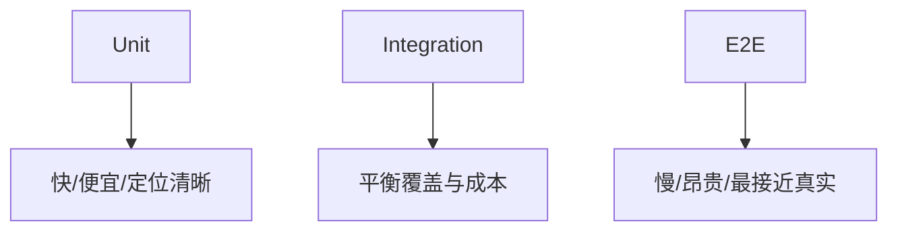
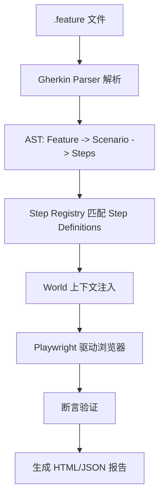
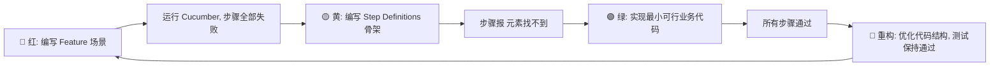
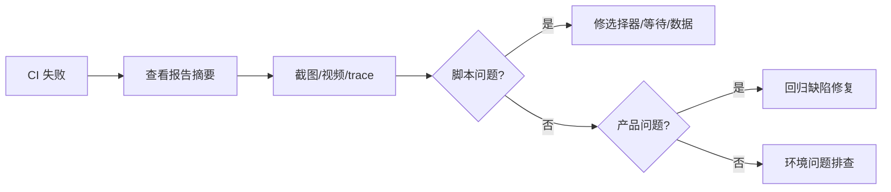
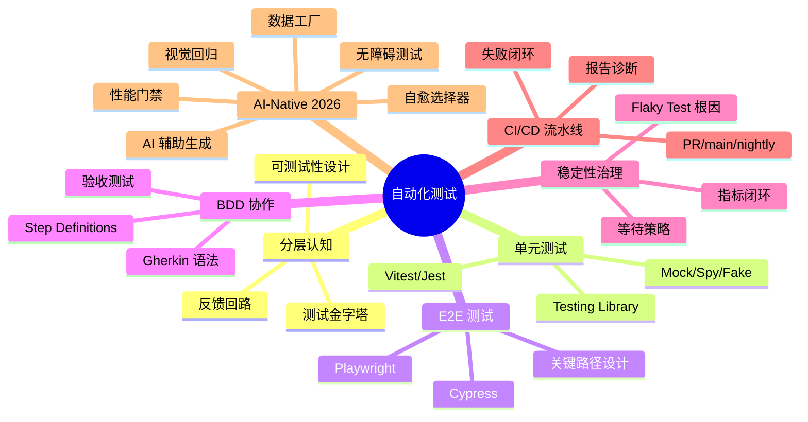

### 🧭 前端自动化测试学习总览

这份文档采用单层学习结构，按“分层认知 -> 单测/组件测 -> E2E/BDD -> 稳定性 -> CI 治理”展开。

自动化测试不是“把人工点点点改成脚本”，而是通过分层验证、可测试性设计、稳定的运行环境与可诊断的报告体系，持续降低回归成本与线上风险。

### 📊 学习路径建议

1. 先学模块一，建立测试金字塔和可测试性设计的基础认知。
2. 再学模块二，掌握 Jest/Vitest、Mock/Spy、Testing Library 的常见用法。
3. 再学模块三，理解 Playwright/Cypress 的定位与关键路径 E2E 设计。
4. 再学模块四，把 BDD/Gherkin 接到真实业务协作流程里。
5. 最后学模块五和模块六，补齐 Flaky Test 稳定性治理与 CI/CD 流水线设计。

### 🎯 学习目标

- 能解释为什么“测试越多不一定越安全”，关键在分层和反馈速度。
- 能写出用户视角的单测、组件测与 E2E 用例。
- 能识别 flaky test 的根因，而不是简单依赖 retry 掩盖问题。
- 能设计适合团队的测试流水线、报告诊断与失败闭环机制。

---

### 🧱 模块一：测试金字塔与可测试性设计

- **知识点**：测试金字塔、测试对象分层、可测试性设计、依赖边界、副作用隔离、反馈回路与成本模型。
- **模块讲解**：
    - 测试体系的核心不是某个框架，而是“哪些风险放在哪一层验证”。
    - 金字塔底层要足够宽，保证大量反馈来自快速、稳定、便宜的单元测试。
    - 代码如果难测，通常说明边界混乱、职责过重、副作用不可控。

#### 1.1 测试金字塔的结构、价值与误区

- **讲解**：
    - 测试金字塔一般分为 Unit、Integration、E2E 三层。
    - Unit 关注规则函数、工具函数、状态转换、格式转换等纯逻辑。
    - Integration 关注模块之间的协作，例如组件与路由、组件与服务、表单与校验器。
    - E2E 关注关键业务链路，例如登录、下单、支付、审批、导出等高价值流程。
    - 底层测试应该多，因为它运行快、失败定位清晰、维护成本低。
    - 顶层测试应该少而准，因为运行慢、环境依赖高、诊断成本高。
- **常见误区**：
    - 误区一：只做 E2E，觉得“最接近真实用户”就足够。
    - 误区二：只看覆盖率，不看断言质量与业务价值。
    - 误区三：把金字塔做成“冰激凌筒”，E2E 过多、单测过少。
    - 误区四：把所有细节都放进一个超长用例，失败后无法定位。
- **实践建议**：
    - 对纯逻辑优先用单测。
    - 对跨模块协作用集成测试。
    - 对关键业务流程保留少量高价值 E2E。
    - 每一层都要明确“验证目标”和“不验证什么”。
- **示例（分层目标）**：

```text
Unit: 金额计算、权限判断、表单校验、日期格式化
Integration: 搜索页组件 + 请求层 + 空状态/错误态展示
E2E: 登录 -> 搜索 -> 下单 -> 支付结果页
```

- **面试追问**：
    - 为什么很多团队 E2E 很多但回归效率仍然低？
    - 回答重点：E2E 太慢、太脆弱、定位模糊、环境依赖重，应该把大部分确定性逻辑下沉。

#### 1.2 测试对象分层与边界设计

- **讲解**：
    - 业务代码要先分出“纯逻辑层、状态编排层、UI 展示层、基础设施层”。
    - 纯逻辑层最容易单测，输入输出清晰，适合高覆盖。
    - 状态编排层适合集成测试，例如 reducer、store action、query 状态切换。
    - UI 展示层适合 Testing Library 等从用户视角进行断言。
    - 基础设施层如请求、埋点、存储，需要通过 mock 或契约测试控制边界。
- **一个经验法则**：
    - 纯函数：多写单测。
    - 多组件协作：写集成测试。
    - 浏览器关键流程：写 E2E。
    - 第三方依赖：用适当的 mock、fake server 或 contract test。
- **示例（把复杂组件拆成可测结构）**：

```ts
export function calcDiscount(total: number, level: 'normal' | 'vip') {
  if (level === 'vip') return total * 0.8;
  return total;
}

export async function submitOrder(api: { post: Function }, payload: any) {
  const price = calcDiscount(payload.total, payload.level);
  return api.post('/orders', { ...payload, price });
}
```

- **为什么这样更好测**：
    - `calcDiscount` 可以独立做单测。
    - `submitOrder` 可以通过 mock api 做行为测试。
    - 页面按钮点击再到页面跳转的整条链路留给 E2E。

#### 1.3 可测试性设计：纯函数、依赖注入与副作用隔离

- **讲解**：
    - 可测试性不是测试阶段补出来的，而是设计阶段决定的。
    - 纯函数最容易测试，因为结果只由输入决定。
    - 依赖注入能让外部能力替换成 mock/fake，例如 API、时间、随机数、存储。
    - 副作用要显式放在边界层，而不是混在业务逻辑内部。
    - 时间、随机数、全局单例、浏览器 API 是前端最常见的“难测来源”。
- **坏例子**：

```ts
export async function createIdAndSave(data: any) {
  const id = Math.random().toString(36).slice(2);
  localStorage.setItem('draft', JSON.stringify(data));
  await fetch('/api/save', {
    method: 'POST',
    body: JSON.stringify({ ...data, id })
  });
  return id;
}
```

- **问题分析**：
    - 随机数不可控。
    - 本地存储副作用直接耦合。
    - 网络请求难以隔离。
    - 失败路径不易断言。
- **改造示例**：

```ts
type Deps = {
  idGen: () => string;
  saveDraft: (data: any) => void;
  post: (url: string, body: any) => Promise<any>;
};

export async function createIdAndSave(data: any, deps: Deps) {
  const id = deps.idGen();
  deps.saveDraft(data);
  await deps.post('/api/save', { ...data, id });
  return id;
}
```

- **收益**：
    - 单测里可固定 id。
    - 可验证 `saveDraft` 是否被调用。
    - 可验证失败分支是否处理正确。
    - 不必真的访问网络或存储。

- **模块小结**：
    - 金字塔解决“测什么”。
    - 分层边界解决“在哪一层测”。
    - 可测试性设计解决“为什么代码能稳定地被测”。

#### 1.4 测试反馈回路与成本模型：为什么不是测试越多越好

- **讲解**：
  - 自动化测试的核心经济学问题不是“能不能测”，而是“用多高的成本换多大的风险下降”。
  - 单元测试通常反馈最快、定位最清晰、执行最便宜；E2E 最接近真实用户，但最慢、最脆弱、最贵。
  - 团队真正追求的是高价值反馈回路：开发提交后能在尽可能短的时间内知道是否引入回归。
  - 所以测试体系设计本质上是在平衡反馈速度、定位精度、维护成本和风险覆盖面。
- **一个实用心智模型**：
  - 便宜且稳定的逻辑放底层多测。
  - 关键链路在顶层少而准地测。
  - 不要把所有信心都押在最昂贵的一层。
- **图例（测试成本与反馈）**：



---

### 🧪 模块二：Jest/Vitest、Mock/Spy 与 Testing Library

- **知识点**：测试运行器、断言库、Mock/Spy/Fake、Testing Library、覆盖率、测试命名。
- **模块讲解**：
    - Jest 与 Vitest 都能承担前端单测与组件测试。
    - Mock 用来替代依赖，Spy 用来观察调用，Fake 用来提供可控实现。
    - Testing Library 的核心理念是“越接近用户使用方式，测试越可靠”。

#### 2.1 Jest / Vitest 基础用法与运行环境

- **讲解**：
    - Jest 生态成熟，很多老项目和 React 项目使用广泛。
    - Vitest 与 Vite 集成更自然，冷启动和增量执行通常更快。
    - 两者都支持 `describe`、`it/test`、`expect`、mock、coverage 等能力。
    - 前端组件测试常配合 `jsdom` 运行环境模拟浏览器 DOM。
- **Vitest 示例**：

```ts
import { describe, it, expect } from 'vitest';

function normalizeName(name: string) {
  return name.trim().toLowerCase();
}

describe('normalizeName', () => {
  it('should trim and lowercase', () => {
    expect(normalizeName('  Alice  ')).toBe('alice');
  });
});
```

- **Jest 配置关注点**：
    - 是否需要 `testEnvironment: 'jsdom'`。
    - 是否需要 `setupFilesAfterEnv` 注入全局断言。
    - 是否需要 alias 映射与 ts 转换。
- **Vitest 配置示例**：

```ts
import { defineConfig } from 'vitest/config';

export default defineConfig({
  test: {
    environment: 'jsdom',
    globals: true,
    setupFiles: ['./test/setup.ts'],
    coverage: {
      reporter: ['text', 'html']
    }
  }
});
```

- **命名建议**：
    - 优先写行为：`should show error when api fails`。
    - 避免写实现：`calls setState twice`。

#### 2.2 Mock、Spy、Stub、Fake 的区别与用法

- **讲解**：
    - Mock：替换依赖，并可定义返回值、断言调用。
    - Spy：保留原函数或包装函数，只观察调用情况。
    - Stub：提供固定返回值，减少外部依赖影响。
    - Fake：提供简化但可工作的替代实现，例如内存版仓库。
- **何时用**：
    - 测业务分支时，用 mock 隔离第三方请求。
    - 想验证函数是否被调用，用 spy。
    - 想固定时间、随机数、网络结果，用 stub/fake。
- **Vitest 示例**：

```ts
import { describe, it, expect, vi } from 'vitest';
import { createIdAndSave } from './order';

describe('createIdAndSave', () => {
  it('should call deps and return generated id', async () => {
    const saveDraft = vi.fn();
    const post = vi.fn().mockResolvedValue({ ok: true });

    const id = await createIdAndSave(
      { total: 100 },
      {
        idGen: () => 'fixed-id',
        saveDraft,
        post
      }
    );

    expect(id).toBe('fixed-id');
    expect(saveDraft).toHaveBeenCalledOnce();
    expect(post).toHaveBeenCalledWith('/api/save', { total: 100, id: 'fixed-id' });
  });
});
```

- **Spy 示例**：

```ts
const spy = vi.spyOn(console, 'error').mockImplementation(() => {});

console.error('boom');
expect(spy).toHaveBeenCalledWith('boom');

spy.mockRestore();
```

- **常见错误**：
    - 对实现细节 mock 过度，导致重构后测试大量误报。
    - 在一个文件中共享 mock 状态，造成用例之间互相污染。
    - 忘记 `restoreAllMocks` 或 `clearAllMocks`。

#### 2.3 Testing Library：查询、交互与断言

- **讲解**：
    - 查询顺序通常推荐 `getByRole` > `getByLabelText` > `getByText` > `getByTestId`。
    - 用户交互建议使用 `userEvent`，比直接触发底层 DOM 事件更接近真实行为。
    - 异步渲染要用 `findBy`、`waitFor` 等等待 DOM 进入目标状态。
- **组件示例**：

```tsx
function LoginForm({ onSubmit }: { onSubmit: (data: any) => Promise<void> }) {
  const [error, setError] = React.useState('');

  async function handleSubmit(e: React.FormEvent<HTMLFormElement>) {
    e.preventDefault();
    const form = new FormData(e.currentTarget);
    try {
      await onSubmit({
        email: form.get('email'),
        password: form.get('password')
      });
    } catch {
      setError('登录失败');
    }
  }

  return (
    <form onSubmit={handleSubmit}>
      <label>
        邮箱
        <input name="email" />
      </label>
      <label>
        密码
        <input name="password" type="password" />
      </label>
      <button type="submit">登录</button>
      {error && <p role="alert">{error}</p>}
    </form>
  );
}
```

- **测试示例**：

```tsx
import { render, screen } from '@testing-library/react';
import userEvent from '@testing-library/user-event';
import { vi, it, expect } from 'vitest';

it('should show error when submit fails', async () => {
  const user = userEvent.setup();
  const onSubmit = vi.fn().mockRejectedValue(new Error('fail'));

  render(<LoginForm onSubmit={onSubmit} />);

  await user.type(screen.getByLabelText('邮箱'), 'a@test.com');
  await user.type(screen.getByLabelText('密码'), '123456');
  await user.click(screen.getByRole('button', { name: '登录' }));

  expect(await screen.findByRole('alert')).toHaveTextContent('登录失败');
});
```

- **测试哲学**：
    - 断言页面上用户能看到或能操作的内容。
    - 避免断言内部状态、类实例、hook 私有变量。
    - 关注输出和可见行为，而不是实现细节。

#### 2.4 覆盖率、测试数据与高质量用例设计

- **讲解**：
    - 覆盖率是参考指标，不是质量本身。
    - 高覆盖率但没有覆盖边界条件，价值仍然有限。
    - 应特别关注空值、异常、权限、超时、弱网、并发点击等边界。
- **一个更有价值的测试清单**：
    - 正常路径是否通过。
    - 错误路径是否提示清晰。
    - 状态切换是否一致，例如 loading -> success / error。
    - 表单校验是否覆盖非法输入。
    - 按钮防重复提交是否生效。
- **示例（表驱动测试）**：

```ts
import { describe, it, expect } from 'vitest';
import { calcDiscount } from './order';

const cases = [
  { total: 100, level: 'normal', expected: 100 },
  { total: 100, level: 'vip', expected: 80 }
] as const;

describe('calcDiscount', () => {
  cases.forEach(({ total, level, expected }) => {
    it(`should return ${expected} when level is ${level}` , () => {
      expect(calcDiscount(total, level)).toBe(expected);
    });
  });
});
```

- **模块小结**：
    - Jest/Vitest 解决“怎么跑测试”。
    - Mock/Spy 解决“如何隔离依赖并观察行为”。
    - Testing Library 解决“如何从用户视角验证组件行为”。

#### 2.5 组件测试选型矩阵：Storybook、Playwright CT、Cypress CT 怎么选

- **讲解**：
  - 组件测试不是“多一个框架”，而是用最低成本验证组件在真实交互下是否稳定。
  - 选型要围绕三个维度：反馈速度、调试体验、与现有工程链路的耦合度。
- **快速选型规则**：
  - 已重度使用 Storybook：优先 `Storybook test-runner`，文档即测试，评审成本低。
  - 已有 Playwright 体系：优先 `Playwright Component Testing`，断言/报告/trace 统一。
  - 团队以 Cypress 为主：优先 `Cypress Component Testing`，本地交互调试体验好。
- **选型矩阵（面试可直接复述）**：

```text
目标一：最快回归组件行为 -> Storybook test-runner
目标二：统一 E2E 与组件测试基础设施 -> Playwright CT
目标三：前端本地可视化调试优先 -> Cypress CT
```

- **落地建议**：
  - 不要三套并存，主选一套，另一套仅在历史包袱场景过渡使用。
  - 组件层优先验证：交互行为、可访问性语义、关键状态切换。
  - 与视觉回归联动时，优先在 Storybook 场景上做截图基线。
- **面试速答模板（30 秒）**：
  - 组件测试选型我看三点：是否已有 Storybook、是否要和 E2E 统一、团队本地调试习惯。
  - 通常我会主选一套工具避免重复建设：文档驱动选 Storybook，统一链路选 Playwright CT，交互调试优先选 Cypress CT。
  - 关键是稳定反馈，不是工具越多越好。

---

### 🌐 模块三：Playwright / Cypress 的完整示例与实践策略

- **知识点**：浏览器自动化、关键路径设计、稳定选择器、测试数据隔离、环境治理。
- **模块讲解**：
    - E2E 的目标不是覆盖全部页面，而是兜住最关键的业务流程。
    - Playwright 更强调现代浏览器自动化、跨浏览器与 trace 能力。
    - Cypress 更强调开发过程中的交互反馈与前端团队易用性。

#### 3.1 Playwright：完整登录与下单示例

- **讲解**：
    - Playwright 内置 `expect`、trace、录屏、截图、fixture 等能力。
    - 推荐使用 role、label、testid 等稳定选择器。
    - 避免自己写 `sleep`，优先依赖 Playwright 的自动等待。
- **示例**：

```ts
import { test, expect } from '@playwright/test';

test('user can login and create order', async ({ page }) => {
  await page.goto('/login');
  await page.getByLabel('邮箱').fill('buyer@test.com');
  await page.getByLabel('密码').fill('123456');
  await page.getByRole('button', { name: '登录' }).click();

  await expect(page).toHaveURL(/dashboard/);

  await page.goto('/orders/new');
  await page.getByLabel('商品名').fill('机械键盘');
  await page.getByLabel('数量').fill('2');
  await page.getByTestId('submit-order').click();

  await expect(page.getByRole('status')).toHaveText('创建成功');
});
```

- **配套配置示例**：

```ts
import { defineConfig } from '@playwright/test';

export default defineConfig({
  use: {
    baseURL: 'http://localhost:3000',
    trace: 'retain-on-failure',
    screenshot: 'only-on-failure',
    video: 'retain-on-failure'
  },
  retries: 1,
  workers: 2
});
```

- **诊断重点**：
    - 失败时先看 trace。
    - 再看 screenshot/video 是否与预期页面一致。
    - 再看请求失败、选择器变更还是数据状态问题。

#### 3.2 Cypress：组件交互与页面流程示例

- **讲解**：
    - Cypress 的命令链、实时可视化和时间旅行调试对前端团队非常友好。
    - 但要注意命令队列与同步代码执行模型不同，避免写出难懂的链式逻辑。
- **示例**：

```ts
describe('checkout flow', () => {
  it('should submit order successfully', () => {
    cy.visit('/orders/new');
    cy.findByLabelText('商品名').type('显示器');
    cy.findByLabelText('数量').clear().type('1');
    cy.findByTestId('submit-order').click();
    cy.findByRole('status').should('contain.text', '创建成功');
  });
});
```

- **请求拦截示例**：

```ts
cy.intercept('POST', '/api/orders', {
  statusCode: 200,
  body: { id: 'o_1001', success: true }
}).as('createOrder');

cy.findByTestId('submit-order').click();
cy.wait('@createOrder');
```

- **适用场景**：
    - 本地开发时快速验证某个页面流程。
    - 前端独立调试复杂 UI 状态。
    - 需要直观回放命令执行轨迹时。

#### 3.3 E2E 的测试数据、环境隔离与稳定性策略

- **讲解**：
    - E2E 失败的常见原因不是断言，而是环境和数据不稳定。
    - 用例要尽量自包含，避免依赖前置测试先执行。
    - 测试环境应可重置、可预置、可观测。
- **常用策略**：
    - 为测试创建专用账号和专用数据集。
    - 通过 API 或 DB seed 快速初始化状态。
    - 给元素添加 `data-testid`，减少样式类名变更影响。
    - 使用固定时区、固定语言、固定浏览器版本。
    - 避免与真实第三方支付、短信、地图服务强耦合。
- **示例（测试数据准备）**：

```ts
test.beforeEach(async ({ request }) => {
  await request.post('/test-api/reset');
  await request.post('/test-api/seed-order-user', {
    data: { email: 'buyer@test.com' }
  });
});
```

- **E2E 用例设计模板**：
    - 前置条件：账号、数据、环境。
    - 操作步骤：用户真实操作序列。
    - 预期结果：页面变化、请求变化、业务状态变化。
    - 清理策略：是否需要回收数据。

#### 3.4 前后端契约测试：防止“前端以为对，后端也以为对”

- **讲解**：
  - 契约测试用于验证接口约定本身，而不是页面流程。
  - 它位于单测和 E2E 之间，成本低于全链路 E2E，但能提前发现接口字段漂移。
- **什么时候必须上契约测试**：
  - 前后端并行开发，Mock 与真实接口经常不一致。
  - BFF 或网关频繁改字段名、可空性、枚举值。
  - 多端复用同一 API（Web、App、小程序）。
- **两种常见模式**：
  - Consumer-Driven Contract（如 Pact）：由消费方定义期望，提供方校验是否满足。
  - Schema-Driven Contract（OpenAPI/JSON Schema）：以规范文件为单一事实源，双方都做校验。
- **工程接入建议**：
  - PR：消费方契约测试必须通过。
  - main：提供方回放全部消费者契约。
  - release：对外 API 做一次破坏性变更扫描（字段删除、类型收窄、枚举收窄）。
- **极简示例（Schema 校验思路）**：

```ts
import { z } from 'zod';

const OrderSchema = z.object({
  id: z.string(),
  status: z.enum(['pending', 'paid', 'failed']),
  amount: z.number()
});

// 在集成测试中校验真实响应是否仍满足契约
function assertOrderContract(payload: unknown) {
  return OrderSchema.parse(payload);
}
```

- **面试速答模板（30 秒）**：
  - 我把契约测试放在集成层，专门防接口漂移。
  - E2E 主要看流程，契约测试主要看字段和类型约定，二者不替代。
  - 流程上是 PR 校验消费者契约、主干回放提供者契约，这样能把联调风险前移。

---

### 🥒 模块四：BDD / Gherkin 的实战应用

- **知识点**：Gherkin、Feature、Scenario、Step Definitions、业务语言协作、验收测试。
- **模块讲解**：
    - BDD 的价值不在“语法很像自然语言”，而在让业务、测试、开发对齐验收标准。
    - Feature 文件应该表达业务规则，而不是 DOM 细节和技术实现步骤。

#### 4.1 Gherkin 场景如何写得既清晰又可维护

- **讲解**：
    - `Feature` 表示功能主题。
    - `Scenario` 表示单个业务场景。
    - `Given / When / Then` 分别描述前置条件、动作、结果。
    - `Scenario Outline` 可用于多个输入组合。
- **好例子**：

```gherkin
Feature: 订单创建
  作为采购员
  我希望提交订单
  以便完成采购流程

  Scenario: 库存充足时创建订单成功
    Given 采购员已登录系统
    And 商品 "机械键盘" 库存充足
    When 采购员提交数量为 2 的订单
    Then 系统应提示 "创建成功"
    And 订单状态应为 "待支付"
```

- **坏例子**：

```gherkin
Scenario: click button
  Given user visits /orders/new
  When user clicks .btn-primary
  Then user sees div.toast-success
```

- **为什么坏**：
    - 业务语义缺失。
    - DOM 细节写入场景，UI 结构一变就全坏。
    - 产品和测试同学难以参与讨论。

#### 4.2 Step Definitions、自动化落地与协作流程

- **讲解**：
    - Step Definitions 负责把业务语言映射到自动化实现。
    - 建议一个步骤做一件事情，保持可复用与可组合。
    - 业务评审时先确定 Feature，再开始编码与实现步骤。
- **示例（伪代码）**：

```ts
Given('采购员已登录系统', async () => {
  await loginAsBuyer();
});

Given('商品 {string} 库存充足', async (name: string) => {
  await seedStock(name, 100);
});

When('采购员提交数量为 {int} 的订单', async (count: number) => {
  await page.goto('/orders/new');
  await page.getByLabel('商品名').fill('机械键盘');
  await page.getByLabel('数量').fill(String(count));
  await page.getByRole('button', { name: '提交订单' }).click();
});

Then('系统应提示 {string}', async (message: string) => {
  await expect(page.getByRole('status')).toHaveText(message);
});
```

- **协作流程建议**：
    - 需求评审阶段先写验收场景。
    - 开发和测试共同确认 Given/When/Then 是否完整。
    - UI 改动不应频繁改 Feature，只改步骤实现。
    - 复盘线上事故时，可把关键缺失场景补成 BDD 用例。

#### 4.3 Cucumber.js + Playwright 实现原理与 TDD 工作流

- **讲解**：
    - Cucumber.js 是 Gherkin 的 JavaScript 执行引擎，负责将 `.feature` 文件中的业务语言解析为可执行的测试用例。
    - Playwright 提供浏览器自动化能力，作为 Step Definitions 的底层驱动。
    - TDD（测试驱动开发）模式与 BDD 结合，形成"先写验收标准 -> 再写实现 -> 绿->重构"的闭环。

##### 4.3.1 整体架构与执行原理

- **执行流程**：



- **核心原理拆解**：
    1. **Gherkin Parser**：将 `.feature` 文件解析为 AST（抽象语法树），提取 Feature、Scenario、Step 的层次结构。
    2. **Step Registry**：维护正则表达式到 Step 函数的映射表。每个 Step 定义通过正则匹配对应的 Gherkin 行。
    3. **World 上下文**：每个 Scenario 执行前创建独立的 World 实例，实现用例间状态隔离。
    4. **钩子（Hooks）**：`Before`/`After` 在每个 Scenario 前后执行，负责环境准备与清理。
    5. **并行执行**：Cucumber.js 支持按 Profile 分组并行执行，结合 Playwright 的多 worker 能力加速 E2E。

##### 4.3.2 项目结构与配置

- **目录结构**：

```
e2e/
├── features/
│   ├── order-creation.feature          # Gherkin 业务场景
│   ├── login.feature
│   └── step-definitions/
│       ├── common.steps.ts             # 通用步骤
│       ├── order.steps.ts              # 订单相关步骤
│       └── world.ts                    # World 上下文
├── support/
│   ├── hooks.ts                        # Before/After 钩子
│   └── playwright.config.ts            # Playwright 配置
├── cucumber.js                         # Cucumber Profile 配置
└── tsconfig.json
```

- **Cucumber Profile 配置**：

```js
// cucumber.js
const common = [
  "e2e/features/**/*.feature",
  "--require-module ts-node/register",
  "--require 'e2e/features/step-definitions/**/*.ts'",
  "--require 'e2e/support/**/*.ts'",
  "--format @cucumber/pretty-formatter",
  "--format json:e2e/reports/cucumber-report.json",
  "--format html:e2e/reports/cucumber-report.html",
].join(" ");

module.exports = {
  default: common,
  parallel: `${common} --parallel 4`,
  smoke: `e2e/features/smoke/**/*.feature ${common}`,
};
```

- **Playwright + Cucumber 集成配置**：

```ts
// e2e/support/playwright.config.ts
import { defineConfig } from '@playwright/test';

export default defineConfig({
  use: {
    baseURL: process.env.BASE_URL || 'http://localhost:3000',
    trace: 'retain-on-failure',
    screenshot: 'only-on-failure',
    video: 'retain-on-failure',
    viewport: { width: 1280, height: 720 },
  },
});
```

##### 4.3.3 World 上下文：状态隔离的核心

- **原理**：World 是 Cucumber 在每个 Scenario 执行前创建的独立上下文对象。所有 Step Definitions 通过 `this` 访问共享状态，但不同 Scenario 的 World 完全隔离。

```ts
// e2e/features/step-definitions/world.ts
import { World as CucumberWorld, setWorldConstructor } from '@cucumber/cucumber';
import { Browser, BrowserContext, Page, chromium } from '@playwright/test';
import { PrismaClient } from '@prisma/client';

export class World extends CucumberWorld {
  public browser!: Browser;
  public context!: BrowserContext;
  public page!: Page;
  public prisma = new PrismaClient();
  public testData: Record<string, any> = {};

  constructor(options: any) {
    super(options);
  }

  // 附加辅助方法
  async goto(path: string) {
    await this.page.goto(path);
  }

  async seedUser(overrides = {}) {
    const user = await this.prisma.user.create({
      data: { email: `test_${Date.now()}@test.com`, ...overrides }
    });
    this.testData.user = user;
    return user;
  }
}

setWorldConstructor(World);
```

##### 4.3.4 Step Definitions 完整实现

- **参数类型捕获**：Cucumber 支持 `{string}`、`{int}`、`{float}`、`{word}` 等内置类型，也可自定义。

```ts
// e2e/features/step-definitions/order.steps.ts
import { Given, When, Then, Before, After } from '@cucumber/cucumber';
import { expect } from '@playwright/test';
import { World } from './world';

// ===== Given：前置条件 =====

Given('我是一名已注册的{string}用户', async function (this: World, role: string) {
  // this 指向当前 Scenario 的 World 实例
  this.testData.user = await this.prisma.user.create({
    data: {
      email: `e2e_${Date.now()}@test.com`,
      password: 'hashed_pw',
      role: role as 'buyer' | 'seller' | 'admin',
    }
  });
});

Given('购物车中有{int}件商品', async function (this: World, count: number) {
  await this.prisma.cartItem.createMany({
    data: Array.from({ length: count }, (_, i) => ({
      userId: this.testData.user.id,
      productId: `product_${i + 1}`,
      quantity: 1,
    }))
  });
});

// ===== When：用户操作 =====

When('我打开登录页面', async function (this: World) {
  this.browser = await chromium.launch();
  this.context = await this.browser.newContext();
  this.page = await this.context.newPage();
  await this.page.goto('/login');
});

When('我输入正确的用户名和密码', async function (this: World) {
  await this.page.getByLabel('邮箱').fill(this.testData.user.email);
  await this.page.getByLabel('密码').fill('Test123!');
  await this.page.getByRole('button', { name: '登录' }).click();
});

When('我点击提交订单按钮', async function (this: World) {
  await this.page.getByRole('button', { name: '提交订单' }).click();
});

// ===== Then：断言验证 =====

Then('我应该看到订单确认页面', async function (this: World) {
  await expect(this.page).toHaveURL(/\/orders\/confirmation/);
  await expect(this.page.getByRole('heading', { name: '订单提交成功' })).toBeVisible();
});

Then('订单金额应为{float}元', async function (this: World, expectedAmount: number) {
  const amountText = await this.page.getByTestId('order-total').textContent();
  const actualAmount = parseFloat(amountText!.replace(/[^\d.]/g, ''));
  expect(actualAmount).toBeCloseTo(expectedAmount, 2);
});

Then('我应该收到确认邮件', async function (this: World) {
  const emails = await this.prisma.emailLog.findMany({
    where: { to: this.testData.user.email }
  });
  expect(emails.length).toBeGreaterThan(0);
});
```

##### 4.3.5 钩子（Hooks）：生命周期管理

- **原理**：Hooks 在每个 Scenario 前后执行，负责浏览器、数据库、测试数据的生命周期管理。

```ts
// e2e/support/hooks.ts
import { Before, After, BeforeAll, AfterAll } from '@cucumber/cucumber';
import { World } from '../features/step-definitions/world';

// 全局只执行一次
BeforeAll(async () => {
  // 启动测试服务器 / 连接数据库
  console.log('🚀 E2E test suite starting...');
});

AfterAll(async () => {
  // 清理全局资源
  console.log('🏁 E2E test suite finished.');
});

// 每个 Scenario 前后执行
Before(async function (this: World) {
  // 可以在这里做更细粒度的初始化
  this.testData = {};
});

After(async function (this: World, { result }: { result: { status: string } }) {
  // 失败时自动截图和保存 Trace
  if (result.status === 'FAILED' && this.page) {
    await this.page.screenshot({ path: `e2e/reports/screenshots/${Date.now()}.png` });
    await this.page.context().tracing.stop({ path: `e2e/reports/traces/${Date.now()}.zip` });
  }

  // 清理测试数据
  if (this.testData.user?.id) {
    await this.prisma.user.delete({ where: { id: this.testData.user.id } }).catch(() => {});
  }

  // 关闭浏览器
  if (this.page) await this.page.close();
  if (this.context) await this.context.close();
  if (this.browser) await this.browser.close();
});
```

##### 4.3.6 TDD 工作流：红 -> 绿 -> 重构

- **完整 TDD 循环**：



- **TDD 实战示例**：

```gherkin
# 第一步：🔴 红 - 先写验收场景（业务驱动）
# features/user-registration.feature
Feature: 用户注册
  Scenario: 新用户使用有效信息注册成功
    Given 用户打开注册页面
    When 用户填写有效的邮箱、密码和确认密码
    And 用户点击注册按钮
    Then 用户应该看到"注册成功"的提示
    And 用户应该收到验证邮件
```

```ts
// 第二步：🟡 黄 - 运行后 Cucumber 报告 "Undefined step"
// 生成 Step Definitions 骨架
// step-definitions/registration.steps.ts
import { Given, When, Then } from '@cucumber/cucumber';
import { expect } from '@playwright/test';
import { World } from './world';

Given('用户打开注册页面', async function (this: World) {
  this.browser = await chromium.launch();
  this.page = await this.browser.newPage();
  await this.page.goto('/register');
});

When('用户填写有效的邮箱、密码和确认密码', async function (this: World) {
  await this.page.getByLabel('邮箱').fill('newuser@test.com');
  await this.page.getByLabel('密码').fill('SecurePass123!');
  await this.page.getByLabel('确认密码').fill('SecurePass123!');
});

When('用户点击注册按钮', async function (this: World) {
  await this.page.getByRole('button', { name: '注册' }).click();
});

Then('用户应该看到"注册成功"的提示', async function (this: World) {
  await expect(this.page.getByText('注册成功')).toBeVisible();
});

Then('用户应该收到验证邮件', async function (this: World) {
  const emails = await this.prisma.emailLog.findMany({
    where: { to: 'newuser@test.com', subject: '验证邮箱' }
  });
  expect(emails.length).toBeGreaterThan(0);
});
```

```bash
# 第三步：🟢 绿 - 运行测试
# npx cucumber-js                    # 全部通过 = 功能实现完成
# 第四步：🔄 重构 - 优化代码，测试持续通过
```

##### 4.3.7 并行执行与 CI 集成

- **并行策略**：按 Feature 文件分组，每个 worker 独立浏览器上下文。

```bash
# package.json scripts
{
  "scripts": {
    "test:e2e": "cucumber-js",
    "test:e2e:parallel": "cucumber-js --parallel 4",
    "test:e2e:smoke": "cucumber-js --profile smoke",
    "test:e2e:report": "cucumber-js --format html:e2e/reports/report.html"
  }
}
```

- **CI Pipeline 集成**：

```yaml
# .github/workflows/e2e-bdd.yml
e2e-bdd:
  runs-on: ubuntu-latest
  steps:
    - uses: actions/checkout@v4
    - run: npm ci
    - run: npx playwright install --with-deps
    - run: npm run build
    - run: npm run start & npx wait-on http://localhost:3000
    - run: npm run test:e2e:parallel
    - name: Upload Cucumber Report
      if: always()
      uses: actions/upload-artifact@v4
      with:
        name: cucumber-report
        path: e2e/reports/
```

##### 4.3.8 最佳实践与常见陷阱

- **DO**：
    - Step Definitions 只负责调用 Playwright 和断言，不包含业务逻辑。
    - 使用 World 管理状态，避免全局变量。
    - 一个 Step 只做一件事，保持高内聚低耦合。
    - 优先使用 `await expect(...).toBeVisible()` 而非 `await page.waitForTimeout()`。
    - 在 After 钩子中清理测试数据，防止数据污染。
- **DON'T**：
    - 不要在 Feature 文件中写 CSS 选择器或 DOM 细节。
    - 不要在 Step 之间依赖隐式状态（一个 Scenario 不应依赖另一个 Scenario 的执行结果）。
    - 不要在一个 Step 中执行过多操作（调试困难，失败无法精确定位）。
    - 不要跳过 TDD 循环直接写实现（先写 Feature 场景，再写 Step，再写代码）。

- **模块小结**：
    - Gherkin 解决"业务验收标准如何表达"。
    - Step Definitions 解决"业务语言如何映射到自动化操作"。
    - Cucumber.js + Playwright 解决"如何高效执行并报告 BDD 测试"。
    - World + Hooks 解决"如何实现用例间的状态隔离和资源管理"。
    - TDD 工作流解决"如何以业务价值驱动开发节奏"。

---

### 🧷 模块五：Flaky Test 稳定性治理

- **知识点**：异步竞争、选择器稳定性、环境抖动、重试策略、隔离机制、治理指标。
- **模块讲解**：
    - Flaky Test 的危害不是“偶尔失败一次”，而是削弱团队对测试结果的信任。
    - 一旦团队习惯性忽略红灯，自动化测试就失去门禁价值。

#### 5.1 Flaky Test 的根因分类与诊断方法

- **根因分类**：
    - 异步竞争：请求还没完成就断言，动画未结束就点击，状态尚未稳定就读取 DOM。
    - 选择器不稳定：依赖 class、nth-child、文案碎片、动态结构。
    - 环境抖动：CPU、网络、第三方接口、测试机负载不同。
    - 数据污染：前序用例留下状态，账号被复用，缓存未清理。
    - 时间依赖：定时器、时区、日期跨天、轮询边界。
- **诊断思路**：
    - 判断是必现、偶现还是只在 CI 出现。
    - 收集失败截图、trace、日志、请求记录。
    - 看失败点是“元素找不到”“元素不可点击”“断言文本不一致”还是“接口超时”。
    - 比较本地和 CI 的环境差异。
- **实战原则**：
    - 先定位根因，再决定是否需要 retry。
    - retry 只能减小偶发波动，不能代替修复。

#### 5.2 等待策略、稳定选择器与测试数据治理

- **等待策略建议**：
    - 优先等“可见、可交互、请求完成、文本出现、URL 变化”。
    - 避免裸 `sleep(3000)`，因为它既慢又不稳定。
    - 对异步列表加载，用“空状态消失或目标元素出现”作为等待条件。
- **选择器建议**：
    - 优先 `role`、`label`、`placeholder`、`testid`。
    - 避免 `.button.primary:nth-child(3)` 这类脆弱选择器。
- **数据治理建议**：
    - 每个用例准备独立数据。
    - 用 API/fixture 快速恢复状态。
    - 对需要唯一值的场景使用可预测 ID，而非真实随机数据。
- **示例（不推荐）**：

```ts
await page.click('.list > div:nth-child(2) button');
await page.waitForTimeout(3000);
```

- **示例（推荐）**：

```ts
await page.getByRole('button', { name: '提交订单' }).click();
await expect(page.getByRole('status')).toHaveText('创建成功');
```

#### 5.3 稳定性治理机制：重试、隔离、隔离仓与指标看板

- **讲解**：
    - 治理 flaky 不只是修单个用例，还要建立制度。
    - 对频繁波动用例可临时隔离到 quarantine 集合，但必须有 owner 和清理时限。
    - 看板要统计失败率、波动率、平均修复时长、主要根因分布。
- **治理策略**：
    - PR 门禁只跑稳定的快测试和 smoke 用例。
    - 夜间回归跑全量 E2E，并输出波动趋势。
    - 对同一用例的重复失败进行聚类，避免团队重复排查。
    - 对 flaky 失败单独打标，区分“真实产品故障”和“测试不稳定”。
- **指标示例**：

```text
Suite 通过率 = 成功执行数 / 总执行数
Flaky 率 = 重跑后成功的失败数 / 总执行数
平均定位时长 = 从失败到找到根因的平均耗时
```

- **模块小结**：
    - 稳定性治理的关键是：根因分类、等待策略、数据隔离、组织机制、指标闭环。

#### 5.4 确定性思维：为什么 flaky 本质上是系统设计问题

- **讲解**：
  - flaky 表面看是测试失败，实质上往往是系统里存在未被控制的非确定性：异步竞争、共享状态、时间依赖、环境差异。
  - 如果一个系统只有在“运气好”时才通过测试，那不是测试太严格，而是系统边界设计不稳。
  - 所以治理 flaky，不能只修脚本，还要回到产品代码、测试数据、环境隔离和基础设施设计。
- **一个判断标准**：
  - 同一输入、同一环境、同一代码版本，测试结果应尽量稳定一致。
  - 任何破坏这个前提的因素，最终都会变成 flaky 风险源。

---

### 🚀 模块六：CI/CD 流水线设计与报告诊断

- **知识点**：分层流水线、质量门禁、测试矩阵、报告产物、失败诊断、责任闭环。
- **模块讲解**：
    - 流水线目标不是堆步骤，而是在合理时机用合理成本拦住合理风险。
    - 测试运行结果必须可追溯、可诊断、可复现，否则红灯没有行动价值。

#### 6.1 分层流水线设计：PR、主干、夜间回归怎么分工

- **讲解**：
    - PR 阶段强调快速反馈，通常执行 lint、typecheck、unit、关键集成测试。
    - 主干合并后可执行 smoke E2E、构建产物校验、基础性能 smoke。
    - 夜间回归再执行全量 E2E、跨浏览器矩阵、BDD 场景和更重的兼容性检查。
- **示例（分层执行策略）**：

```text
PR pipeline: lint + typecheck + unit + key integration
main pipeline: build + smoke e2e + artifact verify
nightly pipeline: full e2e + bdd + multi-browser + report trend
```

- **设计原则**：
    - 快测试前置，慢测试后置。
    - 容易波动的测试不要直接卡死所有开发者。
    - 发布前必须覆盖核心交易链路。

#### 6.2 报告、截图、视频、trace 与失败诊断路径

- **讲解**：
    - 报告至少应包含失败堆栈、截图、视频、trace、请求日志、环境信息。
    - 没有上下文的失败日志，只会让排查成本转嫁给开发者。
- **报告中建议保留的信息**：
    - 浏览器类型、版本、系统、分辨率。
    - 当前 commit、分支、构建号。
    - 失败步骤、失败截图、trace 下载地址。
    - 关联测试数据 ID、用户 ID、traceId。
- **失败诊断路径**：
    - 第一步：确认是脚本错误、产品错误还是环境错误。
    - 第二步：查看 screenshot/video，判断页面是否已经进入目标状态。
    - 第三步：查看 trace/network，判断是否存在接口超时、4xx/5xx、资源失败。
    - 第四步：结合代码提交与日志，确认是否为回归引入。
- **Mermaid 示意**：



#### 6.3 失败处理闭环、Owner 机制与持续改进

- **讲解**：
    - 测试失败必须有 owner，不能长期停留在“有人看看”。
    - 用例、模块、流水线都应有明确负责人。
    - 失败闭环包括：发现、分类、修复、复盘、预防。
- **推荐机制**：
    - 对门禁失败设置 SLA，例如工作日 2 小时内确认归属。
    - 对频繁失败套件进行周度治理。
    - 把高频故障写成团队知识库和排障 SOP。
    - 对发布阻塞类失败设立升级通道。
- **CI 配置示意**：

```yaml
stages:
  - quality
  - build
  - smoke
  - regression

quality:
  script:
    - pnpm lint
    - pnpm typecheck
    - pnpm test:unit

smoke:
  script:
    - pnpm test:e2e:smoke
  artifacts:
    paths:
      - playwright-report/
      - test-results/
```

- **模块小结**：
    - 好的流水线不是“所有测试都放进去”，而是“能快速反馈 + 能有效诊断 + 能形成闭环”。

#### 6.4 流水线设计的底层原则：吞吐、等待时间与信任度

- **讲解**：
  - 从工程治理角度看，CI/CD 是团队的共享排队系统，过慢的门禁会直接拖垮开发吞吐。
  - 如果门禁经常误报，团队会失去信任；如果门禁太松，回归会流入线上。
  - 因此流水线设计要同时优化三件事：平均等待时间、失败诊断效率、结果可信度。
- **设计原则**：
  - 高频提交路径优先快反馈。
  - 高成本测试集中在主干、夜间或发布前。
  - 失败必须能快速区分脚本波动、环境问题、真实产品回归。

#### 6.5 质量门禁阈值模板：把“重视质量”变成可执行规则

- **讲解**：
  - 质量治理失败最常见原因不是没有测试，而是没有明确阈值。
  - 只讲“尽量快、尽量稳”无法执行，必须配置可观测、可告警、可阻断的红线。
- **默认阈值模板（可按团队成熟度微调）**：

```text
PR 阶段
- 总耗时目标: <= 12 分钟
- 单测 + 关键集成: 必须通过
- 新增/变更代码覆盖率: >= 80%
- a11y 阻断级别: critical/serious = 0

main 阶段
- smoke e2e 通过率: = 100%
- 构建成功率: >= 99%
- 首次失败可诊断率(含截图/trace): >= 95%

nightly 阶段
- 全量 e2e 通过率: >= 98%
- flaky 率: < 2%
- 平均定位时长(MTTD): < 30 分钟
```

- **落地步骤**：
  - 先定义阻断级别：哪些失败立即阻断，哪些转告警。
  - 再定义指标 owner：每个指标必须有人负责解释和改进。
  - 每周复盘一次阈值命中情况，避免阈值长期失真。
- **常见误区**：
  - 指标过多，团队无人维护。
  - 所有失败都阻断，导致门禁形同虚设（大量绕过）。
  - 只看通过率，不看可诊断性与修复时效。
- **面试速答模板（30 秒）**：
  - 我会把门禁分 PR/main/nightly 三层，每层有明确阈值和 owner。
  - PR 追求快反馈，main 保证可发布质量，nightly 负责趋势治理和技术债清理。
  - 关键不是“测很多”，而是用可执行阈值稳定交付节奏。

---

### 🧠 自动化测试常见问题与回答模板

#### Q1：覆盖率 90% 就代表质量高吗？

- 不代表。
- 覆盖率只能说明“执行到了多少代码”，不能说明“断言是否覆盖关键业务风险”。
- 更有价值的是边界条件、异常分支、关键业务路径是否被有效验证。

#### Q2：什么时候应该写 E2E，什么时候不应该？

- 核心交易链路、跨页面流程、登录支付审批等应该写。
- 纯展示细节、简单函数、可在低层验证的规则不应该全推给 E2E。

#### Q3：为什么不推荐大量使用 sleep？

- 因为 sleep 只是赌时间足够，无法表达真实等待条件。
- 机器变慢或变快时都可能出问题，还会拖慢执行时间。

#### Q4：Mock 会不会让测试失真？

- 会，所以要控制边界。
- 对内部依赖使用 mock 是合理的。
- 对关键外部契约，应补充集成测试或 contract test，避免“假接口永远是对的”。

#### Q5：如何向团队推动测试治理？

- 先从高价值路径和高频回归缺陷开始。
- 先建立小而稳定的门禁，再逐步扩展范围。
- 让测试结果可诊断、可归因、可度量，否则很难持续推进。

### ✅ 复习清单

- 我能否解释测试金字塔与冰激凌筒的区别？
- 我能否把一个组件拆出可单测的纯逻辑？
- 我是否会用 Mock/Spy 隔离依赖并断言行为？
- 我是否会用 Testing Library 从用户视角写组件测试？
- 我是否理解 Playwright/Cypress 的使用边界？
- 我是否知道 flaky test 的常见根因与治理策略？
- 我是否能设计 PR / main / nightly 的分层流水线？
---

### 🤖 模块七：AI-Native 测试与 2026 最佳实践

- **知识点**：AI 辅助生成测试代码、自愈选择器、测试数据工厂、视觉回归测试、无障碍测试、Ephemeral Environments、性能预算门禁。
- **模块讲解**：
    - 2026 年的 AI 不再是概念，而是测试工程师的"结对编程伙伴"。
    - 自动化测试的目标从"验证功能"转向"建立信心"——支持大胆重构、加速交付、守住质量底线。

#### 7.1 AI 辅助生成测试代码

- **讲解**：
    - 利用 LLM 快速生成样板代码，将重心转移到断言逻辑和业务价值上。
    - 好的 Prompt 策略能产出高质量、遵循最佳实践的测试代码。
- **Prompt 策略示例**：
    > "你是一位资深前端测试专家。请基于 React Hook Form 和 Zod 校验规则，为 UserRegistrationForm 组件编写 Vitest 测试用例。
    > 要求：
    > 1. 使用 @testing-library/react，遵循'测试行为而非实现细节'原则。
    > 2. 覆盖：成功提交、必填项缺失、邮箱格式错误、密码强度不足场景。
    > 3. 模拟 api.register 接口调用，使用 msw 进行网络拦截。"
- **生成的测试示例**：

```tsx
import { render, screen } from '@testing-library/react';
import userEvent from '@testing-library/user-event';
import { vi, describe, it, expect, beforeEach, afterEach, afterAll } from 'vitest';
import { UserRegistrationForm } from './UserRegistrationForm';
import { setupServer } from 'msw/node';
import { http, HttpResponse } from 'msw';

const server = setupServer(
  http.post('/api/register', async ({ request }) => {
    const body = await request.json();
    if ((body.password as string).length < 8) {
      return HttpResponse.json({ error: '密码强度不足' }, { status: 400 });
    }
    return HttpResponse.json({ id: 'user_123' });
  })
);

beforeEach(() => server.listen());
afterEach(() => server.resetHandlers());
afterAll(() => server.close());

describe('UserRegistrationForm', () => {
  it('should submit successfully with valid data', async () => {
    const user = userEvent.setup();
    render(<UserRegistrationForm />);

    await user.type(screen.getByLabelText('邮箱'), 'test@example.com');
    await user.type(screen.getByLabelText('密码'), 'SecurePass123!');
    await user.click(screen.getByRole('button', { name: '注册' }));

    expect(await screen.findByRole('status')).toHaveTextContent('注册成功');
  });

  it('should show error when required fields are missing', async () => {
    const user = userEvent.setup();
    render(<UserRegistrationForm />);

    await user.click(screen.getByRole('button', { name: '注册' }));

    expect(await screen.findByText('邮箱不能为空')).toBeTruthy();
    expect(await screen.findByText('密码不能为空')).toBeTruthy();
  });

  it('should show error when email format is invalid', async () => {
    const user = userEvent.setup();
    render(<UserRegistrationForm />);

    await user.type(screen.getByLabelText('邮箱'), 'invalid-email');
    await user.click(screen.getByRole('button', { name: '注册' }));

    expect(await screen.findByText('邮箱格式不正确')).toBeTruthy();
  });

  it('should show error when password strength is insufficient', async () => {
    const user = userEvent.setup();
    render(<UserRegistrationForm />);

    await user.type(screen.getByLabelText('邮箱'), 'test@example.com');
    await user.type(screen.getByLabelText('密码'), '123');
    await user.click(screen.getByRole('button', { name: '注册' }));

    expect(await screen.findByText('密码强度不足')).toBeTruthy();
  });
});
```

- **注意事项**：
    - AI 生成的代码需要人工审核断言质量和边界覆盖。
    - 不要盲目信任 AI 生成的 mock 策略，需结合业务逻辑验证。

#### 7.2 测试脚本的"自愈"机制

- **讲解**：
    - E2E 测试中最头疼的问题是"选择器失效"——UI 变更导致测试大量误报。
    - 自愈机制：当 Playwright/Cypress 找不到 `[data-testid="submit-btn"]` 时，AI 分析 DOM 树，发现按钮文本为"立即注册"，自动尝试通过文本或 Aria 标签定位并重试。
- **工具推荐**：
    - Playwright 的 AI 插件
    - 集成 Self-healing 功能的 SaaS 平台（如 Testim, Mabl）
- **自愈原理**：
    1. 原始选择器失败
    2. AI 分析当前 DOM 结构和语义信息
    3. 尝试备选策略：文本匹配 > Aria 标签 > 相邻元素关系 > 视觉位置
    4. 记录自愈行为并生成报告
- **减少自愈依赖的最佳实践**：
    - 优先使用稳定的语义选择器（`getByRole`, `getByLabelText`）
    - 为关键交互元素添加 `data-testid`
    - 避免依赖 CSS 类名或 DOM 层级

#### 7.3 测试数据工程：告别手动造数

- **讲解**：
    - 数据是自动化测试的血液。2026年的最佳实践是"代码即数据"。
    - 避免在测试代码中硬编码复杂的 JSON 对象。

##### 7.3.1 工厂模式

- **使用 `@faker-js/faker` 创建数据工厂**：

```ts
// factories/person.factory.ts
import { faker } from '@faker-js/faker/locale/zh_CN';

export const createPerson = (overrides = {}) => ({
  id: faker.string.uuid(),
  name: faker.person.fullName(),
  email: faker.internet.email(),
  phone: faker.phone.number(),
  role: 'user',
  createdAt: faker.date.past(),
  ...overrides, // 允许覆盖特定字段
});

// 在测试中使用
const adminUser = createPerson({ role: 'admin', name: '测试管理员' });
const normalUser = createPerson();
const vipUser = createPerson({ role: 'vip', email: 'vip@test.com' });
```

- **复杂对象工厂示例**：

```ts
// factories/order.factory.ts
import { faker } from '@faker-js/faker/locale/zh_CN';
import { createPerson } from './person.factory';

export const createOrder = (overrides = {}) => ({
  id: faker.string.uuid(),
  buyer: createPerson(),
  items: Array.from({ length: faker.number.int({ min: 1, max: 5 }) }, () => ({
    name: faker.commerce.productName(),
    price: faker.commerce.price(),
    quantity: faker.number.int({ min: 1, max: 10 }),
  })),
  status: 'pending',
  total: 0, // 可由计算函数填充
  ...overrides,
});
```

##### 7.3.2 数据库直通策略

- **讲解**：
    - 在 E2E 测试中，不要通过 UI 注册账号来登录——这太慢了。
    - 在 `beforeEach` 钩子中，通过 API 或直接连接测试数据库（Prisma/TypeORM）插入用户数据，获取 Token，然后直接访问需要登录后的页面 URL。
- **示例（Prisma 直通）**：

```ts
import { test, expect } from '@playwright/test';
import { PrismaClient } from '@prisma/client';
import { faker } from '@faker-js/faker';

const prisma = new PrismaClient();

test.beforeEach(async ({ page }) => {
  // 直接插入测试用户
  const user = {
    id: faker.string.uuid(),
    email: 'e2e@test.com',
    name: faker.person.fullName(),
  };
  await prisma.user.create({ data: user });

  // 获取认证 Token
  const token = await prisma.session.create({
    data: { userId: user.id, token: faker.string.alphanumeric(32) }
  });

  // 设置 Cookie
  await page.context().addCookies([{
    name: 'auth_token',
    value: token.token,
    domain: 'localhost',
    path: '/'
  }]);
});

test.afterEach(async () => {
  // 清理测试数据
  await prisma.user.deleteMany({ where: { email: { endsWith: '@test.com' } } });
});

test('可以直接访问需要登录的页面', async ({ page }) => {
  await page.goto('/dashboard');
  await expect(page.getByRole('heading', { name: '欢迎' })).toBeVisible();
});
```

- **示例（API 直通）**：

```ts
test.beforeEach(async ({ request, page }) => {
  // 通过专用测试 API 快速创建用户并获取 Token
  const response = await request.post('/test-api/create-user', {
    data: { email: 'buyer@test.com', role: 'buyer' }
  });
  const { token } = await response.json();

  // 设置认证
  await page.context().addCookies([{
    name: 'token',
    value: token,
    domain: 'localhost',
    path: '/'
  }]);
});
```

#### 7.4 视觉回归测试

- **讲解**：
    - 功能正确只是底线，UI 还原度是 2026 年的标配。
    - 防止"改了一个 CSS，全站布局崩坏"。
- **工具对比**：

| 工具 | 适用场景 | 核心优势 |
|------|----------|----------|
| Chromatic | Storybook 组件 | 官方出品，集成体验极佳，可视化审查 |
| Playwright 截图 | 页面级对比 | 免费，与 E2E 流程统一 |

- **Chromatic 流程**：
    1. CI 流水线运行 Storybook 测试
    2. 截取组件截图并与"基准图"进行像素级比对
    3. 如果有差异（颜色、间距、布局），自动标记并生成报告
    4. 差异可阻断合并，需人工审核确认

- **Playwright 视觉回归示例**：

```ts
import { test, expect } from '@playwright/test';

test('首页视觉回归', async ({ page }) => {
  await page.goto('/');
  await expect(page).toHaveScreenshot('homepage.png', {
    fullPage: true,
    maxDiffPixels: 100, // 允许少量差异
  });
});

test('按钮组件视觉回归', async ({ page }) => {
  await page.goto('/storybook/?path=/story/components-button--primary');
  await expect(page.getByRole('button')).toHaveScreenshot('button-primary.png');
});
```

- **最佳实践**：
    - 为截图测试设置合理的差异阈值
    - 使用固定字体、固定时区避免环境差异
    - 动态内容（日期、随机数）需要 Mock

#### 7.5 自动化无障碍测试（a11y）

- **讲解**：
    - 确保应用对所有用户（包括残障人士）友好。
    - 无障碍不是可选项，而是合规要求和基本用户体验。
- **工具**：
    - `jest-axe` / `vitest-axe`（基于 axe-core）
    - Playwright axe 插件
- **Vitest 示例**：

```ts
import { render } from '@testing-library/react';
import { axe, toHaveNoViolations } from 'vitest-axe';
import { expect, it } from 'vitest';
import { HomePage } from './HomePage';

expect.extend(toHaveNoViolations);

it('首页不应有无障碍性问题', async () => {
  const { container } = render(<HomePage />);
  const results = await axe(container);
  expect(results).toHaveNoViolations();
});
```

- **常见无障碍问题**：
    - 图片缺少 `alt` 属性
    - 按钮没有可访问的名称
    - 颜色对比度不足
    - 键盘导航不可用
    - 表单元素缺少 `label` 关联

##### 7.5.1 标准体系：先对齐 W3C 再谈工具

- **为什么要先讲标准**：
  - 自动化工具只是在“执行检查”，真正的验收基线来自标准。
  - 前端团队通常以 **WCAG 2.2 AA** 作为默认目标级别（除非行业合规要求更高）。
- **W3C / WAI 关键标准**：
  - `WCAG 2.2`：可感知、可操作、可理解、稳健（POUR）四大原则。
  - `WAI-ARIA 1.2`：补充语义和状态表达，但第一原则仍是“原生语义优先，ARIA 次之”。
  - `ARIA in HTML`：明确哪些 ARIA 属性在 HTML 元素上是允许或不推荐的。
  - `Accessible Name and Description Computation`：定义可访问名称计算规则，解释为什么同一按钮在读屏里读法不同。
- **常见合规映射（项目可按地区调整）**：
  - 欧盟公共采购常参考 `EN 301 549`（大量条款映射 WCAG）。
  - 美国政府相关项目常参考 `Section 508`（要求与 WCAG 对齐）。

##### 7.5.2 自动化检测与 WCAG 映射：哪些能测，哪些不能

- **自动化可高效覆盖的部分**：
  - 可访问名称缺失（如按钮无名称）
  - 语义角色错误（如交互元素 role 冲突）
  - 颜色对比度低于阈值
  - 表单缺少 label / aria-describedby 关联
  - 页面 landmark 结构明显缺失（main/nav/header/footer）
- **自动化难以完全覆盖的部分**：
  - 文案是否真正“可理解”（认知负担）
  - 键盘焦点顺序是否符合业务流程预期
  - 读屏器真实朗读体验（含中英文混读、动态更新语义）
  - 复杂图表、拖拽组件、多步骤流程的可达性体验
- **一个实用分层**：
  - L1：静态规则扫描（axe/lint）
  - L2：交互流程自动化（键盘 Tab 流、焦点管理、弹窗可达性）
  - L3：人工审计（读屏器 + 键盘 + 业务场景走查）

##### 7.5.3 工程落地：把 a11y 接入 CI 门禁

- **建议门禁策略**：
  - PR：运行组件级 axe 检查，`critical/serious` 问题为 0 才可合并。
  - main：运行关键页面可达性 smoke（登录、下单、支付、表单提交）。
  - nightly：补充跨浏览器 + 读屏抽样审计任务并输出趋势报告。
- **Playwright + axe 示例（页面级）**：

```ts
import AxeBuilder from '@axe-core/playwright';
import { test, expect } from '@playwright/test';

test('checkout page should pass a11y checks', async ({ page }) => {
  await page.goto('/checkout');

  const results = await new AxeBuilder({ page })
    .withTags(['wcag2a', 'wcag2aa', 'wcag22aa'])
    .analyze();

  // 工程上通常先卡严重级别，再逐步清零 moderate/minor。
  const blocking = results.violations.filter(v =>
    ['critical', 'serious'].includes(v.impact ?? '')
  );

  expect(blocking).toEqual([]);
});
```

- **人工补测最小清单（每次大版本至少一次）**：
  - 全站关键流程可仅用键盘完成（无鼠标）。
  - 模态框、抽屉、下拉框的焦点进入/退出逻辑正确。
  - 屏幕阅读器可正确读出标题层级、表单提示、错误信息、动态状态。
  - 颜色不是唯一信息来源（错误态不能只靠红色表达）。
  - 缩放到 200% 及窄屏下核心流程仍可完成。

#### 7.6 Ephemeral Environments（临时环境）

- **讲解**：
    - 在 CI 中为每个 PR 启动一个临时的、容器化的完整环境（包含前端、Mock 后端、数据库）。
- **优势**：
    - 测试环境绝对干净，互不干扰
    - 测试完即销毁，节省资源
    - 可在 PR 评论中直接附上预览链接
    - 支持跨团队协作审查
- **架构示意**：


- **工具生态**：
    - Vercel Preview Deployments
    - Netlify Branch Deploys
    - Docker Compose + CI 自定义脚本
    - Kubernetes Namespace per PR

#### 7.7 性能预算门禁

- **讲解**：
    - 将性能测试左移到开发阶段，防止性能退化。
    - 如果新代码导致关键指标下降，CI 直接报错，禁止合并。
- **工具**：Lighthouse CI
- **配置示例**：

```json
// lighthouserc.json
{
  "ci": {
    "collect": {
      "url": ["http://localhost:3000/"],
      "numberOfRuns": 3
    },
    "assert": {
      "assertions": {
        "categories:performance": ["error", { "minScore": 0.9 }],
        "metrics:lcp": ["error", { "maxNumericValue": 2500 }],
        "metrics:cls": ["error", { "maxNumericValue": 0.1 }],
        "metrics:fcp": ["error", { "maxNumericValue": 1800 }],
        "metrics:tbt": ["error", { "maxNumericValue": 200 }]
      }
    },
    "upload": {
      "target": "temporary-public-storage"
    }
  }
}
```

- **关键指标说明**：

| 指标 | 全称 | 推荐阈值 | 含义 |
|------|------|----------|------|
| LCP | Largest Contentful Paint | < 2.5s | 最大内容绘制时间 |
| CLS | Cumulative Layout Shift | < 0.1 | 累积布局偏移 |
| FCP | First Contentful Paint | < 1.8s | 首次内容绘制 |
| TBT | Total Blocking Time | < 200ms | 总阻塞时间 |

- **CI 集成示例**：

```yaml
# .github/workflows/performance.yml
performance:
  runs-on: ubuntu-latest
  steps:
    - uses: actions/checkout@v4
    - run: npm ci
    - run: npm run build
    - run: npx http-server dist -p 3000 &
    - run: npx lhci autorun
      env:
        LHCI_GITHUB_APP_TOKEN: ${{ secrets.LHCI_GITHUB_APP_TOKEN }}
```

#### 7.8 2026 推荐技术栈清单

| 测试层级 | 推荐工具 (2026版) | 核心优势 |
|----------|-------------------|----------|
| 单元测试 | Vitest | 极速、原生支持 ESM、兼容 Jest API、与 Vite 生态无缝集成 |
| 组件测试 | Storybook + Test-runner | 真正的组件隔离测试，可视化调试，文档即测试 |
| E2E 测试 | Playwright | 速度快、多浏览器支持、自带录制与 Trace Viewer 调试神器 |
| API Mock | MSW | 浏览器层面的请求拦截，一套 Mock 代码同时用于开发和测试 |
| 视觉测试 | Chromatic | 专注于 UI 组件的视觉差异检测，集成 Storybook 体验极佳 |
| 数据生成 | Faker.js | 生成海量、逼真的随机测试数据 |
| 无障碍测试 | axe-core + vitest-axe | 自动化检测 WCAG 合规性 |
| 性能门禁 | Lighthouse CI | 防止性能退化，左移性能测试 |
| 自愈测试 | Testim / Mabl / Playwright AI | 自动恢复失效选择器，降低维护成本 |

---

### 🚀 自动化测试业界热点（2026 前后）

- **AI-Native Testing**：AI 辅助生成测试样例、失败归因、自愈选择器与变更影响分析持续增长，但仍需要人工审核断言质量。
- **可观测性联动**：可观测性与测试平台联动增强，traceId、录屏、日志、回放开始进入统一失败报告。
- **测试左移**：组件测试与 E2E 的边界更加清晰，团队更重视"快反馈 + 高价值用例"而非盲目堆数量。性能门禁和无障碍测试成为标配。
- **数据工程化**：测试数据工厂 + 数据库直通策略取代手动造数，E2E 执行时间从小时级压缩到分钟级。
- **临时环境普及**：Ephemeral Environments 让每个 PR 都有独立预览环境，测试互不干扰。
- **从验证到信心**：自动化测试不仅仅是发现 Bug，更是重构的勇气、交付的速度和质量的底线。

---
### ✅ 复习清单

- 我能否使用工厂模式生成测试数据，避免硬编码？
- 我是否了解视觉回归和无障碍测试的实施方式？
- 我是否理解 W3C/WCAG/WAI-ARIA 的关系，并能解释为什么 WCAG 2.2 AA 常作为目标线？
- 我是否知道如何设置性能预算门禁防止退化？
- 我能否利用 AI 辅助生成测试代码并进行人工审核？

---
### 📚 模块小结：自动化测试全景图


