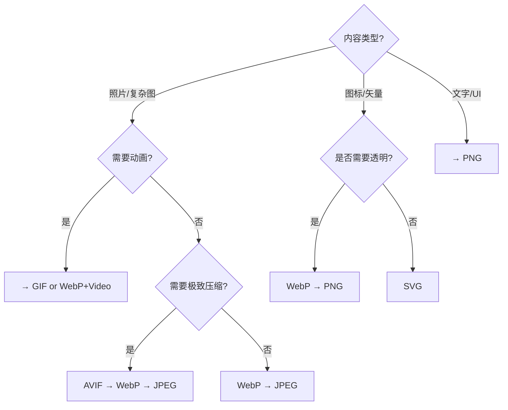
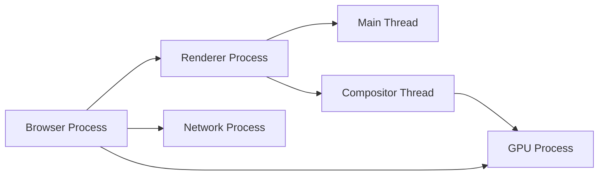

### 🧭 浏览器与网络学习总览

这份文档采用单层学习结构，按“渲染 -> 网络 -> 存储安全 -> 缓存性能 -> 线程排障”展开。

浏览器相关知识的难点在于概念彼此耦合：一个页面慢，可能同时与 CRP、HTTP、缓存、主线程阻塞、脚本执行和资源优先级有关。

### 📊 学习路径建议

1. 先学模块一，建立从 URL 到像素落屏的完整渲染链路认知。
2. 再学模块二，理解 HTTP 1.1 / 2 / 3 的演进与请求优化思路。
3. 再学模块三，补齐存储 API、同源策略与常见 Web 安全基础。
4. 再学模块四，掌握缓存策略与资源加载优先级管理。
5. 最后学模块五和模块六，形成线程模型、Web Vitals 与内存排查能力。

### 🎯 学习目标

- 能解释浏览器如何从 HTML/CSS/JS 构建页面。
- 能把网络耗时拆成 DNS、连接、TLS、TTFB、下载等阶段。
- 能根据数据类型和安全要求选择合适的存储方案。
- 能说明强缓存、协商缓存、预加载、懒加载各自解决的问题。
- 能用 Web Vitals 和内存排查思路定位真实用户性能问题。

---

### 🖼️ 模块一：CRP、DOM/CSSOM 与重排重绘

- **知识点**：Critical Rendering Path、DOM、CSSOM、Render Tree、Layout、Paint、Composite、重排、重绘。
- **模块讲解**：
    - 页面从收到 HTML 到用户看到内容，会经历解析、构建树、布局、绘制与合成。
    - 理解 CRP 的价值在于知道“页面慢是慢在哪一段”。
    - JS、CSS、字体、图片都可能影响首屏与交互响应。

#### 1.1 CRP：从字节流到屏幕像素的全过程

- **讲解**：
    - 浏览器先下载 HTML 字节流并解析成 DOM。
    - 遇到 CSS 时会构建 CSSOM。
    - DOM 与 CSSOM 合并为 Render Tree。
    - Render Tree 经过 Layout 计算元素几何信息，再进入 Paint 和 Composite。
    - 任何会阻塞这些步骤的资源，都可能影响首屏体验。
- **要点**：
    - HTML 解析是增量的，不是必须等整个文档下载完成。
    - CSS 通常会阻塞渲染，因为浏览器需要知道最终样式后才能安全绘制。
    - 非 defer/async 的脚本可能阻塞 HTML 解析。
- **示意图**：

```text
HTML -> DOM
CSS -> CSSOM
DOM + CSSOM -> Render Tree -> Layout -> Paint -> Composite
```

- **优化方向**：
    - 减少关键路径资源数量。
    - 提前加载关键 CSS、字体、首屏图片。
    - 避免首屏期间执行大量同步 JS。

#### 1.2 DOM、CSSOM 与脚本阻塞的关系

- **讲解**：
    - DOM 表示页面结构。
    - CSSOM 表示样式规则树。
    - 浏览器在执行脚本时，脚本可能读取当前 DOM/CSS 状态，因此脚本执行与样式解析会互相影响。
    - 这也是为什么某些脚本会被样式加载间接阻塞。
- **脚本策略**：
    - `defer`：下载不阻塞解析，等文档解析完成后按顺序执行。
    - `async`：下载不阻塞解析，下载完成立即执行，顺序不保证。
    - 模块脚本默认类似 defer，但仍要关注依赖和首屏体积。
- **示例**：

```html
<link rel="stylesheet" href="/app.css" />
<script defer src="/main.js"></script>
```

- **实践经验**：
    - 首屏关键样式尽量前置。
    - 大型业务脚本延后执行。
    - 避免在首屏阶段频繁读取布局信息。

#### 1.3 Layout、Paint、Composite 与重排重绘

- **讲解**：
    - Layout（布局）计算元素位置与尺寸。
    - Paint（绘制）生成像素绘制指令。
    - Composite（合成）把不同图层组合到屏幕上。
    - 重排通常指需要重新计算布局。
    - 重绘通常指布局不变，但视觉属性变化，需要重新绘制。
- **性能影响**：
    - 重排成本通常高于重绘。
    - 频繁读写布局属性可能造成 layout thrashing。
    - `transform`、`opacity` 更适合动画，因为通常只影响合成阶段。
- **坏例子**：

```js
for (let i = 0; i < 1000; i++) {
  box.style.width = `${i}px`;
  void box.offsetWidth;
}
```

- **改进思路**：
    - 批量读、批量写，避免交替读写布局。
    - 动画优先使用 `transform`。
    - 对长列表使用虚拟滚动。

#### 1.4 页面生命周期、可见性与观察 API

- **讲解**：
    - 页面不只有“加载完成”这一个阶段。
    - 还有 `DOMContentLoaded`、`load`、可见性切换、冻结、恢复、卸载等生命周期。
    - 现代前端还会用 `IntersectionObserver`、`ResizeObserver`、`PerformanceObserver` 观察页面行为。
- **示例**：

```js
document.addEventListener('visibilitychange', () => {
  if (document.hidden) {
    console.log('页面进入后台');
  }
});
```

- **典型应用**：
    - 页面进入后台后暂停轮询。
    - 首屏图片进入视口时才加载。
    - 收集 LCP、CLS 等性能指标。

#### 1.5 字体加载策略与 LCP 优化

- **讲解**：
    - Web 字体加载时，浏览器会等待字体下载完成后才渲染文字，可能导致 FOUT（Flash of Unstyled Text）或 FOIT（Flash of Invisible Text）。
    - `font-display` 属性控制加载期间和加载失败时的显示策略，是 LCP 优化的关键。
    - 关键内容字体应提前加载，否则首屏文字可能无法及时显示。
- **font-display 选项**：
    - `auto`：浏览器默认行为，通常先隐藏再替换（FOIT）。
    - `block`：字体加载中隐藏文字，超时后用系统字体（对 LCP 有害）。
    - `swap`：立即用系统字体，加载完成后替换（对用户体验友好但可能抖动）。
    - `fallback`：短暂隐藏（~100ms），后用系统字体，之后再替换（平衡方案）。
    - `optional`：立即用系统字体，后台加载，加载完成后替换（最宽松，不阻塞 LCP）。
- **字体加载策略**：
    - 首屏关键字体用 `preload`，并设置 `font-display: swap`。
    - 非关键装饰字体用 `font-display: optional`，避免阻塞首屏。
    - 对变量字体或权重丰富的字体库，只预加载首屏必需的权重/变体。
    - 考虑使用 `localStorage` 或 Service Worker 缓存已下载的字体。
- **HTML 示例**：

```html
<!-- 预加载关键字体 -->
<link rel="preload" as="font" href="/fonts/system-ui-body.woff2" type="font/woff2" crossorigin />

<!-- CSS 中指定 font-display -->
<style>
  @font-face {
    font-family: 'system-ui';
    src: url('/fonts/system-ui-body.woff2') format('woff2');
    font-display: swap;  /* 立即显示系统字体，加载后替换 */
  }

  @font-face {
    font-family: 'display-serif';
    src: url('/fonts/display-serif.woff2') format('woff2');
    font-display: optional;  /* 非关键字体，不阻塞渲染 */
  }
</style>
```

- **对 LCP 的影响**：
    - `swap` 和 `optional` 不阻塞 LCP，`block` 和 `auto` 可能延迟 LCP。
    - 如果首屏文字是 LCP 的候选元素，过大的字体文件会直接拖累 LCP。
    - 使用 CDN 和 gzip 压缩减小字体体积。
- **面试速答模板（30秒）**：
  > Web 字体加载时，`font-display` 控制显示策略。首屏关键字体用 `preload + swap`（立即显示系统字体，加载后替换），非关键字体用 `optional`（不阻塞渲染）。这能避免 FOIT/FOUT，保持 LCP 稳定。

---

### 🌐 模块二：HTTP 协议演进与请求优化

- **知识点**：HTTP 1.1、HTTP/2、HTTP/3、TLS、连接复用、请求头压缩、弱网优化。
- **模块讲解**：
    - 协议演进的目标不是“更高级”，而是降低等待、提升并发、改善弱网体验。
    - 前端需要理解协议差异，才能做合理的资源组织与加载策略。

#### 2.1 HTTP/1.1：连接复用、队头阻塞与资源组织

- **讲解**：
    - HTTP/1.1 支持 Keep-Alive，减少重复建连成本。
    - 但同一连接内的请求响应顺序仍会带来队头阻塞影响。
    - 这也是早期前端出现雪碧图、域名分片、资源合并等策略的背景。
- **要点**：
    - 请求多时，浏览器会受同域并发连接数限制。
    - 大文件与小文件混合下载时，小资源可能被拖慢。
    - 过度资源拆分在 HTTP/1.1 下代价较高。
- **诊断思路**：
    - 在 Network 面板看连接复用与 Waterfall。
    - 关注 DNS、Initial connection、Waiting(TTFB)、Content Download。

#### 2.2 HTTP/2：多路复用、头部压缩与新瓶颈

- **讲解**：
    - HTTP/2 在单连接上支持多路复用，减少很多并发连接问题。
    - 使用 HPACK 压缩头部，降低头信息成本。
    - 资源拆分策略与 HTTP/1.1 相比会发生变化。
- **但仍要注意**：
    - 应用层队头阻塞减少了，不代表所有阻塞都消失。
    - 一个大响应仍可能影响带宽分配。
    - 服务端优先级实现与浏览器策略并不总是一致。
- **实践建议**：
    - 不必像过去那样激进合并所有资源。
    - 但也不要无限切碎，仍要看缓存粒度、请求头成本和调度开销。

#### 2.3 HTTP/3：QUIC、0-RTT 与请求优化思路

- **讲解**：
    - HTTP/3 基于 QUIC，运行在 UDP 之上。
    - QUIC 把传输层与加密整合，改善连接建立与丢包恢复体验。
    - 在弱网、移动网络切换场景下，HTTP/3 通常表现更好。
- **前端可直接感知的收益**：
    - 建连更快。
    - 丢包时多个流之间影响更小。
    - 首包到达更稳定，尤其在移动端。
- **请求优化仍然需要做**：
    - 合理使用缓存，减少无效请求。
    - 预连接高价值域名。
    - 控制首屏关键请求数量。
    - 避免瀑布式串行请求。
- **fetch 超时示例**：

```js
async function fetchWithTimeout(url, ms = 5000) {
  const c = new AbortController();
  const timer = setTimeout(() => c.abort(), ms);
  try {
    return await fetch(url, { signal: c.signal });
  } finally {
    clearTimeout(timer);
  }
}
```

#### 2.4 TTFB 拆解：不是单点耗时，而是通信链路总和

- **讲解**：
    - TTFB（Time to First Byte）并非单一环节的耗时，而是从发起请求到收到响应首字节之间多个步骤的总和。
    - 因此 TTFB 高不一定是后端慢，也可能是前置网络链路耗时偏高。
- **典型拆解**：
    - DNS 查询：将域名（如 `www.example.com`）解析为服务器的 IP 地址。
    - TCP 连接：与服务器建立可靠连接（TCP 三次握手）。
    - SSL/TLS 协商：若使用 HTTPS，还需完成加密协议握手。
    - 发送 HTTP 请求：将请求头、Cookie 等完整请求信息发给服务器。
    - 服务器处理：服务端接收请求、执行业务逻辑（如查询数据库）、生成响应。
    - 接收首字节：服务端开始回传响应数据，直到客户端收到第一个字节。
- **诊断建议（结合 Network Waterfall）**：
    - 如果 DNS/TCP/TLS 耗时高：优先看 DNS 质量、连接复用、是否可预连接。
    - 如果 Waiting(TTFB) 高：重点排查服务端处理耗时、数据库/缓存命中率、上游依赖。
    - 如果 Download 高：重点看响应体积、压缩、传输速率和资源拆分策略。

---

### 💾 模块三：存储 API 与安全策略

- **知识点**：Cookie、localStorage、sessionStorage、IndexedDB、同源策略、CORS、CSP、XSS、CSRF。
- **模块讲解**：
    - 存储方案要同时考虑容量、结构化能力、生命周期和安全边界。
    - 安全策略的核心是控制“谁能访问”“谁能执行”“哪些请求可信”。

#### 3.1 Cookie / Storage 的适用场景与边界

- **Cookie**：
    - 适合会话、身份、服务端可读信息。
    - 会跟随请求发送，体积不宜过大。
    - 需关注 `HttpOnly`、`Secure`、`SameSite`。
- **localStorage**：
    - 简单键值存储。
    - 生命周期长。
    - API 同步，频繁操作会阻塞主线程。
    - 不适合存敏感令牌和大体积数据。
- **sessionStorage**：
    - 与标签页会话绑定。
    - 适合临时态和短期草稿。
- **示例（Cookie 安全属性）**：

```http
Set-Cookie: sid=abc; HttpOnly; Secure; SameSite=Lax
```

- **选择建议**：
    - 登录会话尽量交给服务端会话 + 安全 Cookie。
    - UI 偏好可放 localStorage。
    - 页面级临时状态可放 sessionStorage。

#### 3.2 IndexedDB：结构化数据与离线能力

- **讲解**：
    - IndexedDB 适合更大体积、结构化、本地索引查询的数据。
    - 常用于离线缓存、草稿箱、PWA 数据同步、前端搜索索引。
    - 它是异步 API，更适合复杂数据场景。
- **示例**：

```js
const request = indexedDB.open('notes-db', 1);
request.onupgradeneeded = () => {
  const db = request.result;
  db.createObjectStore('notes', { keyPath: 'id' });
};
```

- **使用时的关注点**：
    - 升级版本要处理迁移。
    - 注意事务范围。
    - 设计好 keyPath 与索引。
    - 对大数据量操作避免一次性把数据全部读回主线程。

#### 3.3 同源策略、CORS 与常见前端安全问题

- **讲解**：
    - 同源策略限制不同源之间的 DOM 访问与部分资源交互。
    - CORS 是服务端声明“允许哪些跨域访问”的机制。
    - CSP 通过白名单控制脚本、样式、图片等资源来源。
- **高频安全问题**：
    - XSS（**跨站脚本攻击**）：不可信内容被当作脚本执行。
      ```mermaid
	    sequenceDiagram
	    participant A as 攻击者
	    participant B as 网站服务器
	    participant C as 受害者

	    Note over A,B: 第一阶段：植入毒药
	    A->>B: 1. 提交包含恶意脚本的评论/输入
	    B-->>B: 2. 将恶意脚本存储到数据库
	    Note over B,C: 第二阶段：毒发
	    C->>B: 3. 访问受感染的页面
	    B-->>C: 4. 返回包含恶意脚本的页面
	    Note right of C: 💥 恶意脚本在受害者浏览器执行
	    C-->>A: 5. 自动发送受害者的 Cookie 给攻击者
	    ```

    - CSRF（**跨站请求伪造**）：用户身份被浏览器自动携带，攻击者诱导发起恶意请求。
        ```mermaid
        sequenceDiagram
	    participant A as 攻击者 (恶意网站)
	    participant B as 目标网站 (银行)
	    participant C as 受害者 (已登录)

	    Note over C,B: 第一阶段：建立信任
	    C->>B: 1. 登录银行网站
	    B-->>C: 2. 返回并保存登录凭证 (Cookie)
	    Note over C,A: 第二阶段：诱导欺骗
	    C->>A: 3. 访问攻击者构造的恶意链接/图片
	    Note right of A: 💣 恶意页面包含伪造的转账请求
	    A->>C: 4. 浏览器自动加载恶意请求
	    C->>B: 5. 自动向银行发送转账请求 (自动携带 Cookie)
	    B-->>B: 6. 验证 Cookie 合法，认为是用户本人操作
	    B-->>C: 7. 执行转账
        ```

    - 点击劫持：页面被嵌入 iframe 并引导错误点击。
- **防护思路**：
    - 输出做转义或使用可信模板机制。
    - 减少内联脚本并配置 CSP。
    - 会话 Cookie 配置 SameSite 与 HttpOnly。
    - 对关键接口增加 CSRF token 或双重校验。

---

### 📦 模块四：缓存策略与资源加载优先级管理

- **知识点**：强缓存、协商缓存、Service Worker、preload、prefetch、preconnect、懒加载、优先级提示。
- **模块讲解**：
    - 缓存解决“不要重复做同一件事”。
    - 优先级管理解决“先做最重要的事”。

#### 4.1 强缓存、协商缓存与版本策略

- **讲解**：
    - 强缓存由 `Cache-Control`/`Expires` 控制。
    - 命中强缓存时，浏览器可直接复用本地副本。
    - 协商缓存通过 `ETag` 或 `Last-Modified` 与服务器确认是否更新。
- **典型策略**：
    - 静态资源使用带 hash 文件名 + 长缓存。
    - HTML 文档短缓存或协商缓存。
    - API 响应根据业务语义设置缓存头。
- **示例**：

```http
Cache-Control: public, max-age=31536000, immutable
ETag: "v2-asset-hash"
```

- **风险提醒**：
    - 不带 hash 的长期缓存容易产生脏资源。
    - HTML 过长缓存可能导致发布后入口页不更新。

#### 4.2 preload、prefetch、preconnect 与请求优先级

- **讲解**：
    - `preload`：告诉浏览器“这个资源很快就要用，优先准备”。
    - `prefetch`：告诉浏览器“未来页面可能会用，空闲时加载”。
    - `preconnect`：提前建立目标域名连接。
    - `dns-prefetch`：提前解析域名。
- **示例**：

```html
<link rel="preconnect" href="https://static.example.com" />
<link rel="preload" as="style" href="/critical.css" />
<link rel="prefetch" href="/next-page-data.json" />
```

- **使用建议**：
    - preload 不宜滥用，否则会挤占真正关键资源的带宽。
    - prefetch 更适合下一跳路由资源。
    - 第三方域名多时，preconnect 要聚焦最关键的几个。

#### 4.3 资源拆分、图片策略与加载顺序优化

- **讲解**：
    - JS 代码拆分要结合路由、功能模块和缓存粒度。
    - 图片优化要同时关注体积、格式、尺寸和懒加载策略。
    - 字体、首屏图、关键 CSS 往往直接影响 LCP。
- **实践建议**：
    - 非首屏图片加 `loading="lazy"`。
    - 大图使用响应式 `srcset`。
    - 对首屏 Hero 图明确提高优先级。
    - 把首屏阻塞性脚本尽量后移。
- **示例**：

```html

```

#### 4.4 图片格式决策树与浏览器兼容性

- **讲解**：
    - 不同图片格式在体积、压缩率、色彩还原、动画支持上各有权衡。
    - 应根据内容类型、兼容性要求和性能目标选择合适格式。
    - 使用 `<picture>` 和 `srcset` 实现格式降级，让现代浏览器用新格式、旧浏览器用基础格式。
- **格式对比**：

| 格式 | 用途 | 优点 | 缺点 | 兼容性 |
|------|------|------|------|--------|
| **AVIF** | 照片、高质量图 | 最优压缩率（节省 ~30-50%） | 编码慢，兼容性差 | 仅现代浏览器 |
| **WebP** | 照片、现代 Web | 比 JPEG 节省 ~25-35%，支持透明 | 不支持 IE | 现代浏览器 |
| **JPEG** | 照片、复杂场景 | 通用、快速解码、渐进式加载 | 体积较大，不支持透明 | 所有浏览器 |
| **PNG** | 图标、透明、文字 | 无损、支持透明、清晰 | 体积较大，不支持动画 | 所有浏览器 |
| **GIF** | 简单动画 | 支持动画、通用 | 体积大（已过时） | 所有浏览器 |
| **SVG** | 矢量图、图标 | 清晰、体积小、可交互 | 不适合照片 | 几乎所有浏览器 |

- **选择决策流程**：



- **实现示例（picture 标签）**：

```html
<!-- 现代浏览器用 AVIF，降级到 WebP 再到 JPEG -->
<picture>
  <source srcset="/hero.avif" type="image/avif" />
  <source srcset="/hero.webp" type="image/webp" />
  
</picture>
```

- **实践建议**：
    - Hero 图和关键视觉用 AVIF/WebP 组合，保证最优体积和性能。
    - 小图标优先用 SVG，无法矢量化时用 WebP，降级到 PNG。
    - GIF 已过时，用 WebP 或 MP4 短视频替代动图。
    - 使用图片 CDN（如 Cloudflare Image Optimization、imgix）自动适配格式和尺寸。
- **面试速答模板（30秒）**：
  > 照片类用 AVIF/WebP/JPEG 优先级递减。图标和透明图用 WebP/PNG。矢量图用 SVG。使用 `<picture>` 和 `srcset` 实现格式降级，既优化性能也保证兼容性。

#### 4.5 浏览器缓存分层：内存、磁盘、Service Worker、CDN

- **讲解**：
    - 浏览器缓存不只是 HTTP 缓存，而是多层分布式缓存系统。
    - 每一层各有生命周期、容量和访问成本，优化的关键是让热资源留在更快的层。
- **缓存分层结构**：

| 缓存层 | 存储位置 | 容量 | 速度 | 生命周期 | 典型资源 |
|--------|--------|------|------|--------|--------|
| **内存缓存** | 浏览器内存 | 小（~50MB） | 最快 | 单次会话 | 脚本、样式、小图片 |
| **磁盘缓存** | 磁盘 | 大（~500MB+） | 快 | 按 Cache-Control | 大文件、字体、库代码 |
| **Service Worker** | 磁盘/IndexedDB | 较大（~50MB+） | 快 | 应用控制 | 离线资源、关键 API |
| **CDN 缓存** | 边缘节点 | 不限 | 取决于地理位置 | 按服务端设置 | 静态资源、热门文件 |

- **各层的策略与权衡**：
    - **内存缓存**：浏览器自动，无须手动控制。但刷新页面会清空，跨域 iframe 也无法共享。
    - **磁盘缓存**：由 HTTP 缓存头控制。对长期静态资源（hash 文件名 + 长 max-age）最有效。
    - **Service Worker**：提供应用级缓存策略，支持离线加载和自定义失败处理。常用于 PWA 或大型 SPA。
    - **CDN 缓存**：由 CDN 提供商和服务端缓存头协商。覆盖地理范围广，但无法缓存动态内容。
- **常见缓存策略组合**：
    - **Cache First（资源优先）**：适合不变的静态资源（hash 文件名）。浏览器 + CDN 缓存命中率高。
    - **Network First（网络优先）**：适合实时性强的资源（API、HTML）。可离线降级。
    - **Stale While Revalidate**：返回过期缓存，后台更新。用户感知最快。
- **示例：使用 Service Worker 实现 Cache First**：

```js
self.addEventListener('fetch', (e) => {
  if (e.request.url.includes('/static/')) {
    e.respondWith(
      caches.open('v1').then((cache) => {
        return cache.match(e.request).then((resp) => {
          if (resp) return resp;  // 缓存命中
          return fetch(e.request).then((fetched) => {
            cache.put(e.request, fetched.clone());  // 后台存缓存
            return fetched;
          });
        });
      })
    );
  }
});
```

- **缓存调试技巧**：
    - DevTools > Network，勾选 `Disable cache` 禁用磁盘缓存，检查重复请求。
    - 查看 Response Headers 中的 `Cache-Control`、`Age`（CDN 年龄）。
    - Service Worker 可在 DevTools > Application 中手动清除或查看缓存版本。
- **面试速答模板（30秒）**：
  > 浏览器缓存分为内存（会话级）、磁盘（HTTP 缓存）、Service Worker（应用级）、CDN（地域级）。静态资源用 hash 文件名 + 长缓存命中磁盘和 CDN，关键离线资源用 Service Worker。三层结合能极大减少重复请求。

---

### 🧵 模块五：线程模型与 Worker

- **知识点**：浏览器多进程架构、主线程、渲染线程、合成线程、事件循环、宏任务、微任务、Long Task、Web Worker、Service Worker。
- **模块讲解**：
    - 浏览器不是单进程黑盒，而是由 Browser Process、Renderer Process、Network Process、GPU Process 等角色协作完成页面加载与渲染。
    - 浏览器主线程要同时承担脚本执行、样式计算、布局绘制和用户事件处理。
    - 因此前端性能问题本质上常是“主线程竞争资源”。

#### 5.1 浏览器多进程架构与渲染线程分工

- **讲解**：
    - Browser Process 负责标签页管理、地址栏、权限、进程协调等浏览器级功能。
    - Renderer Process 负责页面的 HTML/CSS/JS 解析与执行，通常一个站点或一组相关页面会分配到相应渲染进程。
    - Network Process 负责网络请求，
    - GPU Process 负责图层合成与 GPU 加速相关工作。
    - 在渲染进程内部，又可以继续区分主线程、合成线程、光栅线程等角色，所以“页面卡”并不一定是网络慢，也不一定只是 JS 慢。
- **理解重点**：
    - JS 通常跑在渲染进程主线程。
    - 滚动、合成动画、图层提交会涉及合成线程和 GPU。
    - 这也是为什么 `transform/opacity` 动画通常比改 `top/left` 更平滑，因为前者更可能停留在合成阶段。
- **图例（浏览器协作视角）**：



#### 5.2 事件循环、任务队列与渲染时机

- **讲解**：
    - 宏任务常见于 `setTimeout`、I/O、事件回调。
    - 微任务常见于 `Promise.then`、`queueMicrotask`。
    - 每轮事件循环会执行一个宏任务，再清空微任务队列，然后浏览器才有机会渲染。
- **问题场景**：
    - 大量微任务也可能让页面长时间得不到渲染机会。
    - 一个长达几百毫秒的同步计算会直接卡住输入和点击。
- **示例**：

```js
button.addEventListener('click', () => {
  const start = performance.now();
  while (performance.now() - start < 300) {}
});
```

- **结果**：
    - 点击后页面卡住。
    - 交互延迟上升，INP 变差。

- **长任务分解API**（补充 requestIdleCallback 和 task.yield）：
    - `requestAnimationFrame(callback)`：与屏幕刷新率对齐（基础见 JavaScript.md 6.4）。
    - `requestIdleCallback(callback, { timeout })`：在浏览器空闲时执行低优先级任务。
    - `task.yield()`：主动让出主线程，允许浏览器处理高优先级任务（实验性）。
- **选择场景**：
    - **rAF**：动画、实时更新需要与渲染同步。
    - **requestIdleCallback**：分析、日志上报、非关键数据加载。
    - **task.yield()**：分割长同步计算，比 setTimeout(..., 0) 更高效。
- **分割长任务示例**：

```js
// 用 task.yield 分割计算
async function processLargeList(items) {
  for (const item of items) {
    processItem(item);
    await scheduler.yield();  // 让出主线程
  }
}

// requestIdleCallback 用于非关键任务
requestIdleCallback(() => {
  analyzeData();  // 后台分析
}, { timeout: 2000 });
```

- **INP 优化要点**：
    - 事件回调内的同步计算不超过 50ms。
    - 用 task.yield() 分割长计算。
    - 避免在事件回调中触发大面积 DOM 更新。
- **面试速答模板（30秒）**：
  > 长任务阻塞主线程，导致 INP 差。用 task.yield() 或 requestIdleCallback 分割计算，让出主线程给用户输入。或迁到 Worker。rAF 用于动画同步，requestIdleCallback 用于低优先级后台任务。

#### 5.3 输入事件到合成提交：一次交互为什么会卡

- **讲解**：
    - 用户点击、输入、滚动后，事件先进入浏览器输入处理链路，再由渲染进程主线程执行事件回调。
    - 如果事件回调里有重计算、同步请求、状态更新引发大面积重渲染，主线程会被持续占用，浏览器就无法及时进入下一次绘制。
    - 当样式计算、布局、绘制完成后，图层会交给合成线程与 GPU 组合提交，这一步才真正接近“用户看到结果”。
    - 所以 INP（Interaction to Next Paint） 差并不只是“JS 慢”，而是“输入事件 -> JS 执行 -> 渲染更新 -> 合成提交”整条链路里某一环过重。
- **交互链路示意**：


- **排查重点**：
    - 事件处理函数是否做了重计算。
    - 一次交互是否触发过多组件更新或 DOM 改动。
    - 动画和滚动是否落在主线程而不是合成线程。

#### 5.4 Worker 的类型、通信与适用场景

- **讲解**：
    - Web Worker 适合 CPU 密集计算，例如大数据解析、图像处理、复杂搜索。
    - Service Worker 适合离线缓存、请求拦截、后台同步。
    - Shared Worker 适合多标签页共享逻辑，但使用频率相对低。
- **Web Worker 示例**：

```js
const worker = new Worker('/worker.js');
worker.postMessage({ type: 'calc', payload: [1, 2, 3] });
worker.onmessage = (e) => {
  console.log('worker result:', e.data);
};
```

- **worker.js**：

```js
self.onmessage = (e) => {
  const result = e.data.payload.reduce((a, b) => a + b, 0);
  self.postMessage(result);
};
```

- **注意点**：
    - Worker 不能直接访问 DOM。
    - 传输大对象时要关注复制成本，可考虑 Transferable。
    - Worker 的价值是缓解主线程竞争，不是替代浏览器渲染线程。

#### 5.5 事件处理与交互性能：内存泄漏与 INP 优化

- **讲解**：
    - 事件监听的内存泄漏是常见的性能杀手，尤其在长期运行的 SPA 中。
    - 事件节流/防抖虽然常见，但需理解与 INP 的真实关系。
    - 事件委托与直接绑定的性能对比帮助选择合适策略。
    - 更多事件基础（传播、冒泡、委托实现）见 JavaScript.md 6.2-6.3。
- **内存泄漏陷阱**：
    - **未解绑监听器**：组件卸载时未清理 addEventListener，引用链保持活跃。
    - **闭包捕获大对象**：事件回调闭包持有大数据或 DOM 引用。
    - **匿名函数无法移除**：`el.addEventListener('click', () => {})` 无法后续 removeEventListener。
- **内存泄漏案例**：

```js
// ❌ 泄漏示例：闭包持有大对象，无法解绑
class Component {
  constructor(container) {
    this.container = container;
    this.bigData = new Array(1000000);
    // 匿名回调，无法后续移除
    this.container.addEventListener('click', () => {
      console.log(this.bigData.length);  // 闭包捕获 this
    });
  }
  destroy() {
    // 无法移除监听器，bigData 继续存活
  }
}

// ✅ 改进：保存引用，可解绑
class Component {
  constructor(container) {
    this.container = container;
    this.bigData = new Array(1000000);
    this.handleClick = this.onClick.bind(this);
    this.container.addEventListener('click', this.handleClick);
  }
  onClick() {
    console.log(this.bigData.length);
  }
  destroy() {
    this.container.removeEventListener('click', this.handleClick);
    this.bigData = null;  // 清理
  }
}
```

- **事件委托 vs 直接绑定**：

| 方式 | 监听器数量 | 内存占用 | 动态元素 | INP |
|------|---------|--------|--------|------|
| **直接绑定** | 多（每子元素1个） | 较大 | 需手动处理 | 监听器多时竞争资源 |
| **事件委托** | 1（父节点） | 少 | 自动处理 | 更快响应 |

- **实现对比**：

```js
// ❌ 直接绑定 100 个按钮 = 100 个监听器 + 内存占用
document.querySelectorAll('.btn').forEach((btn) => {
  btn.addEventListener('click', () => {
    console.log(btn.dataset.id);
  });
});

// ✅ 事件委托：1 个监听器，高效
document.querySelector('.btn-container').addEventListener('click', (e) => {
  if (e.target.classList.contains('btn')) {
    console.log(e.target.dataset.id);
  }
  // 新增按钮自动处理，无需重新注册
});
```

- **节流/防抖与 INP 的真实关系**：
    - 防抖延迟执行，首次响应时间长，对 INP 不利。
    - 节流保持定期响应，但"首次响应"时间取决于回调内容，不是节流本身能优化的。
    - 关键不在节流，而在**首次事件回调执行时间**要短。
- **实战建议**：
    - **列表项监听**：用事件委托减少监听器。
    - **回调清晰化**：事件回调内不做重计算，用 task.yield 分割或丢给 Worker。
    - **定期审计**：DevTools Memory 看 Detached DOM、全局缓存增长。
    - **组件卸载检查清单**：
      - [ ] removeEventListener 所有 addEventListener
      - [ ] 清理定时器（clearTimeout / clearInterval）
      - [ ] 取消 fetch（AbortController）
      - [ ] 清空大对象引用（bigData = null）
- **诊断工具**：
    - Chrome DevTools > Memory：堆快照对比，找泄漏对象。
    - Lighthouse：检查长任务和 INP。
    - Performance > Event listeners：看注册了哪些监听。
- **面试速答模板（30秒）**：
  > 事件监听未清理导致内存泄漏。关键是组件卸载时要 removeEventListener（需保存回调引用）。列表项用事件委托减少监听器数量。长回调用 task.yield() 分割，保持首次响应快速。定期用 Memory 工具审计 Detached DOM 和缓存大小。

---

### 📈 模块六：Web Vitals 指标与内存排查

- **知识点**：LCP、INP、CLS、TTFB、Long Task、Memory Leak、Detached DOM。
- **模块讲解**：
    - 性能治理不能只看实验室环境跑分，还要结合真实用户指标。
    - 内存问题通常不容易立即报错，但会通过卡顿、崩溃、页面越用越慢表现出来。

#### 6.1 Web Vitals：用户感知指标怎么理解

- **LCP（Largest Contentful Paint）**：
    - 表示最大内容元素何时完成渲染。
    - 常受服务器响应、首屏图、关键 CSS、字体和客户端阻塞影响。
- **INP（Interaction to Next Paint）**：
    - 反映用户交互到下次绘制之间的延迟。
    - 常受长任务、复杂事件处理、渲染量过大影响。
- **CLS（Cumulative Layout Shift）**：
    - 衡量布局偏移稳定性。
    - 常受图片未设尺寸、异步内容插入、字体切换影响。
- **简单采样示例**：

```js
const t0 = performance.now();
await bootstrapApp();
console.log('bootstrap(ms):', performance.now() - t0);
```

#### 6.2 Performance API 与性能数据采样

- **讲解**：
    - Performance API 提供精细的性能测量接口，支持用户自定义指标和资源计时。
    - 与 RUM（真实用户监控）结合，能收集真实场景下的性能数据。
    - 常见的 PerformanceObserver 可监听 LCP、INP、CLS、Navigation Timing、Resource Timing 等。
- **常用 API**：
    - `performance.mark()` / `performance.measure()`：自定义标记与测量。
    - `performance.now()`：高精度时间戳。
    - `PerformanceObserver`：订阅特定性能指标的变化。
    - `performance.getEntriesByType()`：查询特定类型的性能条目（如 'resource'、'navigation' 等）。
- **采样示例**：

```js
// 1. 采集 LCP（最大内容绘制）
const lcpObserver = new PerformanceObserver((list) => {
  const lastEntry = list.getEntries().pop();
  console.log('LCP:', lastEntry.renderTime || lastEntry.loadTime);
  // 上报到监控平台
  reportMetric('lcp', lastEntry.renderTime || lastEntry.loadTime);
});
lcpObserver.observe({ entryTypes: ['largest-contentful-paint'] });

// 2. 采集 INP（交互响应）
const inpObserver = new PerformanceObserver((list) => {
  const entries = list.getEntries();
  entries.forEach((entry) => {
    console.log('INP entry:', entry.duration, entry.processingDuration);
    reportMetric('inp', entry.duration);
  });
});
inpObserver.observe({ entryTypes: ['event'] });

// 3. 采集资源加载时序（Resource Timing）
const resourceObserver = new PerformanceObserver((list) => {
  const entries = list.getEntries();
  entries.forEach((entry) => {
    console.log(`Resource: ${entry.name} took ${entry.duration}ms`);
    console.log(`  DNS: ${entry.domainLookupEnd - entry.domainLookupStart}ms`);
    console.log(`  TCP: ${entry.connectEnd - entry.connectStart}ms`);
    console.log(`  TTFB: ${entry.responseStart - entry.requestStart}ms`);
    console.log(`  Download: ${entry.responseEnd - entry.responseStart}ms`);
  });
});
resourceObserver.observe({ entryTypes: ['resource'] });

// 4. 自定义指标
performance.mark('app-init-start');
await initApp();
performance.mark('app-init-end');
performance.measure('app-init', 'app-init-start', 'app-init-end');
const appInitMeasure = performance.getEntriesByName('app-init')[0];
console.log('App init time:', appInitMeasure.duration);
```

- **关键时间点的诊断**：
    - **DNS 高**：域名解析慢，可使用 `dns-prefetch` 或考虑更换 DNS。
    - **TCP 高**：网络延迟大或连接复用不好，可用 `preconnect` 或优化服务端配置。
    - **TTFB 高**：服务端处理慢或关键路径深，需优化数据库查询、缓存策略或后端代码。
    - **Download 高**：资源过大，需压缩、拆分或换更优格式。
- **采样工具与平台**：
    - 使用 Web Vitals 库简化采集：`npm install web-vitals`。
    - 上报到监控平台（如 DataDog、New Relic、自建 ELK）做聚合分析。
    - 定期生成性能报告，追踪趋势和回归。
- **面试速答模板（30秒）**：
  > Performance API 通过 PerformanceObserver 采集 LCP、INP、CLS、Resource Timing 等。结合自定义 mark/measure，能精确定位瓶颈：DNS/TCP 慢用 dns-prefetch/preconnect，TTFB 慢优化后端，Download 慢压缩资源。上报到 RUM 平台实时监控。

#### 6.3 性能诊断路径：指标 -> 面板 -> 根因

- **建议流程**：
    - 先看 RUM 或 Lighthouse 中的 LCP、INP、CLS。
    - 再进入 Performance/Network 面板查看资源、长任务、渲染阶段。
    - 最后回到代码和资源策略修复根因。
- **举例**：
    - LCP 高：检查首屏图是否过大、CSS 是否阻塞、TTFB 是否过高。
    - INP 差：检查点击事件是否执行重计算、是否触发大面积重渲染。
    - CLS 高：检查图片尺寸、广告位占位、Skeleton 是否稳定。

#### 6.4 内存排查：增长对象、引用链与泄漏预防

- **常见原因**：
    - 事件监听未解绑。
    - 定时器未清理。
    - 闭包持有大对象。
    - 全局缓存无限增长。
    - Detached DOM 被引用无法释放。
- **预防建议**：
    - 组件销毁时清理监听和定时器。
    - 限制缓存大小和生命周期。
    - 避免在全局数组长期保存 DOM 引用。
- **示例**：

```js
const listeners = [];
function mount() {
  const handler = () => {};
  window.addEventListener('resize', handler);
  listeners.push(handler);
}
```

- **问题**：
    - 如果没有对应清理逻辑，监听器和相关闭包会持续存活。

---

### 🔥 模块七：浏览器业界热点（2026前后）

- **知识点**：WebGPU、Chrome AI API、长动画帧指标。
- **模块讲解**：
    - 浏览器发展方向反映产业需求变化。
    - 面试中适度了解前沿能体现技术关注，但核心仍是理解"为什么"。

#### 7.1 WebGPU：走向浏览器的 GPU 计算

- **讲解**：
    - WebGPU 是新一代浏览器 GPU 访问 API，比 WebGL 更现代、更接近底层。
    - 主要应用场景：游戏引擎（Babylon.js、Needle Engine）、科学计算、图像处理、AI 推理。
    - 相比 WebGL 的优势是更高级的控制、更好的性能、更简洁的 API。
    - 2026 年前后 WebGPU 逐渐从实验阶段进入稳定阶段（Chrome 127+ 支持）。
- **应用方向**：
    - 游戏与 3D：实时渲染、复杂场景。
    - 数据处理：矩阵运算、流式计算（适合 AI 推理加速）。
    - 图像处理：滤镜、特效、图像转码。
- **简洁示例**：

```js
// 创建 WebGPU 上下文并绘制简单三角形
const canvas = document.querySelector('canvas');
const gpu = navigator.gpu;
const adapter = await gpu.requestAdapter();
const device = await adapter.requestDevice();

const context = canvas.getContext('webgpu');
context.configure({ device, format: navigator.gpu.getPreferredCanvasFormat() });

const renderPass = /* ... 编写 shader + render pipeline ... */;
// 通过 GPU 加速计算几何、颜色、动画
```

- **为什么重要**：
    - Web 应用开始能处理过去只有桌面 app 才能做的计算密集任务。
    - 为本地 AI 推理、3D 编辑、科学模拟打开大门。
- **面试速答模板（30秒）**：
  > WebGPU 是浏览器的现代 GPU API，用于游戏、3D、AI 推理加速。比 WebGL 性能更好、API 更简洁。2026 年逐渐稳定，适合知道其用途和与 WebGL 的区别即可。

#### 7.2 Chrome AI API：浏览器原生 AI 推理

- **讲解**：
    - Chrome 逐步推进原生 AI 能力，允许网页离线运行小模型（局部 LLM）。
    - 基于现有硬件加速和 ONNX Runtime，支持文本生成、识别、翻译等任务。
    - 隐私优势：数据不离开浏览器，无需上传到服务器。
    - 2025-2026 年处于 Origin Trial（试验计划），逐步向普通网页开放。
- **适用场景**：
    - 智能补全、写作助手（本地模型）。
    - 内容审查、敏感词识别。
    - 客户端和服务端混合推理：复杂问题问服务器，简单任务本地处理。
    - 离线模式优化：网络差时用本地模型作备选。
- **简洁示例（Origin Trial）**：

```js
// 检查 API 可用性
if ('ai' in self && 'languageModel' in self.ai) {
  const session = await self.ai.languageModel.create({ temperature: 0.8 });
  const response = await session.prompt('你好');
  console.log(response);  // 本地 AI 模型输出
}
```

- **为什么重要**：
    - 网页应用能独立完成 AI 任务，依赖减少。
    - 用户隐私和数据安全大幅提升。
    - 离线网页体验更完整。
- **面试速答模板（30秒）**：
  > Chrome AI API 允许网页在本地运行小 LLM，无需上传数据到服务器。2026 年逐步开放，适合智能补全、内容审核、离线模式。理解隐私优势和与服务端 AI 的分工即可。

#### 7.3 长动画帧指标（Long Animation Frame API）

- **讲解**：
    - 与 Long Task API 类似，用于追踪长动画帧（阻塞帧的指标）。
    - 帮助诊断为什么动画掉帧：JS 执行、样式计算、布局等哪个环节耗时。
    - 2026 年逐步稳定（Chrome 123+ 已支持）。
- **采集示例**：

```js
const observer = new PerformanceObserver((list) => {
  list.getEntries().forEach((entry) => {
    console.log(`Long animation frame: ${entry.duration}ms`);
    console.log('Duration breakdown:', entry.scripts, entry.styleAndLayoutDuration);
  });
});
observer.observe({ entryTypes: ['long-animation-frame'] });
```

- **优化意义**：
    - 精确定位帧卡在哪个阶段。
    - 针对性优化（如 CSS 计算慢 -> 简化选择器，JS 执行慢 -> task.yield）。
- **面试速答模板（30秒）**：
  > Long Animation Frame API 追踪掉帧原因，区分 JS 执行、样式计算、布局哪个阶段耗时。比 Long Task 更细粒度，有利于动画优化。

---

### 总结：从核心到前沿的递进

- **核心能力**（必须掌握）：
    - CRP、HTTP 协议、缓存策略、事件循环、渲染管线。
    - Web Vitals、性能诊断、内存排查。
- **深化能力**（加分）：
    - 多进程架构、长任务分解、跨域通信、安全策略。
- **前沿认知**（加分）：
    - WebGPU、Chrome AI API、长动画帧指标的应用方向和与核心知识的关系。

**面试建议**：
- 深度优于广度，能讲清楚"为什么"比背诵新 API 更重要。
- 遇到新技术题，第一步是分类（性能、安全、功能），第二步是关联核心原理。
- 合理表达"不了解但如何思考"比装懂更好。


### ✅ 复习清单

- 我是否能说清 CRP 的完整链路？
- 我是否理解脚本、样式、渲染之间的阻塞关系？
- 我是否知道 HTTP/1.1、2、3 的关键差异？
- 我是否能为登录态、草稿箱、离线数据选择合适存储？
- 我是否会设计强缓存、协商缓存与资源预加载策略？
- 我是否能解释事件循环与长任务如何影响 INP？
- 我是否能描述 Web Vitals 与内存排查的基本流程？
