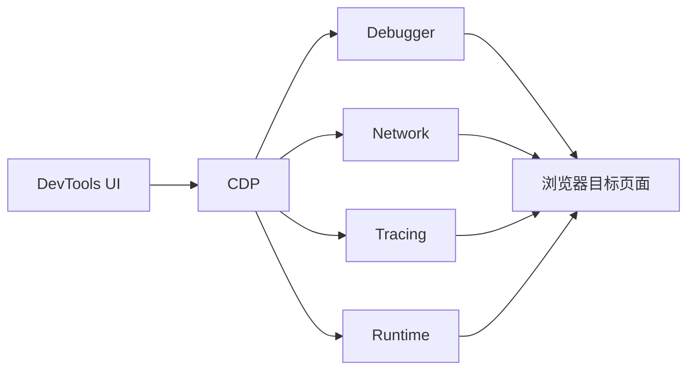

### 🧭 DevTools 学习总览

这份文档聚焦“问题出现时如何快速定位”，不是面板功能罗列。

DevTools 的真正价值不在知道面板名字，而在建立“问题类型 -> 定位入口 -> 证据收集 -> 根因确认 -> 修复验证”的完整路径。

### 📊 学习路径建议

1. 先学模块一，建立 DevTools 面板与故障类型的映射关系。
2. 再学模块二和模块三，掌握样式、脚本、请求三类高频问题排障。
3. 再学模块四和模块五，形成性能和内存分析能力。
4. 最后学模块六，把浏览器调试与线上可观测平台接起来。

### 🎯 学习目标

- 能根据问题类型快速选择合适面板，而不是盲目切换。
- 能用 Elements、Sources、Network 联合诊断页面异常。
- 能用 Performance、Memory 定位卡顿和泄漏。
- 能结合 Source Map、traceId、日志平台形成线上排障闭环。

---

### 🧰 模块一：面板地图与排障入口

- **知识点**：问题分类、面板映射、复现开关、环境模拟、Workspace / Overrides、CDP 基础。
- **模块讲解**：
    - 第一步不是点开某个面板，而是先回答“这更像样式问题、逻辑问题、请求问题还是性能问题”。
    - 如果问题无法稳定复现，再强的工具也难以发挥作用。

#### 1.1 面板与问题类型的映射关系

- **映射原则**：
    - 样式错乱、层级覆盖、布局异常：优先看 Elements。
    - JS 报错、断点调试、变量状态：优先看 Sources 和 Console。
    - 接口失败、资源 404、请求慢：优先看 Network。
    - 页面卡顿、掉帧、交互慢：优先看 Performance。
    - 内存上涨、页面越用越慢：优先看 Memory。
    - 登录态、缓存、Service Worker、Storage：优先看 Application。
- **一个排障口诀**：
    - 看不对：Elements。
    - 算不对：Sources。
    - 拉不对：Network。
    - 跑不动：Performance。
    - 越用越慢：Memory。
- **常见误区**：
    - 一报错就只看 Console。
    - 请求失败只盯状态码，不看请求头、响应体、Timing。
    - 卡顿时不录制性能而直接猜测哪段代码慢。

#### 1.2 复现开关：缓存、日志保留、节流与设备模拟

- **关键开关**：
    - `Preserve log`：页面跳转后保留日志和请求。
    - `Disable cache`：禁用缓存，适合排查资源更新与缓存问题。
    - Throttling：模拟慢网、弱 CPU。
    - Device Toolbar：模拟移动端尺寸、DPR、UA。
- **为什么重要**：
    - 很多问题只在弱网、缓存失效、移动端尺寸下出现。
    - 如果复现条件不一致，排查结果往往是错的。
- **复现流程**：
    - 先确认用户报错环境。
    - 在 DevTools 开启相近网络与 CPU 节流。
    - 打开 Preserve log 和 Disable cache。
    - 重新操作并记录失败步骤。

#### 1.3 Workspace、Local Overrides 与临时验证修复

- **讲解**：
    - Workspace 可以把本地源码与浏览器加载代码映射起来，便于边改边调。
    - Local Overrides 可以临时覆盖线上资源，用于快速验证修复思路。
    - 这很适合定位“是配置问题、打包问题还是业务逻辑问题”。
- **典型场景**：
    - 线上 CSS 缺失，先用 Overrides 修改资源验证是否恢复。
    - sourcemap 可用时，直接在 Sources 中调试源码。
    - 临时改接口参数，验证是不是请求数据格式导致问题。
- **模块诊断流程**：

```text
确认问题类型 -> 设置复现环境 -> 打开 Preserve log / Disable cache -> 选择目标面板 -> 收集证据 -> 验证修复假设
```

- **代码示例（本地验证某个全局变量）**：

```js
window.__DEBUG__ = true;
console.log('debug mode on');
```

#### 1.4 DevTools 底层：Chrome DevTools Protocol 是怎么工作的

- **讲解**：
    - DevTools 不是浏览器里一堆孤立面板，它底层依赖的是 Chrome DevTools Protocol（CDP）去和目标页面通信。
    - 当你在面板里设置断点、抓取 network、录制 performance，本质是在通过协议向浏览器发送命令、订阅事件，再把结果展示出来。
    - 这也是为什么 Puppeteer、Playwright、Lighthouse 等工具能复用一部分浏览器调试能力，因为它们本质上也在使用浏览器调试协议或等价接口。
- **理解重点**：
    - Sources 面板依赖 Debugger domain。
    - Network 面板依赖 Network domain。
    - Performance/Tracing 依赖 Tracing 或性能相关 domain。
    - 所以“面板能力”和“自动化调试能力”在底层不是两套完全独立的系统。
- **图例（DevTools 底层关系）**：



---

### 🧱 模块二：Elements 与样式 / 布局问题排查

- **知识点**：Styles、Computed、Box Model、Flex/Grid、DOM Breakpoints、Layers、强制伪类。
- **模块讲解**：
    - 样式问题不能只看源码，要看“最终命中的规则”。
    - 布局问题不能只看 DOM 结构，还要看盒模型、层叠上下文和父子容器约束。

#### 2.1 Styles / Computed：最终样式从哪里来

- **讲解**：
    - `Styles` 面板看规则来源、优先级、被覆盖情况。
    - `Computed` 面板看最终值，更适合回答“现在到底是什么”。
    - 看到样式没生效时，先问：没命中、被覆盖、继承错误、单位错误还是条件不满足？
- **问题诊断流程**：
    - 选中目标元素。
    - 在 Computed 中看最终值是否符合预期。
    - 如果不符合，回到 Styles 查找来源规则。
    - 临时勾掉/开启某条规则，验证影响。
    - 若值正确但视觉仍异常，再排查布局容器和层级问题。
- **示例（定位优先级覆盖）**：

```css
.button { color: blue; }
.card .button { color: red; }
```

- **排查重点**：
    - 选择器优先级。
    - 行内样式和 `!important`。
    - CSS Modules / 原子类生成顺序。

#### 2.2 Box Model、Flex/Grid 与层级问题

- **讲解**：
    - 布局异常往往不是子元素本身的问题，而是父容器约束导致的。
    - Flex 要看 `flex-basis`、`shrink`、`grow`、最小宽高。
    - Grid 要看模板轨道、自动放置与容器尺寸。
    - 遮挡问题要排查层叠上下文、`z-index`、`position`、`transform`。
- **问题诊断流程**：
    - 先看 Box Model，确认元素真实尺寸。
    - 再看父容器是否限制 overflow / width / height。
    - 使用 Flex/Grid 可视化覆盖层检查分布。
    - 如果是遮挡问题，查看是否创建新层叠上下文。
- **代码示例（常见层级问题）**：

```css
.modal {
  position: fixed;
  z-index: 1000;
}
.sidebar {
  position: relative;
  transform: translateZ(0);
  z-index: 2000;
}
```

- **问题说明**：
    - `transform` 可能创建新的层叠上下文，导致 modal 被意外遮挡。

#### 2.3 DOM Breakpoints、强制状态与动态问题复现

- **讲解**：
    - 有些样式问题只在 hover、focus、active、DOM 动态变化时出现。
    - 强制伪类能复现悬浮和聚焦状态。
    - DOM Breakpoints 可以观察元素何时被移除、属性何时被改写。
- **问题诊断流程**：
    - 给目标元素强制 `:hover` 或 `:focus`。
    - 若元素会闪现/消失，对其设置 subtree / attribute modification 断点。
    - 重新触发行为，查看是谁改动了 DOM。
- **代码示例（动态 class 导致闪烁）**：

```js
setTimeout(() => {
  menu.classList.remove('open');
}, 50);
```

- **常见问题列表**：
    - 文本被截断：检查 `line-height`、`overflow`、`white-space`。
    - 弹层被裁切：检查父元素 `overflow: hidden`。
    - 按钮 hover 不生效：检查遮罩层覆盖或 pointer-events。
    - 移动端布局错位：检查 viewport、媒体查询、最小宽度。

---

### 🧾 模块三：Sources 与 Network 联合调试

- **知识点**：断点、异步调用栈、Source Map、XHR/fetch Breakpoints、Waterfall、请求复制复现。
- **模块讲解**：
    - 逻辑错就用断点还原执行路径。
    - 请求错就用 Network 还原链路与数据。
    - 真实问题往往是两者叠加：因为某个状态没更新，所以发了错请求。

#### 3.1 Sources：断点、作用域与异步调用栈

- **讲解**：
    - 断点不是为了“看代码停下来”，而是为了回答“为什么执行到了这里”。
    - 重点看 Scope、Call Stack、Watch、Async Stack。
    - sourcemap 可用时，应优先调试源码而不是打包后的混淆代码。
- **问题诊断流程**：
    - 在可疑函数入口或条件分支上打断点。
    - 重现问题并查看当前变量与闭包状态。
    - 沿调用栈回溯是谁传入了错误参数。
    - 如涉及异步链路，展开 async stack 还原前序事件。
- **代码示例**：

```ts
async function loadUser(id: string) {
  const res = await fetch(`/api/users/${id}`);
  return res.json();
}
```

- **定位问题时关注**：
    - `id` 是不是 undefined。
    - fetch 前参数是否被错误覆盖。
    - 上游状态初始化是否完成。

#### 3.2 Network：请求、响应、Timing 与瀑布图阅读

- **讲解**：
    - Network 排查不要只看 status code。
    - 还要看 Method、Headers、Payload、Response、Preview、Timing、Initiator。
    - Timing 可以帮助拆解慢在哪里，是 DNS、连接、SSL、TTFB 还是下载。
- **问题诊断流程**：
    - 过滤目标请求。
    - 对照请求参数与预期是否一致。
    - 看响应码、响应体和错误信息。
    - 打开 Timing 判断慢点在哪一段。
    - 查看 Initiator，确认是谁发起了这个请求。
- **复制复现**：

```text
Network -> 目标请求 -> Copy as fetch/cURL -> 在本地或终端复现
```

- **常见问题列表**：
    - 401：登录态失效、Cookie 未带上、CORS 凭证设置不匹配。
    - 404：路径错、路由重写错、静态资源发布不完整。
    - 415 / 400：请求头和 payload 格式不匹配。
    - 请求慢：TTFB 高可能是服务端或网关问题，下载慢可能是资源过大。

#### 3.3 断点与请求联合调试：谁触发了错误请求

- **讲解**：
    - 单看 Network 知道“请求错了”，但不知道“为什么会发错”。
    - XHR/fetch Breakpoints 能在请求发起时停住，连接到 Sources 调试。
- **问题诊断流程**：
    - 在 XHR/fetch Breakpoints 中按 URL 关键词设断点。
    - 触发页面行为。
    - 请求发起时自动中断。
    - 沿调用栈查到触发按钮、状态变更或 effect。
- **代码示例（错误的 effect 触发重复请求）**：

```tsx
useEffect(() => {
  fetch(`/api/search?q=${keyword}`);
}, [keyword, filters]);
```

- **可能的问题**：
    - 只改了筛选条件，却意外重复搜索。
    - 依赖数组设置不合理，造成过多请求。

#### 3.4 条件断点、Logpoint 与异常捕获

- **讲解**：
    - 普通断点在每次执行时都会停住，条件断点只在表达式为真时才暂停，更适合高频调用中的特定情况。
    - Logpoint 是轻量替代 `console.log` 的方式：不暂停执行，只记录值到 Console，生产调试不影响用户。
    - Break on exceptions 能在未被捕获的异常抛出时立刻定位，不需要提前预判断点位置。
- **三种断点场景对比**：

| 类型 | 设置方式 | 适合场景 |
|------|--------|--------|
| **普通断点** | 行号左键点击 | 初步锁定范围 |
| **条件断点** | 右键 → Add Conditional Breakpoint | 只对特定值暂停（如 user.id === 123） |
| **Logpoint** | 右键 → Add Logpoint | 想打日志但不想暂停，生产调试首选 |
| **XHR/Fetch 断点** | Sources → XHR/fetch Breakpoints | 拦截指定 URL 的请求发起时刻 |
| **异常断点** | Sources → ⊘ 图标 | 未捕获异常发生的第一现场 |

- **示例**：

```text
条件断点表达式：user.id === undefined && page === 'checkout'
Logpoint 表达式：'[购物车] userId={userId} items={items.length}'
```

- **实用技巧**：
    - 循环中只关心某次迭代：`i === 99` 或 `item.id === target`。
    - 生产环境排查：Logpoint 不会暂停页面，用户不感知。
    - 找吞掉异常的位置：开启 Pause on caught exceptions，查找哪个 try/catch 包住了问题。
- **面试速答模板（30秒）**：
  > 条件断点只在表达式为真时暂停，适合循环和高频函数。Logpoint 不暂停只打日志，生产排查更友好。Break on exceptions 可以在异常第一现场停住，省去反复猜位置的过程。

---

### ⏱️ 模块四：Performance 性能分析

- **知识点**：录制、Flame Chart、Main Thread、Long Task、Frames、Interactions、Web Vitals 映射。
- **模块讲解**：
    - 性能问题一定要用录制数据说话。
    - 感知卡顿通常来自主线程长任务、重排重绘频繁或资源阻塞。

#### 4.1 录制性能并读取 Flame Chart

- **讲解**：
    - 先点击 Record，再复现卡顿，再停止录制。
    - Flame Chart 看的是时间花在哪里。
    - 主线程上长时间连续占用就是高优先级嫌疑点。
- **问题诊断流程**：
    - 复现时尽量只做一个动作，例如点击、打开弹窗、切路由。
    - 录完后先看 Main Thread 是否有 Long Task。
    - 展开长任务，找到最耗时的函数或脚本片段。
    - 再看同时间段的 Layout/Paint 是否异常密集。
- **代码示例（点击触发重计算）**：

```js
button.addEventListener('click', () => {
  const result = bigList.sort((a, b) => a.score - b.score);
  render(result);
});
```

- **可能结论**：
    - 排序耗时太长，应迁移到 Worker 或做增量处理。

#### 4.2 渲染问题：布局抖动、掉帧与交互迟缓

- **讲解**：
    - 60fps 目标下每帧预算大约 16.7ms。
    - 布局、绘制、脚本总和超预算就会掉帧。
    - INP 差往往与输入事件处理过重相关。
- **问题诊断流程**：

#### DevTools 与线上监控联动

- **讲解**：
    - DevTools 擅长本地还原，监控平台擅长发现线上分布；两者必须联动，才能形成真实闭环。
    - 典型联动方式：
        - 监控平台先给出版本、路由、traceId、设备环境。
        - DevTools 再按相同网络、设备、缓存策略复现。
        - 最后通过 source map、请求链路和性能录制验证修复假设。
- **示例**：
    - 线上报错集中发生在低端 Android + 3G 网络，通过监控平台拿到版本和路径，再在 DevTools 里用 CPU/Network 节流复现白屏。
- **图例：线上到本地排障链路**

| 阶段 | 工具 | 目标 |
| --- | --- | --- |
| 发现问题 | 监控平台 | 找到版本、路径、错误聚类 |
| 复现场景 | DevTools | 对齐设备、网络、缓存条件 |
| 确认根因 | Sources/Network/Performance | 验证假设 |
| 回归验证 | 灰度 + DevTools | 防止修复失效 |

- **原理追问**：
    - 为什么很多前端排障失败，不是不会用 DevTools，而是没拿到正确的线上上下文？
    - 找用户交互对应的 Interaction 标记。
    - 看交互后是否出现长任务或多次布局。
    - 检查是否有同步测量布局、列表全量重渲染、动画属性选择不当。
- **代码示例（读写布局交替）**：

```js
for (const item of items) {
  item.style.width = `${container.offsetWidth / 2}px`;
}
```

- **改进方向**：
    - 先读取一次容器宽度。
    - 批量更新样式。
    - 列表场景采用虚拟化。

#### 4.3 Web Vitals 映射与优化验证

- **讲解**：
    - DevTools 中的录制数据可以关联到 LCP、CLS、INP 等指标。
    - 优化不是改完就结束，还要重新录制验证是否真的变好。
- **问题诊断流程**：
    - 先锁定最差指标。
    - 如果是 LCP，看首屏资源、TTFB、CSS/字体阻塞。
    - 如果是 INP，看事件回调、状态更新、渲染耗时。
    - 如果是 CLS，看布局偏移来源。
    - 修复后复录对比前后差异。
- **常见问题列表**：
    - LCP 慢：首屏图大、接口串行、骨架屏过重。
    - CLS 高：图片无尺寸、广告位插入、字体切换。
    - INP 差：大表格重渲染、富文本计算、同步校验过多。

#### 4.4 Trace Event 模型：为什么录制能还原主线程活动

- **讲解**：
    - Performance 面板的录制结果，本质上是浏览器在一段时间内采集的 trace events。
    - 这些事件包含时间戳、线程、类别、持续时间、关联任务等信息，所以 Flame Chart 才能把脚本、布局、绘制、合成按时间轴展开。
    - 你看到的 Long Task、Evaluate Script、Layout、Paint，不是随便画出来的标签，而是浏览器内部执行阶段暴露出的事件片段。
    - 理解这一点后，你会知道 Performance 录制不是“猜哪里慢”，而是在读浏览器执行证据。
- **面试可讲的重点**：
    - 为什么录制时要尽量只做一个动作：因为 trace 是时间线证据，动作混在一起会污染判断。
    - 为什么要对比前后录制：因为优化是否生效，本质上要看事件分布和耗时是否真的变了。

#### 4.5 Rendering 面板：渲染可视化调试

- **讲解**：
    - Rendering 面板（More Tools → Rendering）提供一组实时渲染叠加层，用于可视化调试绘制、合成和布局问题。
    - 与 Performance 录制的区别：Performance 是录制快照事件，Rendering 面板是实时叠加层，交互时即时反馈。
- **核心功能**：

| 功能 | 用途 |
|------|------|
| **Paint flashing** | 重绘区域绿色高亮，看哪些元素在频繁重绘 |
| **Layout Shift Regions** | CLS 布局偏移区域蓝色标注，快速定位抖动 |
| **Layer borders** | 图层边框橙色显示，看 GPU 合成图层分布 |
| **FPS meter** | 实时 FPS 计量，判断是否掉帧 |
| **Scrolling performance issues** | 标出可能阻塞滚动的被动事件监听 |
| **Core Web Vitals** | 实时显示 LCP/CLS/INP 评分 |

- **典型排查场景**：
    - 动画卡顿：开 Paint flashing，看每帧是否有大量重绘区域。
    - 滚动卡顿：开 Scrolling performance issues，找阻塞主线程的监听器。
    - 图层爆炸：开 Layer borders，看是否创建了过多 GPU 图层（`will-change` 滥用）。
    - CLS 定位：开 Layout Shift Regions，实时看哪个元素在触发布局偏移。
- **图层数量控制**：

```css
/* ❌ 过度提升图层，内存压力大 */
.every-item { will-change: transform; }

/* ✅ 只在动画阶段临时提升 */
.animating { will-change: transform; }
.done { will-change: auto; }
```

- **面试速答模板（30秒）**：
  > Rendering 面板提供实时可视化调试：Paint flashing 看重绘区域，Layer borders 看 GPU 图层分布，FPS meter 实时看帧率，Layout Shift Regions 定位 CLS。比 Performance 录制更轻量，适合快速排查渲染问题。

---

### 🧠 模块五：Memory 内存泄漏排查

- **知识点**：Heap Snapshot、Allocation Sampling、Retainers、Detached DOM、GC 观察。
- **模块讲解**：
    - 内存排查核心是回答：什么对象一直在增长，谁持有了它。
    - 只看“总内存曲线”不够，必须顺着引用链找到根因。

#### 5.1 Heap Snapshot：对比前后快照找增长对象

- **讲解**：
    - 在操作前拍一张快照，重复触发问题后再拍一张。
    - 对比对象数量和 retained size 的变化。
    - 高增长的数组、Map、闭包对象、Detached DOM 都值得优先排查。
- **问题诊断流程**：
    - 进入 Memory -> Heap snapshot。
    - 拍第一次快照作为基线。
    - 重复操作 5 到 10 次。
    - 拍第二次快照并对比 diff。
    - 沿 Retainers 查看是谁引用了这些对象。
- **代码示例（缓存无限增长）**：

```js
const cache = new Map();
export function remember(key, value) {
  cache.set(key, value);
}
```

- **问题说明**：
    - 没有过期和上限控制时，缓存会持续膨胀。

#### 5.2 Allocation Sampling 与 Detached DOM 排查

- **讲解**：
    - Allocation Sampling 更适合观察一段时间内谁在持续分配对象。
    - Detached DOM 表示 DOM 已从文档中移除，但仍被 JS 引用，无法释放。
- **问题诊断流程**：
    - 选择 Allocation sampling 并开始录制。
    - 重复操作后停止录制。
    - 看热点分配函数和对象类型。
    - 搜索 Detached 相关对象，检查事件监听和全局引用。
- **代码示例**：

```js
const list = [];
function mount() {
  const el = document.createElement('div');
  document.body.appendChild(el);
  document.body.removeChild(el);
  list.push(el);
}
```

- **问题说明**：
    - 节点已从页面移除，但仍被 `list` 保存，导致 Detached DOM 泄漏。

#### 5.3 泄漏模式、修复策略与验证方法

- **常见模式**：
    - 事件监听未清理。
    - 定时器、轮询未停止。
    - 全局缓存、单例、Store 长期持有大对象。
    - 第三方库实例未调用 destroy。
- **修复流程**：
    - 根据引用链找到持有者。
    - 在组件卸载或页面离开时清理引用。
    - 给缓存增加 TTL 或大小上限。
    - 修复后重复录制并验证曲线是否恢复正常。
- **常见问题列表与解决方案**：
    - 页面切换后内存不降：检查路由卸载逻辑和事件解绑。
    - 图表页面越用越慢：检查图表实例是否复用或销毁。
    - 搜索页卡顿：检查结果缓存是否无限增长。

---

### 🌐 模块六：Application、Coverage、Lighthouse 与线上调试

- **知识点**：Cookie/Storage、Service Worker、Coverage、Lighthouse、Source Map、traceId、日志联动、Sensors。
- **模块讲解**：
    - 很多线上问题不是代码本身，而是用户真实浏览器状态导致的，例如脏缓存、旧 SW、异常登录态。
    - Coverage 和 Lighthouse 是性能优化决策的重要工具，两者与 Application 面板共同构成上线前的质量检查环节。

#### 6.1 Application：存储、Cookie 与 Service Worker 问题

- **讲解**：
    - 登录态异常先看 Cookie 是否存在、是否过期、SameSite 是否符合预期。
    - 功能状态异常看 localStorage / sessionStorage / IndexedDB。
    - 资源更新异常和离线问题要看 Service Worker 与 Cache Storage。
- **问题诊断流程**：
    - 打开 Application 面板。
    - 检查 Cookie 是否随登录正确写入。
    - 检查本地存储是否有旧配置污染。
    - 检查是否有旧 Service Worker 控制页面。
    - 必要时清理站点数据并重新加载验证。
- **代码示例（版本校验）**：

```js
if (localStorage.getItem('app-version') !== __APP_VERSION__) {
  localStorage.clear();
  localStorage.setItem('app-version', __APP_VERSION__);
}
```

#### 6.2 设备、地理位置、网络与传感器模拟

- **讲解**：
    - 某些问题只在移动端、弱网、特定地理位置或时区下出现。
    - DevTools 的 Sensors、Network Throttling、Device 模拟对复现非常重要。
- **问题诊断流程**：
    - 切换到移动端视图。
    - 设置 Slow 4G / 低端 CPU。
    - 模拟地理位置、时区、深色模式、触摸输入。
    - 重新执行问题步骤并记录差异。
- **常见问题列表**：
    - 只在 iPhone 尺寸下按钮换行：检查断点样式。
    - 弱网下白屏：检查资源加载超时和错误态。
    - 不同时区日期错误：检查字符串解析和时区处理。

#### 6.3 Coverage 面板：未使用代码排查

- **讲解**：
    - Coverage 面板（More Tools → Coverage）记录页面运行期间 JS 和 CSS 哪些行被执行、哪些没有。
    - 红色表示未覆盖（未执行），绿色表示已执行，是首屏代码拆分和 Tree Shaking 的直接依据。
- **使用流程**：
    - 打开 Coverage 面板，点击刷新录制。
    - 页面完成首屏加载后停止录制。
    - 按未使用率（Unused Bytes）排序，找出加载了但首屏根本没运行的文件。
    - 对高未使用率的模块，做路由级代码拆分或延迟加载。
- **判断标准**：

| 未使用率 | 建议操作 |
|---------|--------|
| < 20% | 正常，不需要处理 |
| 20–50% | 考虑是否拆分 |
| > 50% | 优先做代码分割或懒加载 |

- **示例（React 路由懒加载）**：

```tsx
// ❌ 首屏加载全部页面
import SettingsPage from './SettingsPage';

// ✅ 懒加载，只在进入路由时才加载
const SettingsPage = React.lazy(() => import('./SettingsPage'));
```

- **CSS 未使用排查**：
    - Coverage 同样覆盖 CSS。对于大型组件库（如 Ant Design、Material UI），首屏可能有大量未使用 CSS。
    - 方案：使用 PurgeCSS 或按需引入（Tree Shaking CSS）。
- **面试速答模板（30秒）**：
  > Coverage 面板显示 JS/CSS 哪些代码首屏没有执行。红色标注未覆盖区域，找出未使用率 50% 以上的文件，做路由级懒加载或 Tree Shaking。是代码拆分优先级判断的直接依据。

#### 6.4 Source Map、traceId 与日志平台的线上闭环

- **讲解**：
    - 线上排查的难点是“现场已经过去”。
    - source map 负责把压缩代码映射回源码。
    - traceId 负责把前端错误、网络请求、后端日志串起来。
- **问题诊断流程**：
    - 从监控平台拿到错误堆栈、traceId、用户环境信息。
    - 用 source map 还原源码位置。
    - 在 Network / 日志平台中搜索同一 traceId。
    - 对照用户操作路径、请求结果和代码提交确认根因。
- **当 source map 失效时怎么排查**：
    - 第一步：确认报错里的 release/build id 与静态资源版本是否一致。
    - 第二步：确认当前报错文件名、hash、行列号是否能在对应产物中定位到。
    - 第三步：检查 source map 是否真的上传，且没有被 CDN、权限或路径改写。
    - 第四步：核对 `sourceMappingURL`、监控平台 release 名称、commit hash、部署时间窗是否一致。
    - 第五步：如果仍不能还原，退回到未压缩产物、网络 initiator、同批次发布 diff 和 traceId 链路做交叉定位。
- **常见失效原因**：
    - map 上传的是旧版本。
    - 前端上报 release 和平台 release 不同名。
    - 构建后 CDN 改写了资源路径，但 map 路径没同步。
    - 生产关闭了 map 暴露，但内部平台没有私有上传链路。
- **Mermaid 闭环图**：


---

#### 6.5 Lighthouse：全面性能与质量审计

- **讲解**：
    - Lighthouse 是 Chrome 内置的自动化审计工具，对页面进行性能、可访问性、最佳实践、SEO 和 PWA 的综合评分。
    - 与手动 DevTools 调试不同，Lighthouse 在受控环境下自动采集指标，能给出系统化的问题清单和优化建议。
    - 注意：Lighthouse 是实验室数据（模拟网速/设备），不等于真实用户 RUM 数据。
- **核心维度**：

| 维度 | 关注点 | 典型面试话题 |
|------|--------|------------|
| **Performance** | LCP、INP、CLS、TBT、Speed Index | 首屏优化、代码拆分 |
| **Accessibility** | 颜色对比度、ARIA、键盘导航 | a11y 合规 |
| **Best Practices** | HTTPS、console错误、废弃API | 代码质量 |
| **SEO** | meta标签、可索引性、移动端适配 | 搜索优化 |
| **PWA** | 离线支持、Service Worker、manifest | 渐进式 Web 应用 |

- **使用流程**：
    - 关闭无关扩展插件（它们会影响分数）。
    - 选择 Mobile 或 Desktop 模式，模拟网络。
    - 点击 Analyze，等待结果。
    - 优先看 Opportunities（有量化收益）和 Diagnostics（问题诊断）。
    - 不要追求 100 分，而是关注有实际用户影响的低分项。
- **Lighthouse CI 集成**：

```bash
# 在 CI 中自动跑 Lighthouse，性能回归时阻断部署
npx lhci autorun --collect.url=http://localhost:3000
```

- **与 RUM 数据的区别**：
    - Lighthouse 是实验室数据（Lab Data），采用固定模拟环境，适合持续回归。
    - RUM 是真实用户数据（Field Data），反映真实设备和网络分布，更代表实际体验。
    - 两者互补：Lighthouse 发现问题，RUM 验证改善。
- **面试速答模板（30秒）**：
  > Lighthouse 是 Chrome 内置的综合审计工具，覆盖性能、可访问性、SEO、PWA 五个维度。优先看 Opportunities 中有量化收益的项目。但它是实验室数据，不替代 RUM——Lighthouse 发现问题，RUM 验证真实影响。

---

### 🚀 DevTools 业界热点（2026 前后）

- **知识点**：INP 交互链路增强、AI 辅助排障、Session Replay、WebAssembly 调试、远程调试。
- **模块讲解**：
    - 调试工具本身在进化，理解"方向"比记住具体面板操作更重要。
    - 核心变化是：从"人工看面板"向"平台辅助 + 人工确认"迁移。

#### H.1 INP 交互链路：Performance 面板的交互标记增强

- **讲解**：
    - INP 成为 Core Web Vitals 正式指标后，Chrome DevTools 对交互链路的追踪持续增强。
    - Performance 面板新增 Interactions 轨道，能直接标注每次点击/键盘/拖拽对应的延迟时间。
    - 配合 Long Animation Frame API（LoAF），可以把"哪帧慢"拆解到 JS 执行、样式计算、布局哪个阶段。
- **实操要点**：
    - 录制时勾选 Web Vitals 轨道。
    - 找到 Interactions 中标红的交互（> 200ms 即为差）。
    - 展开对应时间段，找 Long Task 和 Layout 的具体来源。
    - 结合 5. 浏览器.md 7.3 的 LoAF API 进行自动化采集。
- **面试速答模板（30秒）**：
  > INP 差时，在 Performance 面板的 Interactions 轨道找到延迟 > 200ms 的交互，展开对应时间段看 Long Task 归因。配合 Long Animation Frame API 自动采集哪帧卡在 JS 执行还是布局，定位比靠猜准确。

#### H.2 AI 辅助排障：Console Insights 与智能提示

- **讲解**：
    - Chrome DevTools 推出 Console Insights（Gemini 驱动），对 Console 报错提供 AI 解释和修复建议。
    - 错误不再是裸堆栈，而是可以直接看到"这个错误通常是因为 X，建议检查 Y"。
    - 2026 年前后逐步扩展到 Performance 面板（长任务建议）和 Network 面板（请求异常建议）。
- **理解重点**：
    - AI 给的是"常见解释"，不代表你的问题一定是那个原因。
    - 最终仍需沿调用栈、作用域、请求链路做人工确认。
    - 价值在于降低"找到第一个切入点"的时间，不是替代判断。
- **使用姿势**：

```text
1. Console 报错出现后，点击旁边的 ✨ Insights 图标
2. 读取 AI 给出的错误解释和建议修复方向
3. 以 AI 输出为线索，回到 Sources/Network 做实际验证
4. 不要直接采纳 AI 建议，要验证上下文是否匹配
```

- **面试速答模板（30秒）**：
  > Chrome DevTools 的 Console Insights 用 AI 解释报错和给修复建议，降低找切入点的时间。但 AI 基于常见模式，不一定匹配当前上下文，最终仍要沿调用栈和请求链路做人工验证。

#### H.3 Session Replay 与线上调试闭环

- **讲解**：
    - Session Replay 是监控平台录制用户操作视频流的技术（代表：Sentry、LogRocket、Datadog RUM）。
    - 当线上问题难以本地复现时，Session Replay 可以看到用户的真实点击路径、DOM 状态、网络请求。
    - 与 DevTools 的结合：Replay 提供"现场"，DevTools 提供"解剖工具"。
- **典型工作流**：

```text
线上报错 → 监控平台找到 errorId
         → 找到对应 Session Replay
         → 看用户真实操作路径和报错前状态
         → 拿到关键路由、请求参数、设备信息
         → 在本地 DevTools 按相同条件复现
         → Sources / Network / Performance 定位根因
```

- **隐私注意事项**：
    - Session Replay 可能录制敏感输入，需配置脱敏规则（如屏蔽密码框、身份证字段）。
    - 合规场景要明确告知用户并获取同意。
- **面试速答模板（30秒）**：
  > Session Replay 录制用户真实操作，解决线上问题难以复现的痛点。配合 errorId 找到现场后，再用 DevTools 按相同条件解剖根因。注意脱敏敏感字段、获取用户同意。

#### H.4 WebAssembly 调试支持增强

- **讲解**：
    - 随着 Wasm 在前端使用增多（图像处理、音视频、游戏、AI 推理），DevTools 对 Wasm 的调试支持在持续增强。
    - 2024-2026 年，Chrome DevTools 已支持 Wasm 的 DWARF 符号调试，能将 Wasm 字节码映射回 C/C++/Rust 源码。
    - 意味着 Wasm 崩溃不再只是看十六进制 dump，而是可以在 Sources 里看源码行。
- **前端开发者需了解的点**：
    - 当 Wasm 模块出现性能问题或崩溃，可以在 Sources 面板找到对应模块。
    - Performance 录制中会展示 Wasm 执行的时间片段。
    - 若团队使用 Rust/C++ 编译到 Wasm，需确认构建时保留 DWARF 调试信息。
- **面试速答模板（30秒）**：
  > DevTools 已支持 Wasm 的 DWARF 符号调试，能把 Wasm 字节码映射回 C/C++/Rust 源码。Wasm 在前端的图像处理、AI 推理场景增多后，理解 Wasm 调试思路是加分项。关键是构建时要保留调试符号。

### ✅ 复习清单

- 我是否能根据问题类型快速选对面板？
- 我是否会使用 Preserve log、Disable cache、Throttling？
- 我是否会在 Elements 中定位最终样式来源？
- 我是否会结合断点和 Network 追踪错误请求来源？
- 我是否会用条件断点和 Logpoint 精准调试？
- 我是否能读懂 Performance 中的长任务和渲染事件？
- 我是否会用 Rendering 面板可视化定位重绘和图层问题？
- 我是否知道 Coverage 面板如何辅助代码拆分决策？
- 我是否知道 Lighthouse 与 RUM 的区别和互补关系？
- 我是否知道 Heap Snapshot 和 Allocation Sampling 的区别？
- 我是否能把 source map、traceId、日志串起来定位线上问题？