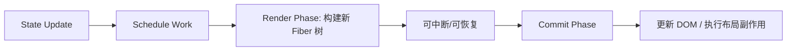
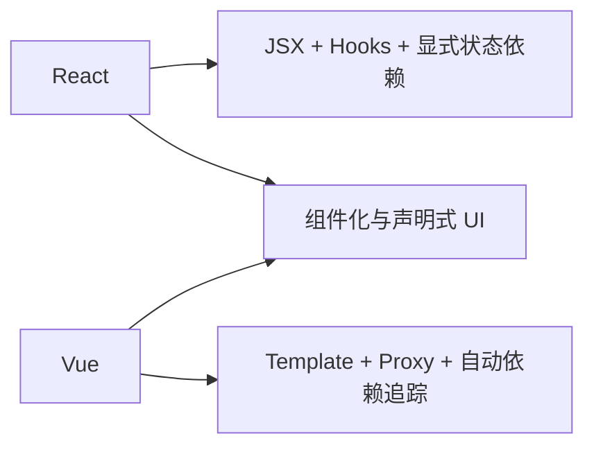

### 🧭 React / Vue 概念与原理学习总览

这份文档面向未系统使用 React / Vue 的学习者，重点是概念、原理和工程认知，不走 API 背诵路线。

学习框架时最容易陷入两个误区：

- 误区一：只记语法，不理解为什么会这样更新。
- 误区二：只比较谁“更简单”，却忽略团队规模、业务复杂度和工程边界。

### 📊 学习路径建议

1. 先学模块一和模块二，分别建立 React 与 Vue 的基础心智模型。
2. 再学模块三，理解两者共同点与差异来自哪里。
3. 再学模块四和模块五，把框架认知接到真实工程实践和高级主题上。
4. 最后学模块六，形成选型、迁移和面试表达能力。

### 🎯 学习目标

- 能解释 React 与 Vue 分别如何描述 UI、管理状态与触发更新。
- 能说清 JSX、模板、Hooks、响应式系统、Virtual DOM 等核心概念。
- 能把框架概念连接到路由、状态管理、数据获取、性能优化等工程问题。
- 能进行基础选型和渐进迁移讨论，而不是简单站队。

---

### 🌱 模块一：React 基础认知与心智模型

- **知识点**：组件、JSX、状态驱动、Hooks、单向数据流、Fiber、协调与提交。
- **模块讲解**：
    - React 用“状态 -> UI”的方式描述界面。
    - 组件本质是接收输入并返回 UI 描述的函数。
    - 理解 React 的关键不是记住 hook 名字，而是理解“每次渲染都是一次新的计算”。

#### 1.1 JSX、组件与声明式 UI

- **讲解**：
    - JSX 是语法糖，本质会被编译为函数调用。
    - 组件是组织 UI 的最小单位，可组合、可复用、可嵌套。
    - 声明式 UI 表示“描述结果”，而不是手动一步步操作 DOM。
- **示例**：

```tsx
function Welcome({ name }: { name: string }) {
  return <h1>Hello, {name}</h1>;
}
```

- **理解重点**：
    - 组件接收 props，返回一个 UI 描述。
    - React 再根据前后描述差异更新真实 DOM。
- **常见误区**：
    - 把 JSX 当模板语言理解，却忽略它其实是 JS 表达式。
    - 在渲染阶段做副作用，例如请求、订阅、直接改 DOM。

#### 1.2 状态、事件与 Hooks

- **讲解**：
    - `useState` 用于本地状态。
    - 事件处理会触发状态更新。
    - 状态变化后 React 重新执行组件函数，得到新的 UI 描述。
- **示例**：

```tsx
function Counter() {
  const [count, setCount] = React.useState(0);
  return <button onClick={() => setCount(c => c + 1)}>{count}</button>;
}
```

- **副作用概念**：
    - 请求、订阅、计时器、手动改 DOM 都属于副作用。
    - 副作用应放在 `useEffect`，并配合依赖数组和清理函数。
- **示例**：

```tsx
function TitleSync() {
  const [count, setCount] = React.useState(0);

  React.useEffect(() => {
    document.title = `count:${count}`;
  }, [count]);

  return <button onClick={() => setCount(count + 1)}>{count}</button>;
}
```

#### 1.3 React 渲染、协调与 Hooks 规则

- **讲解**：
    - React 渲染阶段负责计算新的 UI 结果。
    - 提交阶段把需要的变更应用到真实 DOM。
    - Hooks 必须在组件顶层按固定顺序调用，这是因为 React 依赖调用顺序关联 hook 状态。
- **常见规则**：
    - 不要在条件分支里调用 Hook。
    - 不要在循环里调用 Hook。
    - 不要把组件当普通函数直接调用。
- **错误示例**：

```tsx
function Bad({ visible }: { visible: boolean }) {
  if (visible) {
    const [count] = React.useState(0);
    return <div>{count}</div>;
  }
  return null;
}
```

- **为什么错**：
    - hook 调用顺序不稳定，会破坏 React 内部状态槽位映射。

#### 1.4 Fiber、调度与为什么 React 能打断渲染

- **讲解**：
    - React 早期栈式协调器一旦开始渲染，就很难中断；Fiber 的目标是把渲染工作拆成可暂停、可恢复、可丢弃的小单元。
    - 每个 Fiber 节点都可以理解成一个“工作单元”，保存组件类型、props、state、子节点和副作用标记。
    - React 会先在 render 阶段构建新的 Fiber 树并计算变更，再在 commit 阶段一次性提交到真实 DOM。
    - 这就是为什么 React 能支持并发渲染、优先级调度、transition 等能力，但 commit 阶段依然要求同步且一致。
- **理解重点**：
    - render 阶段可以被打断、重试、丢弃。
    - commit 阶段不能被打断，因为它会真正修改 DOM。
    - 所以“组件函数执行了”不一定等于“页面已经提交更新了”。
- **图例（React Fiber 心智模型）**：



#### 1.5 React 的 state queue、batching 与闭包旧值问题

- **讲解**：
        - React 的 `setState`/`setCount` 不是立刻改变量，而是把更新放进对应 Fiber 的 update queue，等待后续调度和渲染。
        - 同一个事件循环里的多个状态更新通常会被 batch 进一次渲染，这就是批处理。
        - 因为组件函数每次渲染都会生成新的闭包，所以事件处理器里读到的值，往往是“当前这次渲染快照里的值”，这也是旧值问题的来源。
        - 函数式更新 `setCount(c => c + 1)` 的意义，就是不要依赖可能过期的闭包值，而是基于队列里最新状态继续计算。
- **示例**：

```tsx
function Counter() {
    const [count, setCount] = React.useState(0);

    function badClick() {
        setCount(count + 1);
        setCount(count + 1);
        // 常见结果：只加 1，因为两次都读到同一份闭包里的 count
    }

    function goodClick() {
        setCount(c => c + 1);
        setCount(c => c + 1);
        // 结果：加 2，因为每次都基于队列中的最新值
    }

    return <button onClick={goodClick}>{count}</button>;
}
```

- **理解重点**：
        - React 里“状态更新是排队的”，不是同步覆写变量。
        - 旧值问题很多时候不是 React 奇怪，而是闭包和批处理共同作用的结果。

---

### 🌿 模块二：Vue 基础认知与响应式系统

- **知识点**：模板、SFC、Composition API、ref/reactive、computed/watch、编译与更新、依赖收集。
- **模块讲解**：
    - Vue 强调模板表达和响应式自动追踪。
    - Vue3 通过 Proxy 构建响应式系统，Composition API 提供更灵活的逻辑组织方式。

#### 2.1 SFC、模板与编译结果

- **讲解**：
    - Vue 常见形式是单文件组件 SFC：`<template> + <script> + <style>`。
    - 模板不会直接运行，而是被编译为渲染函数。
    - 这也是 Vue 能做编译期优化的重要原因。
- **示例**：

```vue
<script setup>
const msg = 'hello'
</script>

<template>
  <h1>{{ msg }}</h1>
</template>
```

- **理解重点**：
    - 模板是更友好的声明方式。
    - 编译后本质仍是生成虚拟节点并参与更新。

#### 2.2 ref、reactive、computed 与 watch

- **讲解**：
    - `ref` 适合基础类型或单值引用。
    - `reactive` 适合对象响应式包装。
    - `computed` 用于派生状态，强调缓存和依赖追踪。
    - `watch` 用于观察变化并执行副作用。
- **示例**：

```vue
<script setup>
import { ref, computed, watch } from 'vue'

const count = ref(0)
const label = computed(() => `count:${count.value}`)

watch(count, (value) => {
  console.log('count changed:', value)
})
</script>

<template>
  <button @click="count++">{{ label }}</button>
</template>
```

- **使用边界**：
    - 纯派生值优先 computed。
    - 真正需要副作用时才用 watch。
    - 避免用 watch 做本可由 computed 解决的事情。

#### 2.3 Vue 的更新机制与生命周期

- **讲解**：
    - Vue 会在响应式依赖变更后调度更新。
    - 生命周期帮助我们在合适时机访问 DOM、订阅、清理资源。
    - 更新通常是异步批量的，因此有时需要 `nextTick` 等待 DOM 完成刷新。
- **示例**：

```vue
<script setup>
import { ref, nextTick } from 'vue'

const visible = ref(false)

async function open() {
  visible.value = true
  await nextTick()
  console.log('DOM 已更新')
}
</script>
```

- **常见误区**：
    - 修改响应式状态后立刻读取 DOM，结果拿到旧值。
    - 过度依赖深度 watch，带来性能和维护负担。

#### 2.4 Vue scheduler、批量更新与 nextTick

- **讲解**：
    - Vue 在响应式依赖变更后不会每改一次就立刻重渲染，而是把相关 job 放进 scheduler 队列，做异步批量刷新。
    - 同一轮同步代码里对同一状态的多次修改，通常会被合并，最终减少重复渲染。
    - `nextTick` 的意义不是“延时一下”，而是等待当前这轮异步刷新和 DOM patch 完成后，再执行后续逻辑。
    - 所以 Vue 的更新体验看起来“自动”，本质上仍是调度器在帮你把重复更新折叠掉。
- **示例**：

```vue
<script setup>
import { ref, nextTick } from 'vue'

const count = ref(0)

async function run() {
  count.value++
  count.value++
  count.value++

  // 这里 DOM 还不一定已经更新
  await nextTick()
  // 这里才可安全读取更新后的 DOM
}
</script>
```

- **理解重点**：
    - React 和 Vue 都会做批处理，只是暴露给开发者的心智模型不同。
    - Vue 更像“响应式依赖变化 -> scheduler 合并 job -> patch DOM”。

#### 2.5 Vue3 响应式底层：Proxy、track/trigger 与编译优化

- **讲解**：
    - Vue3 的响应式核心是 `Proxy` 拦截读取和写入：读取时 `track` 收集依赖，写入时 `trigger` 通知副作用重新执行。
    - `computed` 本质上是带缓存的 effect，只有依赖变化才重新计算。
    - 模板在编译阶段会产出 block tree、patch flags 等优化信息，让运行时知道哪些节点是静态的、哪些绑定需要更新。
    - 所以 Vue 的性能不只来自运行时 diff，也来自编译阶段提前告诉运行时“哪里不用再看”。
- **示意代码（响应式原理化简）**：

```ts
const bucket = new WeakMap();

function reactive(target) {
    return new Proxy(target, {
        get(obj, key) {
            track(obj, key);
            return obj[key];
        },
        set(obj, key, value) {
            obj[key] = value;
            trigger(obj, key);
            return true;
        }
    });
}
```

- **理解重点**：
    - React 更偏“重新执行组件函数，显式比较依赖”。
    - Vue 更偏“在访问时自动记录依赖，在变更时精确触发 effect”。

---

### ⚖️ 模块三：React vs Vue 核心对比

- **知识点**：声明方式、状态模型、更新机制、逻辑复用、生态体验。
- **模块讲解**：
    - React 与 Vue 不是“一个先进一个落后”，而是设计取向不同。
    - 对比时要看：开发心智、显式程度、编译优化能力、生态习惯和团队背景。

#### 3.1 共同点：组件化、声明式与 Virtual DOM

- **共同点**：
    - 都用组件组织 UI。
    - 都是声明式更新。
    - 都有 Virtual DOM 或等价抽象层，帮助计算变更。
    - 都有成熟路由、状态管理、测试、SSR 生态。
- **真正共同的工程问题**：
    - 状态边界如何设计。
    - 数据获取如何管理。
    - 大列表如何优化。
    - 错误与性能如何治理。

#### 3.2 差异：显式状态流 vs 自动依赖追踪

- **React 倾向**：
    - JSX 表达能力强。
    - 状态流更显式。
    - Hook 组合逻辑灵活，但也要求开发者更理解闭包和依赖数组。
- **Vue 倾向**：
    - 模板更接近传统前端认知。
    - 响应式自动追踪降低部分心智负担。
    - SFC 把模板、逻辑、样式组织得更集中。
- **一个重要认识**：
    - React 常要求你更显式地管理依赖。
    - Vue 常帮你做一部分依赖追踪，但也要理解响应式边界。

#### 3.3 Diff、调度与性能认知

- **讲解**：
    - 两者都不会“全量重建页面”，而是尽量做差异更新。
    - 但真正的性能问题通常不是 diff 本身，而是组件过多、状态设计不当、渲染粒度太粗。
    - React 更强调调度与可中断渲染；Vue 更强调编译优化和依赖追踪精度。
    - React 常把“状态更新如何排队、如何批处理”暴露得更明显；Vue 则更多由响应式系统和 scheduler 帮你兜住这层细节。
- **优化思路**：
    - 减少不必要更新。
    - 缩小状态影响范围。
    - 长列表做虚拟化。
    - 复杂计算做 memo/computed 或移到 Worker。
- **Mermaid 对照**：



---

### 🧪 模块四：工程实践连接点

- **知识点**：路由、状态管理、服务端状态、表单、测试、性能优化。
- **模块讲解**：
    - 框架只解决 UI 描述问题，复杂度真正来自数据流和工程治理。
    - 很多“框架问题”其实是状态建模和边界设计问题。

#### 4.1 路由与数据获取

- **讲解**：
    - 页面切换不仅是 URL 变化，还涉及数据加载、错误态、权限校验和缓存复用。
    - 现代工程通常会把“服务端状态”与“本地 UI 状态”分开管理。
- **示例（请求状态建模）**：

```ts
type FetchState<T> =
  | { status: 'idle' }
  | { status: 'loading' }
  | { status: 'ok'; data: T }
  | { status: 'error'; message: string }
```

- **实践建议**：
    - 路由切换时明确 loading / error / empty / success 四类状态。
    - 避免在多个组件里重复发同一请求。

#### 4.2 局部状态、共享状态与服务端状态

- **讲解**：
    - 局部状态：弹窗开关、输入框内容、hover 状态。
    - 共享状态：用户信息、主题、权限、购物车。
    - 服务端状态：列表数据、详情数据、搜索结果、分页缓存。
- **核心原则**：
    - 谁使用，谁持有。
    - 尽量不要把所有东西都放全局 store。
    - 服务端状态更适合用专门的数据获取库处理缓存、重试、失效。
- **常见反模式**：
    - 一个页面的临时表单状态也放全局。
    - 多层组件反复透传与重复请求。

#### 4.3 测试与性能优化入门

- **讲解**：
    - UI 测试要从用户视角验证交互结果。
    - 性能优化要先测量再优化，不要凭感觉乱加 memo。
- **React 常见优化点**：
    - `memo`、`useMemo`、`useCallback` 只在有实际收益时使用。
    - 关注组件重渲染边界和 props 稳定性。
- **Vue 常见优化点**：
    - 关注响应式对象粒度。
    - 避免模板中做重计算。
    - 关注大列表渲染和 watch 成本。

---

### 🧩 模块五：高级主题与设计选择

- **知识点**：SSR、SSG、流式渲染、服务端组件、错误边界、代码拆分、异步组件、编译优化。
- **模块讲解**：
    - 高级主题的核心问题是：首屏怎么更快、SEO 怎么更好、交互怎么更稳、团队如何维护。

#### 5.1 CSR / SSR / SSG 的差异与取舍

- **CSR**：
    - 前端拿到 JS 后再渲染页面。
    - 交互灵活，但首屏和 SEO 可能吃亏。
- **SSR**：
    - 先在服务端生成 HTML。
    - 首屏和 SEO 更友好，但增加服务端成本和复杂度。
- **SSG**：
    - 构建期生成静态页面。
    - 适合内容型站点和低频更新页面。
- **理解重点**：
    - 不是所有项目都值得上 SSR。
    - 选型要综合 SEO、首屏速度、动态程度、运维成本。

#### 5.2 代码拆分、异步组件与错误边界

- **讲解**：
    - 大型应用必须关注包体积和路由级拆分。
    - React 可通过 `lazy`、Suspense、错误边界等机制控制异步体验。
    - Vue 可使用异步组件和 `<Suspense>` 等能力。
- **示例（React 懒加载）**：

```tsx
const SettingsPage = React.lazy(() => import('./SettingsPage'));
```

- **示例（Vue 异步组件）**：

```ts
import { defineAsyncComponent } from 'vue'
const SettingsPage = defineAsyncComponent(() => import('./SettingsPage.vue'))
```

- **关注点**：
    - loading 和错误态不能缺失。
    - 切分太细会增加请求与调度开销。

#### 5.3 编译优化、服务端组件与框架演进方向

- **讲解**：
    - React 近年的重点之一是把“运行时优化”逐步前移到编译和服务端，例如 React Compiler、Server Components、流式渲染。
    - Vue 的长期优势之一是模板可静态分析，编译器可以提前标记静态节点、生成 patch flags、提升更新效率。
    - 这意味着现代框架性能优化不再只是手写 memo 或减少 watch，而是越来越依赖编译器、服务端和运行时协同。
- **面试表达建议**：
    - 不要只说“React 性能靠虚拟 DOM，Vue 性能靠响应式”，这太粗。
    - 更准确的说法是：React 强在调度模型与生态演进，Vue 强在编译优化与响应式精确更新。

#### 5.4 常见反模式与原理误区

- **React 常见反模式**：
    - 把所有逻辑塞进一个组件。
    - 依赖数组写不对导致重复请求或闭包旧值问题。
    - 为了“性能”到处加 memo，增加理解成本。
- **Vue 常见反模式**：
    - 用 watch 链式改状态，形成隐式依赖网。
    - 大量深层 reactive 对象不分层。
    - 模板和逻辑高度耦合，难以复用和测试。
- **原则**：
    - 保持单一职责。
    - 让数据流清晰。
    - 副作用放在明确边界。

---

### 🧭 模块六：选型、迁移与面试表达

- **知识点**：选型维度、渐进迁移、微前端边界、团队能力结构、面试回答框架。
- **模块讲解**：
    - 技术选型不应以“我更喜欢哪个”结束，而应回答长期维护和交付问题。

#### 6.1 选型维度：如何讨论 React / Vue 更适合谁

- **可讨论的维度**：
    - 团队已有经验。
    - 招聘供给与培训成本。
    - 现有生态与历史包袱。
    - 项目类型：后台系统、营销站、内容站、复杂交互台。
    - SSR / SSG / 全栈集成需求。
- **表达模板**：
    - 小团队、快速上手、模板偏好明显，可优先 Vue。
    - 大型团队、生态一致、对 React 生态依赖重，可优先 React。
    - 但最终仍应看组织现状，而不是绝对判断。

#### 6.2 渐进迁移：旧项目如何安全演进

- **讲解**：
    - 重写往往风险极高，迁移应优先分边界、分模块、分阶段。
    - 可从新页面、新功能或壳层改造开始。
    - 如果必须双栈共存，要先解决路由、状态、构建、样式隔离问题。
- **实践建议**：
    - 建立共享设计系统和基础组件层。
    - 新增页面采用新栈，旧页面逐步退场。
    - 用契约和边界定义减少双向耦合。

---

### 🚀 模块七：React / Vue 业界热点（2026 前后）

- **知识点**：编译器时代、全栈一体化、局部水合与流式渲染、状态管理收敛。
- **模块讲解**：
    - 这两年热点不再是“React vs Vue 谁更强”，而是“谁能把性能、交付速度、可维护性一起做对”。
    - 面试回答建议从“技术趋势 -> 业务价值 -> 落地风险”三个层次展开。

#### 7.1 编译器时代：从运行时优化走向编译时优化

- **讲解**：
    - React 侧核心趋势是 Compiler 驱动的自动优化，减少手写 `memo/useMemo/useCallback` 的负担。
    - Vue 侧持续强化模板编译优化与 SFC 编译链路，把更多优化前置到构建期。
    - 共性是“把过去靠人肉写的性能技巧交给编译器”。
- **面试速答模板（30秒）**：
    > 2026 前后 React/Vue 都在走编译器路线，把优化从运行时前移到编译时。React 更强调组件级自动 memo 化，Vue 更强调模板静态提升和细粒度更新。趋势是少写手工优化代码，但要接受更强的构建工具约束。

#### 7.2 全栈一体化：前端框架继续向 BFF 靠拢

- **讲解**：
    - React 生态里，Server Components 与 Server Actions 的工程化实践更成熟。
    - Vue 生态里，Nuxt 的服务端能力、数据获取约定和部署链路继续强化。
    - 团队关注点从“会不会 SSR”变成“能否统一前后端边界、缓存策略、鉴权模型”。
- **落地提醒**：
    - 组件边界和服务端边界混在一起时，排障复杂度会提高。
    - 必须提前约定：哪些逻辑在服务端，哪些在客户端，缓存谁负责。
- **面试速答模板（30秒）**：
    > React/Vue 都在全栈化，前端框架不只管 UI，还会管数据读取、服务端执行和缓存。好处是开发体验统一，风险是边界不清会导致排障困难。实际落地要先定义客户端/服务端职责，再做框架能力选型。

#### 7.3 渲染策略升级：流式渲染、岛屿化与局部水合更常态

- **讲解**：
    - 大站点和内容平台越来越强调“先到达可交互关键路径”，而不是整页一次性水合。
    - 流式渲染、部分预渲染、岛屿化架构在 React/Vue 生态都更常见。
    - 指标导向上，直接服务 LCP 与 INP，而不只追求理论 TTI。
- **面试表达建议**：
    - 先说业务场景（内容站、营销页、复杂后台）。
    - 再说渲染策略（CSR/SSR/SSG/Partial Hydration）。
    - 最后说验证方式（Web Vitals + RUM）。
- **面试速答模板（30秒）**：
    > 渲染策略的热点是“局部优先”，比如流式渲染和岛屿化，不再追求整页一次性水合。核心目标是改善 LCP 和 INP。选型不看概念新旧，而看页面类型和可观测数据是否证明收益。

#### 7.4 状态管理收敛：轻量化、约定化、与服务端缓存协同

- **讲解**：
    - React 侧常见模式是“本地状态 + 服务端状态分层”，减少单一全局 store 过载。
    - Vue 侧以组合式 API + Pinia 为主流，强调模块边界与类型友好。
    - 新趋势是把“服务端状态缓存”当一等公民处理，减少重复请求与状态漂移。
- **高频误区**：
    - 把所有状态塞进全局 store。
    - 客户端缓存策略与服务端缓存策略冲突，导致数据不一致。
- **面试速答模板（30秒）**：
    > 2026 前后状态管理趋势是收敛和分层：UI 本地状态、跨页共享状态、服务端数据缓存分别治理。React 和 Vue 的最佳实践都在减少“全局大仓库”，提升可维护性和一致性。

#### 7.5 工程能力成为真正分水岭

- **讲解**：
    - 框架能力差距在缩小，真正拉开效率的是工程体系：设计系统、测试策略、可观测性、发布治理。
    - 同样的 React 或 Vue，工程纪律不同，最终交付质量差距会很大。
- **面试速答模板（30秒）**：
    > React 和 Vue 的原理差距在缩小，团队结果的核心差异来自工程治理。谁能把设计系统、测试、监控、灰度发布做成流程化能力，谁就能稳定交付高质量前端。

### ✅ 复习清单

- 我是否理解 React “渲染是重新执行组件函数”的含义？
- 我是否理解 Vue 的响应式追踪与模板编译机制？
- 我是否能说清两者共同点和差异点？
- 我是否能把框架概念连接到路由、状态管理和性能问题？
- 我是否能解释 CSR / SSR / SSG 的取舍？
- 我是否能解释 2026 前后 React / Vue 的热点趋势及其业务价值？
- 我是否能给出有边界、有背景的选型结论？