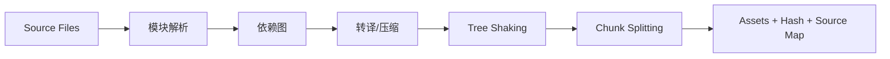

### 🧭 工程化、架构设计与线上可观测性学习总览

这份文档聚焦高级前端最核心的系统化能力：稳定交付、架构设计、性能治理、线上问题闭环。

很多团队写了很多代码，却仍然频繁回归、线上排障低效、发布风险高。根因通常不是“某个人不够努力”，而是工程与治理机制没有形成系统。

### 📊 学习路径建议

1. 先学模块一和模块二，建立工程化与交付体系基础。
2. 再学模块三和模块四，掌握架构设计与可观测性的核心方法。
3. 再学模块五，形成性能治理与回归防线能力。
4. 最后学模块六，把稳定性治理与团队机制连起来。

### 🎯 学习目标

- 能说清工程化的目的不是堆工具，而是降低交付成本和故障率。
- 能设计适合团队规模的 CI/CD、质量门禁与发布策略。
- 能回答常见系统设计题：分层、状态边界、微前端、BFF、SSR 选型。
- 能建立前端可观测性、告警、复盘与长期治理闭环。

---

### 🏗️ 模块一：前端工程化基础

- **知识点**：构建打包、质量门禁、Monorepo、依赖治理、脚手架、缓存、source map。
- **模块讲解**：
    - 工程化的目标是“让正确的事情更容易发生，让错误更早暴露”。
    - 工具不是越多越好，关键是链路是否清晰、成本是否可控。

#### 1.1 构建打包：为什么需要构建系统

- **讲解**：
    - 构建系统负责模块解析、转译、代码分割、压缩、产物输出与资源指纹化。
    - 现代项目通常还要求开发环境热更新、增量编译和源码映射。
- **选型关注点**：
    - 冷启动速度。
    - 增量构建速度。
    - 插件生态与扩展性。
    - 团队已有经验。
- **实践建议**：
    - 大型项目优先考虑增量与缓存能力。
    - 构建配置要标准化，避免每个项目各写一套。
- **目录示例**：

```text
apps/
packages/
tooling/
```

#### 1.2 质量门禁：lint、typecheck、test、commit 规范

- **讲解**：
    - 质量门禁的目标是“尽早失败”。
    - 能在本地和 PR 阶段发现的问题，不要留到线上。
- **常见门禁**：
    - ESLint：约束代码风格与常见错误。
    - TypeScript：约束类型一致性。
    - Unit Test：覆盖核心规则逻辑。
    - Commit message / changelog：提升发布可追溯性。
- **实践建议**：
    - 本地 pre-commit 做轻量校验。
    - PR 阶段做完整校验。
    - 避免把特别慢的流程放到每次提交前。

#### 1.3 Monorepo 与依赖治理

- **讲解**：
    - Monorepo 适合多应用、多包共享和统一治理。
    - 但它不是银弹，边界不清时会把复杂度集中放大。
- **治理重点**：
    - 包之间依赖方向要清晰。
    - 公共包要有版本和发布策略。
    - 需要缓存、任务编排、变更影响分析。
- **常见问题**：
    - 公共包随意引用业务包。
    - 包变更影响范围不可见。
    - 安装慢、构建慢、权限边界混乱。

#### 1.4 构建系统底层原理：模块图、Tree Shaking 与产物映射

- **讲解**：
    - bundler 的核心不是“把文件拼起来”，而是先构建模块依赖图，再决定哪些模块要转译、哪些可以删除、哪些要切到异步 chunk。
    - Tree Shaking 依赖 ESM 的静态 import/export 结构，只有在可静态分析时，未引用导出才有机会被移除。
    - Code Splitting 的目标是把首屏不需要的代码延后加载，但前提是切分边界合理，否则会造成请求碎片化和缓存命中变差。
    - Source Map 的价值是把运行时产物重新映射回源码，它不仅服务调试，也服务线上错误还原和发布追踪。
- **一个正确心智模型**：
    - 解析模块。
    - 构建依赖图。
    - 标记 side effects 和可摇树导出。
    - 切 chunk、生成 hash、输出 source map。
- **图例（构建链路）**：



#### 1.5 增量构建、远程缓存与缓存失效一致性

- **讲解**：
    - 大型前端项目真正决定体验的，不只是“能不能构建”，而是“改一行代码以后要多久能得到可信结果”。
    - 增量构建的本质是只重算受影响的任务或模块，而不是每次全量从头执行。
    - 远程缓存的本质是把任务输入和输出做内容寻址：当源码、配置、环境、依赖版本都等价时，可以直接复用上一次产物。
    - 真正的难点不在“命中缓存”，而在“什么时候必须失效缓存”。只要输入指纹漏掉了环境变量、锁文件、编译参数、生成器版本之一，就可能复用到错误产物。
- **理解重点**：
    - 增量构建关注“影响范围”。
    - 远程缓存关注“结果复用”。
    - 一致性关注“输入指纹是否完整”。
- **常见失效来源**：
    - `package-lock` / `pnpm-lock` 变化未纳入缓存 key。
    - 构建时环境变量变了，但缓存仍命中。
    - codegen 产物变化没有进入依赖图。
    - 本地和 CI 的 Node 版本、平台差异被忽略。
- **实践建议**：
    - 对任务输入做显式声明：源码、配置、锁文件、环境变量、代码生成结果都要纳入 hash。
    - 重要发布链路宁可少命中缓存，也不要冒着错误复用产物的风险。
    - 对缓存命中率和错误命中率分别监控，不要只追求命中率数字好看。

---

### 🚀 模块二：交付流程与发布策略

- **知识点**：CI/CD、环境隔离、灰度发布、回滚预案、Feature Flag、发布可视化。
- **模块讲解**：
    - 交付体系的核心是“低风险上线 + 快速回滚 + 发布可观测”。
    - 发布不是执行一个脚本，而是一套控制风险的机制。

#### 2.1 流水线设计：PR、主干、发布环境怎么分工

- **讲解**：
    - PR 阶段重快速反馈：lint、typecheck、unit、关键集成测试。
    - 合并到主干后可执行构建、冒烟回归、产物校验。
    - 发布阶段关注灰度、流量放量、指标观察与回滚。
- **流水线示意**：

```text
PR: lint + typecheck + unit + build
Merge: integration + smoke e2e
Release: canary -> 10% -> 50% -> 100%
```

- **设计原则**：
    - 快测试前置，慢测试后置。
    - 每一步都要有明确阻断条件和责任人。

#### 2.2 灰度、回滚与 Feature Flag

- **讲解**：
    - 灰度是降低风险，不是拖延发布。
    - Feature Flag 是把“代码部署”和“功能开启”解耦。
    - 回滚预案要在事故前准备，而不是事故后临时想办法。
- **实践建议**：
    - 高风险功能先给内部账号或小流量。
    - 核心业务路径必须能快速回退。
    - Flag 要有 owner 和下线计划，避免长期污染代码。
- **配置示例**：

```json
{
  "newCheckout": {
    "enabled": true,
    "rollout": 10
  }
}
```

#### 2.3 发布指标、观察窗口与失败升级机制

- **讲解**：
    - 发布后不能只看“页面能打开”，还要看错误率、接口成功率、Web Vitals、业务成功率。
    - 观察窗口内要有明确升级路径和停止放量规则。
- **常见观察指标**：
    - JS 错误率。
    - API 失败率。
    - 首屏性能。
    - 转化率、下单成功率等业务指标。
- **失败处理建议**：
    - 指标异常立即停止扩量。
    - 优先确认是否为新版本回归。
    - 回滚后再做根因分析，不要边扩量边排查。

---

### 🧩 模块三：架构设计与系统设计题

- **知识点**：分层架构、状态流、BFF、微前端、SSR/CSR/SSG、领域边界。
- **模块讲解**：
    - 架构讨论不是画几层盒子，而是回答：边界如何划分、依赖如何流动、故障如何隔离、演进如何验证。

#### 3.1 分层与边界：UI、状态、服务、基础设施

- **讲解**：
    - UI Layer 负责展示和交互。
    - State Layer 负责状态编排与派生。
    - Service Layer 负责请求、数据转换、缓存策略。
    - Infra Layer 负责日志、监控、存储、配置等底层能力。
- **示例**：

```text
UI Layer -> State Layer -> Service Layer -> Infra Layer
```

- **设计价值**：
    - 降低耦合。
    - 提升可测试性。
    - 让职责更容易被团队理解和维护。

#### 3.2 状态流、BFF 与接口聚合设计

- **讲解**：
    - 大型前端复杂度通常来自状态同步与接口编排。
    - BFF 适合把多后端接口聚合成更贴近前端页面的数据模型。
    - 但 BFF 也会增加服务治理成本，要看组织边界是否匹配。
- **实践建议**：
    - 页面状态分清局部状态、共享状态和服务端状态。
    - 接口模型不要直接把后端结构原样透传到 UI。
    - 对复杂表单和审批流，要明确状态机与权限边界。

#### 3.3 微前端、SSR 与渲染策略取舍

- **讲解**：
    - 微前端适合多团队独立发布、技术栈异构、边界清晰的场景。
    - 但它会引入运行时集成、样式隔离、公共依赖和性能开销问题。
    - SSR / CSR / SSG 的选择要围绕 SEO、首屏、交互复杂度和运维成本展开。
- **面试表达建议**：
    - 先说明业务背景。
    - 再说明可选方案。
    - 最后说明权衡与演进路径。

#### 微前端的工程约束

- **讲解**：
    - 微前端不是“把前端拆开”这么简单，真正难点在运行时集成与组织边界一致性。
    - 典型约束包括：
        - 样式隔离：避免子应用互相污染。
        - 路由协调：主应用与子应用的路径边界必须清晰。
        - 公共依赖：React/Vue 等运行时是否共享，会直接影响包体和冲突风险。
        - 发布节奏：独立发布要换来真实收益，否则只是在引入额外治理成本。
    - 适合多团队、领域边界清晰、确实需要独立演进的中后台或平台型系统。
- **示例**：
    - 运营后台拆为“商品、订单、营销”三个子应用，主壳负责登录态、菜单与统一埋点。
    - 子应用独立发布，但 UI 规范、埋点协议、错误上报字段仍由主壳统一约束。
- **图例：微前端适用性判断**

| 信号 | 适合微前端 | 不适合微前端 |
| --- | --- | --- |
| 团队数量 | 多团队独立维护 | 单团队单应用 |
| 领域边界 | 明确 | 高度耦合 |
| 发布节奏 | 需要独立发布 | 同步发布即可 |
| 治理能力 | 有统一规范平台 | 治理能力薄弱 |

- **原理追问**：
    - 为什么很多微前端项目最后问题不在技术，而在边界定义失败？
    - 什么时候 BFF + 模块化 Monorepo 比微前端更合适？

---

### 📈 模块四：线上可观测性体系

- **知识点**：Logs、Metrics、Traces、RUM、告警、采样、session replay、traceId。
- **模块讲解**：
    - 可观测性不是“多打日志”，而是让问题被及时发现、准确归因、快速修复。
    - 前端要覆盖错误、性能、资源、请求、用户路径和关键业务指标。

#### 4.1 Logs / Metrics / Traces：三件套如何协同

- **Logs**：
    - 适合记录上下文与详细错误信息。
- **Metrics**：
    - 适合聚合趋势与告警，如错误率、成功率、性能分位数。
- **Traces**：
    - 适合串联前端请求链路和后端服务调用。
- **前端落地重点**：
    - 错误上报要带页面、版本、用户环境、traceId。
    - 性能采样要覆盖 Web Vitals 和关键交互。
    - 请求监控要关注失败码和时延分布。

#### 4.2 告警策略、SLI / SLO 与去噪

- **讲解**：
    - 告警过多会让团队疲劳，告警过少又会错过事故。
    - 需要定义 SLI / SLO 和合理阈值，而不是“有一点异常就报警”。
- **常见 SLI**：
    - 页面可用率。
    - 接口成功率。
    - JS 错误率。
    - LCP / INP 分位数。
    - 关键业务成功率。
- **治理建议**：
    - 按严重程度分级。
    - 做告警聚合和静默时间窗。
    - 只对真正需要值班响应的问题升级。

#### 4.3 线上排障闭环：traceId、回放与日志联动

- **讲解**：
    - 线上定位要尽量恢复用户现场。
    - traceId 把前端错误、接口请求、后端日志串起来。
    - session replay 则帮助还原用户操作过程。
- **闭环流程**：


- **关键要求**：
    - 版本号、commit hash、source map 必须可对齐。
    - 监控字段命名要标准化。

#### 4.4 Source Map、符号化与观测数据模型

- **讲解**：
    - 前端错误平台之所以能把压缩后的堆栈还原成源码位置，本质依赖的是 source map 符号化过程。
    - 如果版本号、构建产物 hash、commit hash、source map 上传版本对不上，监控平台就只能看到混淆堆栈，排障效率会直接下降。
    - 观测平台还需要统一事件模型：错误事件、性能事件、资源事件、用户行为事件至少要共享页面、版本、环境、traceId、user/session 等公共字段。
    - 没有统一数据模型时，日志、性能、回放、后端 trace 就无法稳定串联，最终只能回到人工拼信息。
- **实践建议**：
    - 每次发布自动上传 source map，并与 release/version 绑定。
    - 错误事件字段做 schema 管理，避免不同团队各自乱传。
    - traceId 从页面入口、请求头到后端日志统一透传。
- **示例（观测事件公共字段）**：

```json
{
  "release": "web@2026.04.23-abc123",
  "env": "prod",
  "route": "/checkout",
  "traceId": "t-9f8e7d",
  "sessionId": "s-123",
  "userId": "u-456"
}
```

- **典型失败场景**：
        - 用户报错对应的是 `app.98ab.js`，但平台上上传的是旧版本 `app.31cd.js.map`。
        - sourcemap 上传成功了，但 release 名称和前端上报 release 不一致。
        - 错误发生在 CDN 已切新版本、监控平台仍按旧构建号查 map 的时间窗里。
        - 这类问题本质上都不是“工具不会用”，而是发布元数据没有做到强一致。

#### 前端监控与错误追踪体系

- **讲解**：
    - 前端监控最小闭环不是“报错上来”，而是“采集 -> 聚合 -> 告警 -> 排障 -> 修复验证”。
    - 至少要覆盖四类事件：
        - JS 运行时错误
        - 资源加载失败
        - 接口异常与超时
        - Web Vitals 与关键交互性能
    - 真正决定排障效率的是字段完整度，而不是事件数量。
- **示例**：
    - 某版本白屏率上升，通过错误平台发现集中在 `checkout` 路由，traceId 关联后端日志定位为 BFF 返回字段缺失。
- **图例：前端监控闭环**


- **原理追问**：
    - 为什么只有错误监控而没有性能与请求监控，排障仍然会断链？
    - 为什么前端监控字段必须做 schema 管理？

---

### ⚡ 模块五：高级性能治理方法论

- **知识点**：性能预算、基线管理、资源分析、渲染优化、回归防线、平台化。
- **模块讲解**：
    - 性能治理不是一次优化活动，而是持续运营过程。
    - 如果没有预算和基线，性能问题会在业务迭代中慢慢反弹。

#### 5.1 性能预算与基线管理

- **讲解**：
    - 性能预算是团队对“最多允许多慢、多大”的明确约束。
    - 基线管理用于观察版本间是否出现回退。
- **预算示例**：

```text
js bundle <= 250KB gzip
LCP <= 2.5s
INP <= 200ms
CLS <= 0.1
```

- **实践建议**：
    - 对首页、列表页、详情页设置不同预算。
    - 在 CI 中校验包体积和基础指标。

#### 5.2 分层诊断：资源、网络、主线程、渲染

- **讲解**：
    - 先从用户感知指标出发，再下钻到资源和代码层。
    - 常见诊断顺序：TTFB -> 资源加载 -> 主线程长任务 -> 渲染开销。
- **代码示例（资源耗时采样）**：

#### 性能优化闭环：诊断 -> 优化 -> 验证

- **讲解**：
    - 前端性能治理最常见的问题不是“不知道怎么优化”，而是没有闭环，优化完也不知道是否真的有效。
    - 推荐固定四步：
        - 先定指标：LCP、INP、CLS、首屏包体、接口 RT。
        - 再定根因：资源过大、主线程长任务、布局抖动、接口瀑布。
        - 再做优化：代码分割、缓存、懒加载、Worker、服务端聚合。
        - 最后验证：实验对照、灰度观察、回归防线。
- **示例**：
    - 商品详情页 LCP 偏高，拆解后发现主图过大 + 推荐接口阻塞首屏。
    - 优化为 AVIF + 首屏接口裁剪 + 下折叠推荐延迟加载，LCP 从 3.4s 降到 2.1s。
- **图例：性能闭环矩阵**

| 阶段 | 关注问题 | 典型工具 | 输出 |
| --- | --- | --- | --- |
| 诊断 | 慢在哪 | RUM、DevTools、APM | 根因假设 |
| 优化 | 改什么 | 构建配置、代码、缓存 | 优化方案 |
| 验证 | 是否真的变好 | A/B、灰度、指标对比 | 指标变化 |
| 防回退 | 下次不再坏 | CI 预算、告警、基线 | 长期约束 |

- **原理追问**：
    - 为什么“本地跑快了”不等于真实用户性能改善？
    - 性能优化为什么必须把业务指标一起看？

```js
performance.getEntriesByType('resource').forEach((item) => {
  console.log(item.name, item.duration);
});
```

- **实践重点**：
    - 包体积是否膨胀。
    - 首屏图和关键 CSS 是否过大。
    - 输入响应是否被同步计算拖慢。

#### 5.3 回归防线：自动化检查与平台化治理

- **讲解**：
    - 只靠人工性能排查不可持续。
    - 应把包体积、关键指标、资源规则纳入自动化检查。
- **可落地机制**：
    - PR 评论展示包体积 diff。
    - 构建后自动跑 Lighthouse 或自定义性能 smoke。
    - 大版本发布前对关键页面做趋势对比。
    - 异常回退自动通知 owner。

---

### 🛡️ 模块六：稳定性治理与团队机制

- **知识点**：错误分级、降级策略、技术债治理、评审机制、复盘流程、知识库。
- **模块讲解**：
    - 稳定性治理的核心是把“发现 -> 修复 -> 预防”制度化。
    - 如果只有事故时临时救火，组织能力不会真正提升。

#### 6.1 错误分级、降级与韧性设计

- **讲解**：
    - 不是所有错误都要同样处理。
    - 核心交易链路故障、数据错误、白屏属于高优先级。
    - 次要模块失败可以采用降级、兜底或延迟重试。
- **实践建议**：
    - 关键模块加错误边界和兜底页面。
    - 第三方服务失败要有超时和 fallback。
    - 前端配置要支持远程开关和紧急关停。
- **代码示例（简单兜底）**：

```ts
async function safeFetch(url: string) {
  try {
    return await fetch(url);
  } catch {
    return new Response(JSON.stringify({ degraded: true }), { status: 200 });
  }
}
```

#### 6.2 事故复盘、技术债治理与长期预防

- **讲解**：
    - 事故复盘不是追责会，而是明确根因和预防机制。
    - 技术债治理要有目标、指标、owner 和截止时间。
- **复盘模板**：

```text
问题现象 -> 影响范围 -> 发现方式 -> 根因 -> 修复动作 -> 预防机制 -> Owner / DDL
```

- **技术债治理建议**：
    - 按风险和收益排序。
    - 每个季度固定投入比例。
    - 避免“谁空谁修”的无主状态。

#### 6.3 团队机制：评审、值班、知识库与能力建设

- **讲解**：
    - 机制比个人英雄主义更可持续。
    - 设计评审、发布评审、事故复盘是三类关键评审场景。
    - 值班和应急流程要清晰，避免多人同时无序响应。
- **建议动作**：
    - 建立发布 checklist。
    - 建立线上问题 SOP。
    - 建立知识库沉淀案例与最佳实践。
    - 对高频事故做专题治理，而不是每次重复踩坑。

---

### 🚀 模块七：工程化、架构与可观测性业界热点（2026 前后）

- **知识点**：Rust 构建工具链、平台工程化、渐进发布自动化、OpenTelemetry 前端落地、AI 辅助排障。
- **模块讲解**：
    - 热点不只是“新工具换旧工具”，而是研发链路从分散脚本走向平台化治理。
    - 面试回答建议围绕三件事：效率提升了多少、风险降低了多少、治理成本是否可控。

#### 7.1 构建链路 Rust 化：从“快一点”到“全链路提效”

- **讲解**：
    - 2026 前后，构建工具明显向 Rust 实现收敛（如 Rspack、Turbopack、Rolldown 生态增强）。
    - 价值不只在单次打包速度，还在冷启动、增量重编译、CI 总时长和开发反馈环路。
    - 团队关注点从“webpack 能不能用”变成“是否具备稳定迁移路径和插件兼容策略”。
- **面试速答模板（30秒）**：
    > 构建热点是 Rust 工具链成熟，收益不只是打包更快，而是开发和 CI 的全链路反馈更短。落地关键不是盲目迁移，而是先评估插件兼容、产物一致性和回滚方案，再分阶段替换。

#### 7.2 平台工程化：Monorepo + 远程缓存 + 质量门禁一体化

- **讲解**：
    - 工程化正从“仓库里一堆脚本”升级为“内部开发者平台（IDP）能力”。
    - 常见组合是 Monorepo + 任务编排（Nx/Turborepo）+ 远程缓存 + Policy as Code。
    - 目标是把重复规则产品化：统一模板、统一门禁、统一发布约束。
- **落地要点**：
    - 每条流水线都要可观测（耗时、失败率、回滚率）。
    - 对高风险变更强制门禁（权限、审计、签名）。
    - 避免“平台变成新瓶颈”，要给团队保留可扩展边界。
- **面试速答模板（30秒）**：
    > 2026 的工程化趋势是平台化：Monorepo 结合远程缓存和统一门禁，把规则从文档变成系统能力。价值是减少重复劳动和发布风险，但要防止平台过重，需用指标持续验证收益。

#### 7.3 渐进发布自动化：Feature Flag、金丝雀、自动回滚成为标配

- **讲解**：
    - 发布策略从“全量发布 + 人工盯盘”转向“分批放量 + SLO 触发自动回滚”。
    - Feature Flag 平台与可观测系统联动后，可按用户群、地区、版本做精准灰度。
    - 发布风险评分（变更规模、触达路径、历史故障）用于决定灰度比例与审批级别。
- **示例流程**：

```text
提交变更 -> 风险评分 -> 小流量灰度 -> 指标守卫（错误率/INP/LCP）
-> 达标自动放量 / 触发自动回滚 -> 复盘沉淀
```

- **面试速答模板（30秒）**：
    > 发布热点是渐进式自动化：用 Feature Flag 和金丝雀控制放量，用 SLO 做自动回滚守卫。这样把发布从“拍脑袋”变成数据驱动，核心是提前定义回滚阈值和观测指标。

#### 7.4 前端可观测性标准化：OpenTelemetry 与 Session Replay 深度融合

- **讲解**：
    - 可观测性从“只收错误”升级为 Logs/Metrics/Traces/Replay 四位一体。
    - OpenTelemetry 在前端埋点语义和链路关联上更普及，traceId 成为串联前后端问题的基础键。
    - Session Replay 与性能指标（LCP/INP/CLS）联动后，更容易复现真实用户问题。
- **落地建议**：
    - 统一事件命名和埋点 schema，减少“同义不同名”。
    - 设定采样与脱敏策略，平衡成本、合规和诊断能力。
    - 按业务旅程建立 SLO，而不是只盯单点技术指标。
- **面试速答模板（30秒）**：
    > 可观测热点是标准化和关联化：OpenTelemetry 统一语义，traceId 串联前后端，Session Replay 还原用户现场。目标不只是收数据，而是能在告警后快速定位根因并验证修复。

#### 7.5 AI 辅助运维：从“自动建议”走向“受控自动执行”

- **讲解**：
    - AI 在 2026 前后主要用于变更影响分析、异常聚类、告警降噪、事故摘要与复盘初稿。
    - 更先进团队开始尝试“受控自动执行”：在低风险场景自动降级、限流或回滚。
    - 原则是 Human-in-the-loop：AI 可提议、可执行受限动作，但关键决策需人工确认。
- **风险提醒**：
    - 模型幻觉可能导致错误归因。
    - 权限边界不清会放大事故。
    - 必须保留审计日志和一键人工接管机制。
- **面试速答模板（30秒）**：
    > AI 在工程化和可观测里的价值是提效，不是替代治理。它适合做异常聚类、影响分析和排障摘要；在自动执行上要限定权限和场景，关键动作仍需人工复核，确保可审计和可回滚。

---
### ✅ 复习清单

- 我是否能解释构建、门禁、Monorepo、依赖治理的目标？
- 我是否能设计 PR / Merge / Release 三阶段流水线？
- 我是否能说清分层架构、BFF、微前端、SSR 的适用边界？
- 我是否理解前端可观测性的 Logs / Metrics / Traces 三件套？
- 我是否能解释 2026 前后工程化、架构与可观测性的热点及落地取舍？
- 我是否会设置性能预算与自动化回归防线？
- 我是否能设计复盘机制和技术债治理流程？
